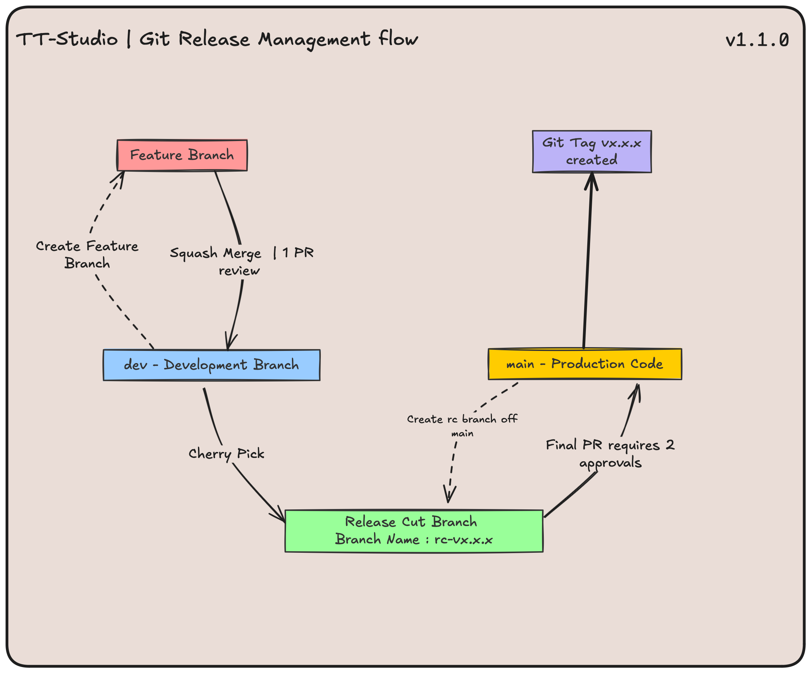

# Contributing to TT-STUDIO

Thank you for your interest in this project! We want to make contributing as easy and transparent as possible.

If you're interested in making a contribution, please familiarize yourself with our technical [contribution standards](#contribution-standards) outlined in this guide.

Next, request the appropriate write permissions by [opening an issue](https://github.com/tenstorrent/tt-studio/issues/new/choose) for GitHub permissions.

All contributions require:

- An issue:
  - Please file a feature request or bug report under the Issues section to help get the attention of a maintainer.
- A pull request (PR).
- Your PR must be approved by the appropriate reviewers.

## Contribution Standards

### Code Reviews

We actively welcome your pull requests! To ensure quality contributions, any code change must meet the following criteria:

- A PR must be opened and approved by:
  - A maintaining team member.
  - Any codeowners whose modules are relevant to the PR.
- Run pre-commit hooks.
- Pass all acceptance criteria mandated in the original issue.
- Pass the automated GitHub Actions workflow tests.
- Pass any testing requirements specified by the relevant codeowners.

### **Git Branching Strategy Overview**

### **1. Main Branches:**

- **`main`**: Holds production-ready code.

  - **Rules:**

    - No force pushes.

    - Requires rebase and merge.

- **`dev`**: The central branch where all feature branches are merged and validated before preparing for release cut branch.

  - **Rules:**

    - No force pushes.

    - Requires squash merge.

---

### **2. Feature Development Workflow**

#### **Development Process**

- Developers create feature branches from `dev` to work on new features or bug fixes.
- Once a feature is completed and reviewed, it is **squash merged** into `dev` to maintain a clean history.

---

#### **Release Preparation**

- When `dev` is stable and ready for release, a **release cut branch** (e.g., `rc-vx.x.x`) is created from `dev`.
- Developers **cherry-pick** their completed and validated features from `dev` into the release branch.
- The release branch is tested before deployment.

---

#### **Final Deployment**

- Once the release branch is validated, it is merged into `main` for production deployment.
- Merging to `main` requires **at least two approvals** to ensure code quality and stability.
- After merging, the release is tagged following semantic versioning (e.g., `v1.0.0`).

---

#### Git Tagging

- Tags are created in main to mark production releases.

- [Semantic versioning (e.g., v1.0.0) is used to track different versions.](#versioning-standards)

---

### Versioning Standards

To ensure consistency in versioning, we follow the principles of **semantic versioning**:

- **MAJOR**: Increment for incompatible or breaking changes to backend or frontend APIs or functionality:

  - Removing or significantly altering existing features.
  - Changing the current networking design.
  - Altering backend API flows.
  - Changing frontend API calls and/or redoing entire components.

- **MINOR**: Increment when adding new features or capabilities in a backward-compatible manner:

  - For example, supporting new models like YOLOv4 or adding new functionalities.

- **PATCH**: Increment for bug fixes and minor improvements that are backward-compatible.

---

### FlowChart for our Git Branching Strategy

