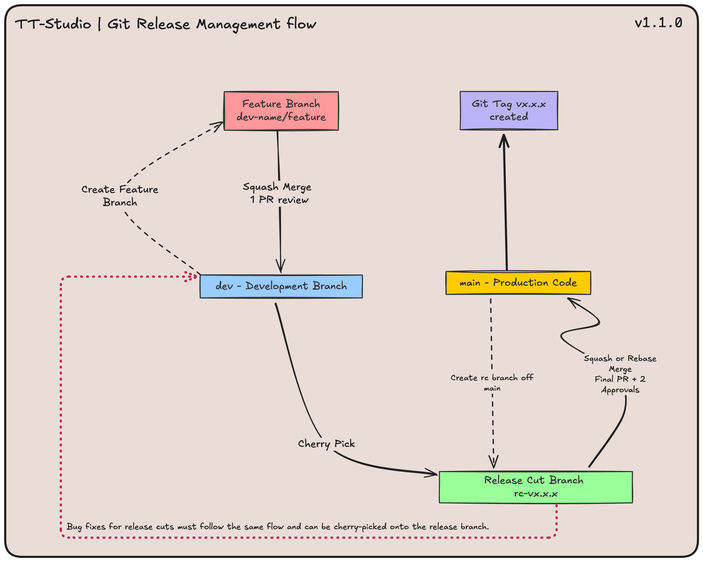

# **Contributing to TT-STUDIO**

Thank you for your interest in this project! We aim to make the contribution process as easy and transparent as possible.

If you’d like to contribute or have suggestions , please familiarize yourself with technical [contribution standards](#contribution-standards) outlined in this guide.

---

## **Contribution Requirements**

- **Issue Tracking:**

  - File a feature request or bug report in the Issues section to notify maintainers.

- **Pull Requests (PRs):**
  - All changes must be submitted via a PR.
  - PRs require approval from the appropriate reviewers before merging.

---

## **Contribution Standards**

### **Code Reviews**

We actively welcome your pull requests! To ensure quality contributions, any code change must meet the following criteria:

- A PR must be opened and approved by:
  - A maintaining team member.
  - Any codeowners whose modules are relevant to the PR.
- Run **pre-commit hooks**.
- Pass all **acceptance criteria** mandated in the original issue.
- Pass the **automated GitHub Actions workflow tests**.
- Pass any **testing requirements** specified by the relevant codeowners.

---

## **Git Branching Strategy Overview**

### **1. Main Branches**

- **`main`** – Holds production-ready tagged code.

  - **Rules:**
    - No force pushes.
    - Requires **rebase and merge** or **squash and merge** from a release cut branch.

- **`dev`** – The central branch where all feature branches are merged and validated before preparing a release branch.
  - **Rules:**
    - No force pushes.
    - Requires **squash merge** from a feature branch.

---

### **2. Feature Development Workflow**

#### **Development Process**

- **Feature Branches:**

  - Created from `dev`.
  - **Naming convention:** `dev-name/feature` or `dev/github-issue-number`.
    - Example: `dev-john/new-feature` or `dev-john/1234`.

- **Merging to `dev`:**
  - Once completed and reviewed, feature branches are **squash merged** into `dev` to maintain a clean history.

---

### **3. Release Process**

#### **Release Preparation**

- **Creating the Release Branch:**

  - When `dev` is stable and ready for release, a **release cut branch** is created from `main`.
  - **Naming convention:** `rc-vx.x.x` (e.g., `rc-v1.2.0`).

- **Feature Inclusion:**

  - Developers **cherry-pick** validated features from `dev` into the release branch.
  - Test and resolve any **merge conflicts** as needed.

- **Testing & Fixes:**
  - The release branch undergoes **testing before deployment**.
  - **Bug fixes and PR comments** follow the standard development flow and can be cherry-picked into the same release branch.

---

#### **Final Deployment**

- After validation, the **release branch is merged into `main`** for production.
- **At least two approvals** are required for merging to `main` to ensure quality.
- Merging can be done via **rebase and merge** or **squash and merge** if multiple commits were cherry-picked.
- The release is **tagged following semantic versioning** (e.g., `v1.0.0`).

---

### **4. Git Tagging**

- **Tags are created in `main`** to mark production releases.
- **Semantic versioning** (e.g., `v1.0.0`) is used to track different versions.

---

## **Versioning Standards**

To ensure consistency, we follow **semantic versioning** principles:

- **MAJOR**: Increment for **breaking changes** to backend or frontend APIs or functionality.

  - Removing or significantly altering existing features.
  - Changing the networking design.
  - Modifying backend API flows.
  - Redesigning frontend API calls or components.

- **MINOR**: Increment for **new features** or capabilities that are **backward-compatible**.

  - Example: Supporting new models like YOLOv4 or adding additional functionalities.
  - If the current version is `1.2.3` and a new **minor** release is introduced, it becomes **`1.3.0`**.
  - If additional patches are needed after `1.3.0`, the version will increment to **`1.3.1`**, **`1.3.2`**, and so on.

- **PATCH**: Increment for **bug fixes and minor improvements** that are **backward-compatible**.
  - If patches are applied to `1.2.3`, the next versions would be `1.2.4`, `1.2.5`, etc.

---

## **Git Branching Strategy Flowchart**

