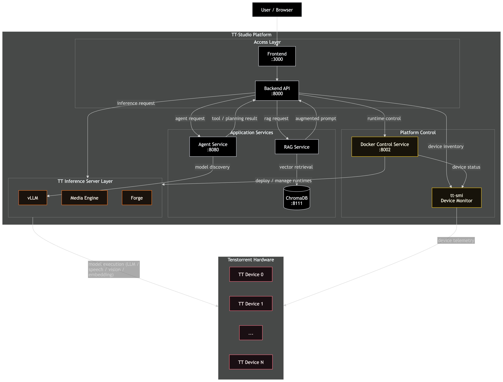

<p align="center">
  
</p>

<h1 align="center">TT-Studio</h1>

<p align="center">
  <em>The deployment platform and application library for Tenstorrent AI hardware — device discovery, model orchestration, and production-ready AI pipelines in a single platform.</em>
</p>

---

TT-Studio gives you AI application patterns and blueprints — chat, RAG, voice pipelines, agents, image generation, and more — pre-integrated with hardware management, so you go from hardware to running AI in minutes. All inference runs on-device; no cloud API keys required. Built on the same open-source inference stack (vLLM, Forge, Media Engine) your production systems will use.

## Quick Start

```bash
git clone https://github.com/tenstorrent/tt-studio.git && cd tt-studio && python3 run.py --easy
```

When prompted, enter your [Hugging Face token](https://huggingface.co/settings/tokens) so TT-Studio can pull models weights.

After provisioning completes, the UI will open automatically; if not, navigate to [http://localhost:3000](http://localhost:3000). On a remote machine, open that URL from your browser or set up port forwarding so you can reach the host's port 3000. See the [Quick Start Guide](docs/quickstart.md) for full details.

---

## Why TT-Studio?

- **Hardware-aware deployment** — TT-SMI inventories devices at startup; the model catalog filters to what your hardware can actually run
- **No cloud dependencies by default** — all inference runs on-device; cloud fallback is opt-in
- **OpenAI-compatible APIs** — deployed models expose `/v1/chat/completions`; existing tooling works without changes
- **Full-stack application patterns** — 8 pipelines ship pre-integrated (not sample code) — RAG, voice, and agents work out of the box
- **60+ pre-validated models** — each model tested against hardware targets in our [TT Inference Server Stack](https://github.com/tenstorrent/tt-inference-server).

---

## Blueprints

TT-Studio ships with eight AI application patterns — four multi-model pipelines and four single-model experiences. Each is pre-integrated with hardware management and ready to run.

### Pipelines

| Blueprint | Description |
|-----------|-------------|
| [RAG](docs/blueprints/rag.md) | Ask questions across your own documents. Upload PDF, DOCX, PPTX, or XLSX and query them with semantic search — LLM responses are grounded in retrieved context. |
| [AI Agent](docs/blueprints/ai-agent.md) | Autonomous assistant with live web search. Connects to any deployed LLM, extends it with tool use, searches the web via Tavily, and maintains conversation threads. |
| [Voice Pipeline](docs/blueprints/voice-pipeline.md) | Full conversational voice loop on-device. Record audio &rarr; Whisper STT &rarr; LLM &rarr; TTS synthesis — three models chained in real-time. |
| [Object Detection](docs/blueprints/object-detection.md) | Visual understanding with CNN models. Submit images for classification and detection using Forge-backed models — no GPU required. |

### Model Experiences

| Blueprint | Models | Description |
|-----------|--------|-------------|
| [LLM Chat](docs/blueprints/llm-chat.md) | 24 | Streaming chat from 1B to 120B parameter models. OpenAI-compatible API, 24 pre-validated models, multi-turn history. |
| [Image Generation](docs/blueprints/image-generation.md) | 9 | Text-to-image with FLUX, Stable Diffusion, and Motif — 9 models, fully on-device, no cloud API costs. |
| [Vision Language Model](docs/blueprints/vlm.md) | 12 | Multimodal chat — send an image and ask questions about it. 12 vision-language models across Wormhole and Blackhole hardware. |
| [Video Generation](docs/blueprints/video-generation.md) | 2 | Text-to-video with Mochi and Wan on Tenstorrent hardware — fully on-device generation. |

For model status definitions and the full list of running models, see the [TT Inference Server](https://github.com/tenstorrent/tt-inference-server?tab=readme-ov-file#tt-inference-server).

---

## Supported Hardware

| Family | Devices | Topology |
|--------|---------|----------|
| **Wormhole** | N150, N300, T3K | Single-chip, multi-chip, mesh |
| **Blackhole** | P100, P150, P300c, P150X4, P150X8 | Single-chip, multi-chip |
| **Galaxy** | GALAXY, GALAXY_T3K | Full-mesh interconnect |

## System Requirements

| Requirement | Specification |
|-------------|--------------|
| OS | Ubuntu 22.04+ |
| Python | 3.8+ |
| Docker | Docker Engine + Compose V2 |
| Hardware | Tenstorrent accelerator (or [remote endpoint.](docs/remote-endpoint-setup.md)) |
| Drivers | [Tenstorrent Getting Started Guide](https://docs.tenstorrent.com/getting-started/README.html) |

## Software Stack

**Tenstorrent Technology**
- [TT-Metal](https://github.com/tenstorrent-metal/tt-metal) — Execution framework
- [TT Inference Server](https://github.com/tenstorrent/tt-inference-server) — Model serving microservice
- [TT-SMI](https://github.com/tenstorrent/tt-smi) — Hardware-aware deployment via device inventory

> **Hardware-aware deployment via TT-SMI:** At startup, TT-SMI inventories your Tenstorrent devices and reports health status. TT-Studio uses this device map to filter the model catalog — you only see models your hardware can run — and routes deployments to specific chips in multi-chip configurations. This prevents hardware mismatch failures and enables multi-model workflows across a device mesh.

**Inference Engines**
- vLLM (LLM/VLM) · Media Engine (Image/TTS/Video/STT) · Forge (CNN/Embedding)

**Third-Party**
- ChromaDB · Docker Compose · React · Django REST Framework · FastAPI

---

## Architecture

<p align="center">
  
</p>

---

## Documentation

| Document | Description |
|----------|-------------|
| [Quick Start Guide](docs/quickstart.md) | Full provisioning walkthrough |
| [Model Catalog](docs/model-catalog.md) | All supported models, hardware compatibility, and sync instructions |
| [CLI Reference](docs/run-py-guide.md) | run.py modes and flags |
| [Remote Endpoints](docs/remote-endpoint-setup.md) | Cloud and remote access configuration |
| [Troubleshooting](docs/troubleshooting.md) | Common issues and fixes |
| [Contributing](CONTRIBUTING.md) | Development workflow and guidelines |
