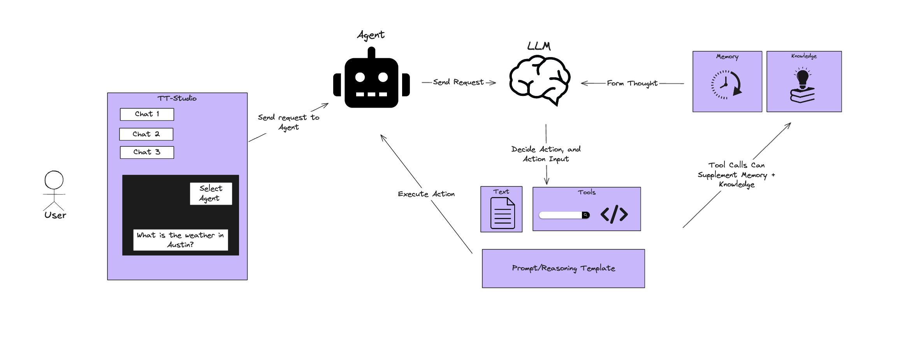

# AI Agent 

TT-Studio currently supports a search agent. To use the search agent, pull the following image from Github Container Registry (GCHR).

```bash
docker pull ghcr.io/tenstorrent/tt-studio/agent_image:v1.1
```

You will also need to create and add your [Tavily API key](https://tavily.com/) to your `.env` file 

How the agent works is depicted in the visual below.


