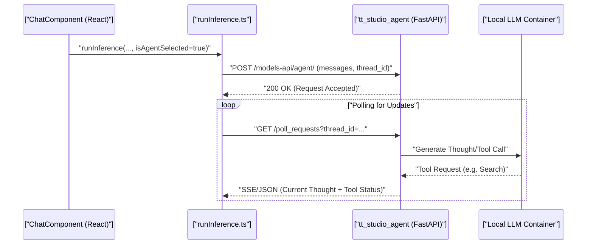
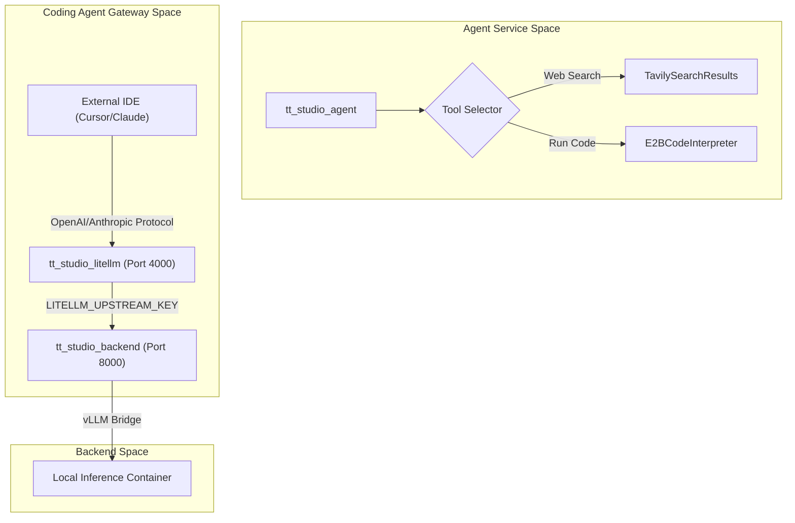

# Agent API & Tool Integration

Relevant source files

<ul>
<li><a href="https://github.com/tenstorrent/tt-studio/blob/c837b829/app/docker-compose.yml">app/docker-compose.yml</a></li>
<li><a href="https://github.com/tenstorrent/tt-studio/blob/c837b829/app/frontend/src/components/chatui/MessageActions.tsx">app/frontend/src/components/chatui/MessageActions.tsx</a></li>
<li><a href="https://github.com/tenstorrent/tt-studio/blob/c837b829/app/frontend/src/components/chatui/runInference.ts">app/frontend/src/components/chatui/runInference.ts</a></li>
<li><a href="https://github.com/tenstorrent/tt-studio/blob/c837b829/app/frontend/src/components/chatui/types.ts">app/frontend/src/components/chatui/types.ts</a></li>
<li><a href="https://github.com/tenstorrent/tt-studio/blob/c837b829/app/frontend/src/components/rag/RagManagement.tsx">app/frontend/src/components/rag/RagManagement.tsx</a></li>
</ul>

The AI Agent service (`tt_studio_agent`) provides an autonomous assistant capable of multi-step reasoning, tool execution, and real-time interaction. It exposes a FastAPI-based interface for the frontend to manage conversations and poll for agent updates.

## API Architecture & Endpoints

The agent service runs on port `8080` [app/docker-compose.yml:116](https://github.com/tenstorrent/tt-studio/blob/c837b829/app/docker-compose.yml#L116) and uses FastAPI to handle incoming requests. It implements a polling-based architecture to manage long-running reasoning tasks and tool executions. The service is integrated into the `tt_studio_network` to communicate with the backend and local LLM containers [app/docker-compose.yml:113-114](https://github.com/tenstorrent/tt-studio/blob/c837b829/app/docker-compose.yml#L113-L114).

### Key Endpoints

| Endpoint | Method | Description |
| :--- | :--- | :--- |
| `/agent/` | `POST` | Primary entry point for sending user messages to the agent. |
| `/poll_requests` | `GET` | Used by the frontend to retrieve the latest state of an active agent reasoning chain. |
| `/status` | `GET` | Health check endpoint returning the status of the agent service and connected LLMs. |

### Data Flow: Frontend to Agent
The frontend initiates communication via the `runInference` function [app/frontend/src/components/chatui/runInference.ts:18-30](https://github.com/tenstorrent/tt-studio/blob/c837b829/app/frontend/src/components/chatui/runInference.ts#L18-L30). If `isAgentSelected` is true, the request is routed to the agent API instead of a standard inference endpoint [app/frontend/src/components/chatui/runInference.ts:181-185](https://github.com/tenstorrent/tt-studio/blob/c837b829/app/frontend/src/components/chatui/runInference.ts#L181-L185).

1.  **Request Initiation**: `runInference` constructs a request body containing the `threadId` and `messages` [app/frontend/src/components/chatui/runInference.ts:201-220](https://github.com/tenstorrent/tt-studio/blob/c837b829/app/frontend/src/components/chatui/runInference.ts#L201-L220).
2.  **Authentication**: Requests include a JWT Bearer token derived from the `VITE_LLAMA_AUTH_TOKEN` (which maps to the stack's `JWT_SECRET`) [app/frontend/src/components/chatui/runInference.ts:190-198](https://github.com/tenstorrent/tt-studio/blob/c837b829/app/frontend/src/components/chatui/runInference.ts#L190-L198).
3.  **Conversation Management**: The `thread_id` allows the agent to maintain state across multiple turns in a single session [app/frontend/src/components/chatui/runInference.ts:201](https://github.com/tenstorrent/tt-studio/blob/c837b829/app/frontend/src/components/chatui/runInference.ts#L201).

**Diagram: Agent API Communication Flow**

Sources: [app/docker-compose.yml:106-137](https://github.com/tenstorrent/tt-studio/blob/c837b829/app/docker-compose.yml#L106-L137), [app/frontend/src/components/chatui/runInference.ts:181-220](https://github.com/tenstorrent/tt-studio/blob/c837b829/app/frontend/src/components/chatui/runInference.ts#L181-L220)

## Tool Integration

The agent uses a ReAct (Reasoning and Acting) framework to interact with external tools. These tools allow the agent to perform actions beyond simple text generation.

### Tavily Search Tool
The agent integrates the **Tavily Search API** to perform real-time web searches. This enables the assistant to answer questions about current events or technical documentation not present in its training data.
*   **Configuration**: Requires the `TAVILY_API_KEY` environment variable [app/docker-compose.yml:119](https://github.com/tenstorrent/tt-studio/blob/c837b829/app/docker-compose.yml#L119).
*   **Usage**: When the agent determines a search is necessary, it invokes the Tavily client, parses the results, and injects them back into its reasoning context.

### Code Interpreter (E2B)
The agent optionally integrates with **E2B (Engine for 2B)** to provide a sandboxed Python code execution environment.
*   **Capabilities**: Allows the agent to write and execute Python code, perform data analysis, and generate charts.
*   **Security**: Code is executed in an isolated cloud-based sandbox, preventing arbitrary execution on the host Tenstorrent machine.
*   **Configuration**: Managed via the `E2B_API_KEY` environment variable [app/docker-compose.yml:128](https://github.com/tenstorrent/tt-studio/blob/c837b829/app/docker-compose.yml#L128).

### LiteLLM Gateway for Coding Agents
For advanced coding tasks (e.g., using Cursor or Claude Code), the system provides a `tt_studio_litellm` service [app/docker-compose.yml:138](https://github.com/tenstorrent/tt-studio/blob/c837b829/app/docker-compose.yml#L138).
*   **Protocol Translation**: Bridges OpenAI and Anthropic surfaces to the local Django backend.
*   **Dynamic Routing**: Routes requests to the backend API hostname defined in environment variables [app/docker-compose.yml:148-150](https://github.com/tenstorrent/tt-studio/blob/c837b829/app/docker-compose.yml#L148-L150).
*   **Security**: Uses `LITELLM_MASTER_KEY` for gateway access and `LITELLM_UPSTREAM_KEY` for backend authentication [app/docker-compose.yml:149-150](https://github.com/tenstorrent/tt-studio/blob/c837b829/app/docker-compose.yml#L149-L150).

**Diagram: Tool & Gateway Entity Mapping**

Sources: [app/docker-compose.yml:138-162](https://github.com/tenstorrent/tt-studio/blob/c837b829/app/docker-compose.yml#L138-L162), [app/frontend/src/components/chatui/runInference.ts:181-185](https://github.com/tenstorrent/tt-studio/blob/c837b829/app/frontend/src/components/chatui/runInference.ts#L181-L185)

## Conversation & State Management

The agent maintains conversation history using a `thread_id` system, which ensures that multi-turn reasoning remains coherent.

### Polling & Circuit Breaking
To prevent infinite loops or stalled agents, the service implements polling configurations:
*   `AGENT_LLM_POLLING_TIMEOUT`: Max time allowed for a single polling request [app/docker-compose.yml:125](https://github.com/tenstorrent/tt-studio/blob/c837b829/app/docker-compose.yml#L125).
*   `AGENT_LLM_POLLING_MAX_ATTEMPTS`: Max retries for agent reasoning steps [app/docker-compose.yml:126](https://github.com/tenstorrent/tt-studio/blob/c837b829/app/docker-compose.yml#L126).
*   `AGENT_LLM_POLLING_CIRCUIT_BREAKER_THRESHOLD`: Threshold to stop execution if the agent fails repeatedly [app/docker-compose.yml:127](https://github.com/tenstorrent/tt-studio/blob/c837b829/app/docker-compose.yml#L127).

### Session Identification
A unique `X-Browser-ID` is generated by the frontend to ensure that RAG collections and agent sessions are correctly associated with specific browser instances [app/frontend/src/components/rag/RagManagement.tsx:67-76](https://github.com/tenstorrent/tt-studio/blob/c837b829/app/frontend/src/components/rag/RagManagement.tsx#L67-L76). This ID is added to the headers of all fetch requests [app/frontend/src/components/rag/RagManagement.tsx:79-97](https://github.com/tenstorrent/tt-studio/blob/c837b829/app/frontend/src/components/rag/RagManagement.tsx#L79-L97).

### Message Actions & UI
The UI provides specific actions for agent-generated messages, including a "Thinking" toggle to visualize the agent's internal reasoning process [app/frontend/src/components/chatui/MessageActions.tsx:154-175](https://github.com/tenstorrent/tt-studio/blob/c837b829/app/frontend/src/components/chatui/MessageActions.tsx#L154-L175).

## Environment Configuration

The agent's behavior and tool access are governed by environment variables defined in the `.env` file and passed to the container via `docker-compose.yml`.

| Variable | Description | Source |
| :--- | :--- | :--- |
| `TAVILY_API_KEY` | API key for web search capabilities. | [app/docker-compose.yml:119](https://github.com/tenstorrent/tt-studio/blob/c837b829/app/docker-compose.yml#L119) |
| `E2B_API_KEY` | API key for the sandboxed Python code interpreter. | [app/docker-compose.yml:128](https://github.com/tenstorrent/tt-studio/blob/c837b829/app/docker-compose.yml#L128) |
| `JWT_SECRET` | Secret used for JWT authentication between services. | [app/docker-compose.yml:118](https://github.com/tenstorrent/tt-studio/blob/c837b829/app/docker-compose.yml#L118) |
| `LITELLM_PORT` | Port for the coding agent gateway (default 4000). | [app/docker-compose.yml:146](https://github.com/tenstorrent/tt-studio/blob/c837b829/app/docker-compose.yml#L146) |
| `AGENT_LLM_POLLING_TIMEOUT` | Max time allowed for a single polling request. | [app/docker-compose.yml:125](https://github.com/tenstorrent/tt-studio/blob/c837b829/app/docker-compose.yml#L125) |
| `USE_CLOUD_LLM` | Toggle to use cloud-based models for the agent reasoning. | [app/docker-compose.yml:122](https://github.com/tenstorrent/tt-studio/blob/c837b829/app/docker-compose.yml#L122) |

Sources: [app/docker-compose.yml:116-130](https://github.com/tenstorrent/tt-studio/blob/c837b829/app/docker-compose.yml#L116-L130), [app/frontend/src/components/rag/RagManagement.tsx:64-97](https://github.com/tenstorrent/tt-studio/blob/c837b829/app/frontend/src/components/rag/RagManagement.tsx#L64-L97), [app/frontend/src/components/chatui/MessageActions.tsx:154-175](https://github.com/tenstorrent/tt-studio/blob/c837b829/app/frontend/src/components/chatui/MessageActions.tsx#L154-L175)27:T1c91,# Frontend Application
