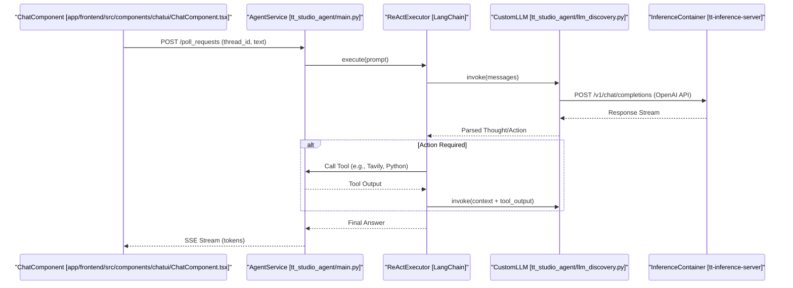
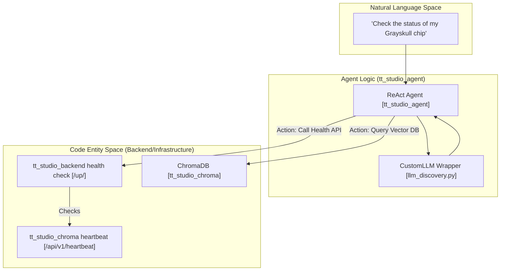

# Agent Architecture & LLM Discovery

Relevant source files

<ul>
<li><a href="https://github.com/tenstorrent/tt-studio/blob/c837b829/README.md">README.md</a></li>
<li><a href="https://github.com/tenstorrent/tt-studio/blob/c837b829/app/README.md">app/README.md</a></li>
<li><a href="https://github.com/tenstorrent/tt-studio/blob/c837b829/app/docker-compose.yml">app/docker-compose.yml</a></li>
<li><a href="https://github.com/tenstorrent/tt-studio/blob/c837b829/app/frontend/index.html">app/frontend/index.html</a></li>
</ul>

The AI Agent service (`tt_studio_agent`) is a specialized autonomous assistant designed to orchestrate complex tasks by leveraging local Tenstorrent-hosted LLMs. It utilizes a LangChain-based ReAct framework to interact with the system through tools while maintaining a resilient connection to inference containers via a dedicated discovery and health monitoring subsystem.

## Core Agent Architecture

The agent is built as a FastAPI service that wraps a LangChain ReAct agent. It operates on a "poll-and-process" model where it consumes requests from a queue, processes them using the available LLM, and streams responses back to the frontend. The service is containerized and depends on the `tt_studio_backend` for its initial state and network configuration [app/docker-compose.yml:106-114](https://github.com/tenstorrent/tt-studio/blob/c837b829/app/docker-compose.yml#L106-L114).

### Component Overview
The architecture is divided into three main layers:
1.  **API Layer**: FastAPI endpoints (port 8080) that handle incoming chat requests via `/poll_requests` and status checks [app/docker-compose.yml:115-116](https://github.com/tenstorrent/tt-studio/blob/c837b829/app/docker-compose.yml#L115-L116).
2.  **Agent Logic Layer**: The ReAct executor and `CustomLLM` wrapper which handles the reasoning loop and tool selection.
3.  **Infrastructure Layer**: Discovery services and health monitors that maintain the link to hardware-accelerated LLM containers.

### System Data Flow: From Request to Execution
The following diagram illustrates how a user request flows through the agent service and how it interacts with the underlying LLM infrastructure.

**Agent Inference & Tool Execution Flow**

Sources: [app/docker-compose.yml:106-128](https://github.com/tenstorrent/tt-studio/blob/c837b829/app/docker-compose.yml#L106-L128).

## LLM Discovery & Health Monitoring

The agent service does not have a hardcoded LLM endpoint. Instead, it dynamically discovers available local inference containers using the `LLMDiscoveryService`.

### LLMDiscoveryService
This service scans the Docker network for containers that expose compatible inference APIs. It prioritizes local Tenstorrent-hosted models over cloud fallbacks.

*   **Detection Logic**: It queries the `docker-control-service` or scans the environment for active deployments tracked in the `ModelDeployment` store.
*   **CustomLLM Wrapper**: Implements the LangChain `BaseLLM` interface, allowing the agent to treat local FastAPI inference servers as standard LangChain LLMs.

### LiteLLM Gateway Integration
For external coding assistants (like Cursor or Claude Code) to interact with local Tenstorrent models, a `tt_studio_litellm` gateway is used as a protocol translation layer. It maps OpenAI and Anthropic API surfaces to the TT-Studio backend [app/docker-compose.yml:138-142](https://github.com/tenstorrent/tt-studio/blob/c837b829/app/docker-compose.yml#L138-L142).

*   **Upstream Routing**: The gateway routes all incoming model requests to the Django backend's OpenAI-compatible endpoint.
*   **Master Key Security**: Access is protected via the `LITELLM_MASTER_KEY` [app/docker-compose.yml:148-150](https://github.com/tenstorrent/tt-studio/blob/c837b829/app/docker-compose.yml#L148-L150).
*   **Persistent Configuration**: Uses a `config.yaml` volume mount to define model mappings and proxy settings [app/docker-compose.yml:151-152](https://github.com/tenstorrent/tt-studio/blob/c837b829/app/docker-compose.yml#L151-L152).

### LLMHealthMonitor
To ensure high availability, the system continuously polls the discovered endpoints.
*   **Polling**: It verifies that containers are still in a `service_healthy` state before routing traffic [app/docker-compose.yml:157-162](https://github.com/tenstorrent/tt-studio/blob/c837b829/app/docker-compose.yml#L157-L162).
*   **ChromaDB Health**: The backend ensures the vector store is healthy before initializing RAG-dependent agent tools [app/docker-compose.yml:25-27](https://github.com/tenstorrent/tt-studio/blob/c837b829/app/docker-compose.yml#L25-L27).
*   **Backend Readiness**: The agent service itself waits for the `tt_studio_backend` to pass its healthcheck before starting its polling loop [app/docker-compose.yml:110-112](https://github.com/tenstorrent/tt-studio/blob/c837b829/app/docker-compose.yml#L110-L112).

| Component | Responsibility | Port |
| :--- | :--- | :--- |
| **Discovery** | Detects local `tt-inference-server` instances via Docker network. | N/A |
| **LiteLLM** | Provides OpenAI surface for external tools [app/docker-compose.yml:146-146](https://github.com/tenstorrent/tt-studio/blob/c837b829/app/docker-compose.yml#L146-L146). | 4000 |
| **Agent API** | Handles chat requests and tool orchestration [app/docker-compose.yml:115-116](https://github.com/tenstorrent/tt-studio/blob/c837b829/app/docker-compose.yml#L115-L116). | 8080 |
| **Backend API** | Manages model deployment lifecycle and health state [app/docker-compose.yml:21-22](https://github.com/tenstorrent/tt-studio/blob/c837b829/app/docker-compose.yml#L21-L22). | 8000 |

Sources: [app/docker-compose.yml:21-162](https://github.com/tenstorrent/tt-studio/blob/c837b829/app/docker-compose.yml#L21-L162).

## LLM Integration & Natural Language Space

The agent acts as the bridge between the user's natural language intent and the "Code Entity Space" of the TT-Studio system. It uses the `CustomLLM` to translate these intents into structured tool calls.

**Natural Language to Code Entity Mapping**

Sources: [app/docker-compose.yml:80-87](https://github.com/tenstorrent/tt-studio/blob/c837b829/app/docker-compose.yml#L80-L87), [app/docker-compose.yml:180-185](https://github.com/tenstorrent/tt-studio/blob/c837b829/app/docker-compose.yml#L180-L185).

## Multi-LLM Fallback Logic

The agent service is designed to be resilient. If the primary high-performance model is not available or the hardware is over-subscribed, it follows a hierarchical fallback strategy:

1.  **Local High-Perf**: Attempts to connect to a local container as specified by `LLM_CONTAINER_NAME` [app/docker-compose.yml:123-123](https://github.com/tenstorrent/tt-studio/blob/c837b829/app/docker-compose.yml#L123-L123).
2.  **Cloud Bridge**: If `USE_CLOUD_LLM` is set to `true`, it routes requests to a remote inference cloud (e.g., via `CLOUD_CHAT_UI_URL`) [app/docker-compose.yml:120-122](https://github.com/tenstorrent/tt-studio/blob/c837b829/app/docker-compose.yml#L120-L122).
3.  **Circuit Breaker**: The polling mechanism uses `AGENT_LLM_POLLING_CIRCUIT_BREAKER_THRESHOLD` to stop attempts if the LLM is consistently unreachable [app/docker-compose.yml:127-127](https://github.com/tenstorrent/tt-studio/blob/c837b829/app/docker-compose.yml#L127-L127).

### Implementation Details
*   **Endpoint Resolution**: The API URL is determined dynamically at runtime based on the `BACKEND_API_HOSTNAME` [app/docker-compose.yml:124-124](https://github.com/tenstorrent/tt-studio/blob/c837b829/app/docker-compose.yml#L124-L124).
*   **Polling Configuration**: Retry logic is governed by `AGENT_LLM_POLLING_MAX_ATTEMPTS` and `AGENT_LLM_POLLING_TIMEOUT` [app/docker-compose.yml:125-126](https://github.com/tenstorrent/tt-studio/blob/c837b829/app/docker-compose.yml#L125-L126).

Sources: [app/docker-compose.yml:117-128](https://github.com/tenstorrent/tt-studio/blob/c837b829/app/docker-compose.yml#L117-L128).26:T1fe8,# Agent API & Tool Integration
