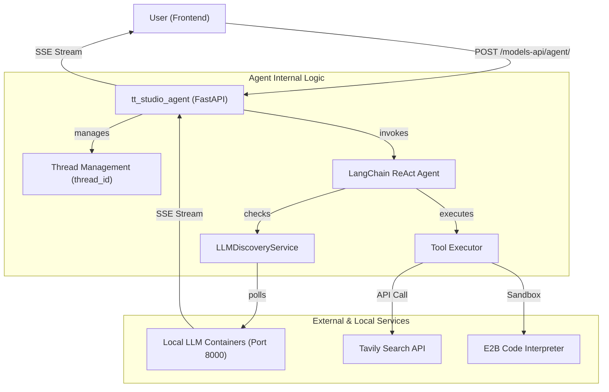
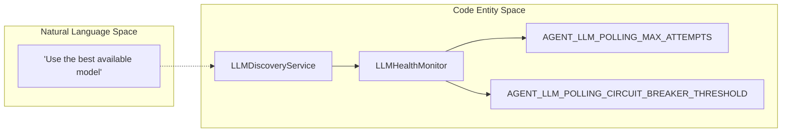

# AI Agent Service

The `tt_studio_agent` service (operating on port `8080`) is an autonomous AI assistant subsystem within TT-Studio. It provides a high-level reasoning interface that can discover locally deployed LLMs, monitor their health, and execute complex tasks using a suite of integrated tools, including web search and secure code execution.

## Overview

The agent service acts as a bridge between natural language user intent and the technical capabilities of the TT-Studio ecosystem. Unlike standard inference routes that provide direct model access, the agent service manages stateful conversations and selects the best available local model to fulfill requests.

### Key Capabilities
* **LLM Discovery & Fallback**: Automatically identifies available LLM containers on the `tt_studio_network` and maintains a priority-based fallback list.
* **Health Monitoring**: Continuously polls inference endpoints to ensure the agent only routes traffic to responsive models.
* **Tool Integration**: Extends LLM capabilities with a Tavily-powered web search and an optional E2B code interpreter for executing Python code in isolated environments.
*   **Conversation Management**: Uses `thread_id` to maintain context across multiple turns in a chat session.

### Service Interaction Map
The following diagram illustrates how the `tt_studio_agent` interacts with other system components and how it maps natural language requests to code-level execution entities.

**Agent Service Integration Flow**


---

## [Agent Architecture & LLM Discovery](architecture.md)

The core of the service is built on a **LangChain-based ReAct (Reasoning and Acting) architecture**. It utilizes a `CustomLLM` wrapper to standardize communication with various local inference servers (e.g., vLLM or TGI-based containers).

The **LLMDiscoveryService** is responsible for scanning the Docker environment to find containers that match known LLM signatures. It works in tandem with the **LLMHealthMonitor**, which performs periodic heartbeats. If the primary high-performance model becomes unresponsive, the agent utilizes polling timeouts and circuit breaker thresholds to manage fallbacks.

For details, see [Agent Architecture & LLM Discovery](architecture.md).

**Natural Language to Code Entity Mapping: Discovery**


---

## [Agent API & Tool Integration](api-and-tools.md)

The agent exposes a FastAPI-based REST interface. Authentication is handled via **JWT (JSON Web Tokens)** to ensure secure access to tool execution and backend communication.

### Integrated Tools
| Tool Name | Code Reference | Description |
| :--- | :--- | :--- |
| **Tavily Search** | `TAVILY_API_KEY` | Provides real-time web search capabilities to ground agent responses in current data. |
| **E2B Interpreter** | `E2B_API_KEY` | An optional tool for executing Python code in a secure sandbox. |
| **Cloud Fallback** | `USE_CLOUD_LLM` | Allows the agent to route queries to cloud providers if local resources are unavailable. |

The service is configured via environment variables to communicate with the `tt_studio_backend` via `BACKEND_API_HOSTNAME` and manage specific container targets via `LLM_CONTAINER_NAME`.

For details, see [Agent API & Tool Integration](api-and-tools.md).

---

:::{admonition} Source files this page was written from
:class: dropdown tt-sources

Captured at commit [`c837b829`](https://github.com/tenstorrent/tt-studio/commit/c837b829), so the linked line numbers match that revision.

- [`README.md`](https://github.com/tenstorrent/tt-studio/blob/c837b829/README.md)
- [`app/README.md`](https://github.com/tenstorrent/tt-studio/blob/c837b829/app/README.md)
- [`app/docker-compose.yml`](https://github.com/tenstorrent/tt-studio/blob/c837b829/app/docker-compose.yml)
- [`app/frontend/index.html`](https://github.com/tenstorrent/tt-studio/blob/c837b829/app/frontend/index.html)
:::

```{toctree}
:hidden:
:maxdepth: 2

architecture
api-and-tools
```
