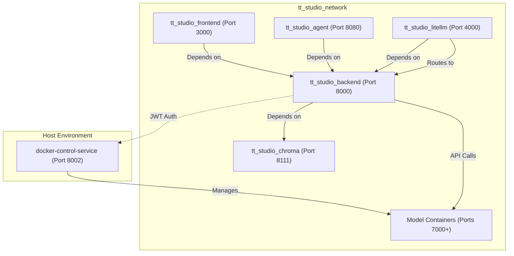
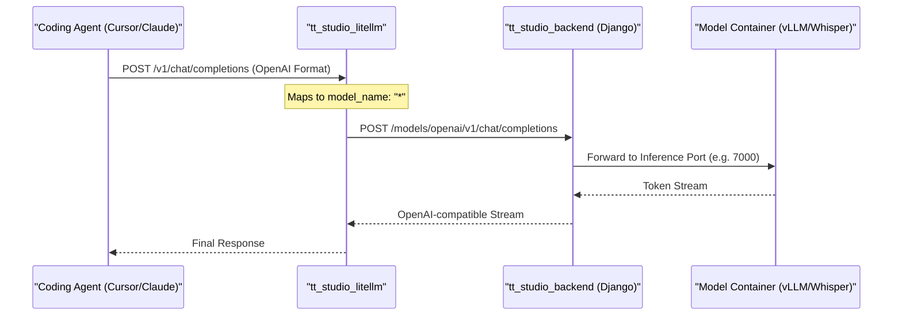

# Architecture Overview

TT-Studio is built as a distributed multi-service system orchestrated via Docker. It bridges high-level user interactions (web UI, AI agents) with low-level hardware execution on Tenstorrent AI accelerators. The architecture follows a microservices pattern where specific responsibilities—such as Docker lifecycle management, vector search, and model inference—are isolated into distinct containers.

## Multi-Service Topology

The system is defined by a core `docker-compose.yml` that establishes the networking and dependency graph for the platform.

### Core Services
* **tt_studio_backend**: A Django-based API (running via Uvicorn) that serves as the central orchestrator. It manages the model catalog, tracks deployment states, and interfaces with the vector database. It runs with 4 workers and includes a health check at `/up/`.
* **tt_studio_frontend**: A React 18 application built with Vite. It provides the user interface for model deployment, RAG management, and interactive chat.
* **tt_studio_agent**: A FastAPI service hosting a LangChain-based autonomous agent that can discover local LLMs and execute tools like Tavily search.
* **tt_studio_chroma**: A ChromaDB instance (v0.5.3) used for vector storage and semantic retrieval (RAG). It persists data to the host volume at `/chroma/chroma`.
* **tt_studio_litellm**: A LiteLLM gateway that provides an OpenAI/Anthropic compatible surface for coding agents, routing requests back to the Django backend.
* **docker-control-service**: A security-hardened FastAPI service running on the **host** (port 8002). It acts as a proxy for Docker socket operations, allowing the backend to manage containers without mounting `/var/run/docker.sock` directly into the backend container.

### Networking & Storage
All services communicate over a dedicated bridge network named `tt_studio_network`. Persistence is handled via host-mounted volumes defined by `HOST_PERSISTENT_STORAGE_VOLUME`, which stores ChromaDB data and backend application state. The backend also mounts `hf_cache` to persist embedding models across restarts.

**Service Dependency Graph**
The following diagram illustrates the startup sequence and inter-service dependencies.

---

## Data Flow & Service Interdependencies

The architecture utilizes a "Control Plane / Data Plane" split. The Backend and Docker Control Service form the control plane, while individual model containers represent the data plane.

### Model Deployment Flow
1.  **Request**: The Frontend sends a deployment request to `tt_studio_backend`.
2. **Orchestration**: The backend uses its internal logic to communicate with the `docker-control-service` via the `DOCKER_CONTROL_SERVICE_URL`.
3. **Execution**: `docker-control-service` pulls the image and runs the container. If Tenstorrent hardware is present, the `docker-compose.tt-hardware.yml` overlay mounts `/dev/tenstorrent` into the container.
4. **Logging**: Deployment logs are stored in `.artifacts/tt-inference-server/workflow_logs`, which the backend mounts as read-only to provide status updates to the UI.

### LiteLLM & Coding Agent Flow
LiteLLM acts as a protocol translator for external coding assistants (e.g., Cursor, Claude Code). It maps incoming OpenAI or Anthropic requests to the internal Django backend.

* **Upstream Routing**: Requests are routed to `http://tt-studio-backend-api:8000/models/openai/v1`.
* **Key Management**: Uses `LITELLM_MASTER_KEY` for gateway access and `LITELLM_UPSTREAM_KEY` for authenticating with the backend.

**Entity Mapping: Protocol Translation**

---

## System Configuration & Environment

The architecture is highly configurable via environment variables, typically managed by `run.py` during setup.

| Variable | Role | Implementation |
| :--- | :--- | :--- |
| `DOCKER_CONTROL_SERVICE_URL` | Points backend to the host service (usually port 8002) | |
| `TT_STUDIO_ROOT` | Absolute path for volume mounting and artifact access | |
| `JWT_SECRET` | Used for backend-to-agent and general service auth | |
| `DOCKER_CONTROL_JWT_SECRET` | Specifically for authenticating with the host Docker service | |
| `VITE_ENABLE_DEPLOYED` | Toggles "AI Playground" mode (skips local hardware checks) | |

### Security & Deployment Modes
The system supports multiple execution modes through Docker Compose overlays:
1. **Dev Mode**: Uses `docker-compose.dev-mode.yml` to mount local source code into `tt_studio_backend` and `tt_studio_frontend` for hot-reloading.
2. **Hardware Mode**: Uses `docker-compose.tt-hardware.yml` to mount `/dev/tenstorrent` devices. The backend container attempts to install `tt-smi` during build if not in Playground mode.
3. **Network Security**: Services are isolated within `tt_studio_network`. The backend uses `extra_hosts` to resolve `host.docker.internal` for communicating with the host-side `docker-control-service`.

---

:::{admonition} Source files this page was written from
:class: dropdown tt-sources

Captured at commit [`c837b829`](https://github.com/tenstorrent/tt-studio/commit/c837b829), so the linked line numbers match that revision.

- [`.vscode/extensions.json`](https://github.com/tenstorrent/tt-studio/blob/c837b829/.vscode/extensions.json)
- [`.vscode/settings.json`](https://github.com/tenstorrent/tt-studio/blob/c837b829/.vscode/settings.json)
- [`README.md`](https://github.com/tenstorrent/tt-studio/blob/c837b829/README.md)
- [`app/README.md`](https://github.com/tenstorrent/tt-studio/blob/c837b829/app/README.md)
- [`app/backend/Dockerfile`](https://github.com/tenstorrent/tt-studio/blob/c837b829/app/backend/Dockerfile)
- [`app/docker-compose.yml`](https://github.com/tenstorrent/tt-studio/blob/c837b829/app/docker-compose.yml)
- [`app/frontend/index.html`](https://github.com/tenstorrent/tt-studio/blob/c837b829/app/frontend/index.html)
- [`app/litellm/config.yaml`](https://github.com/tenstorrent/tt-studio/blob/c837b829/app/litellm/config.yaml)
:::
