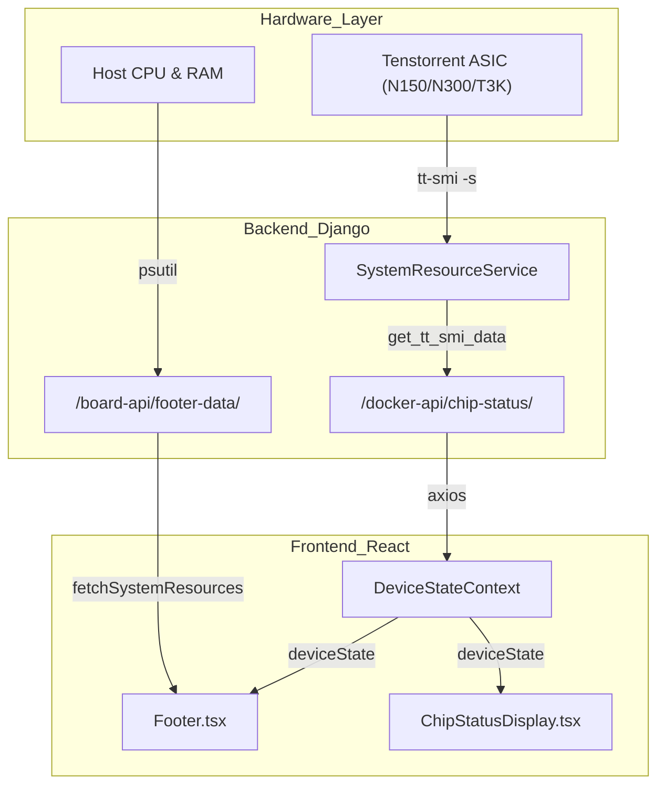
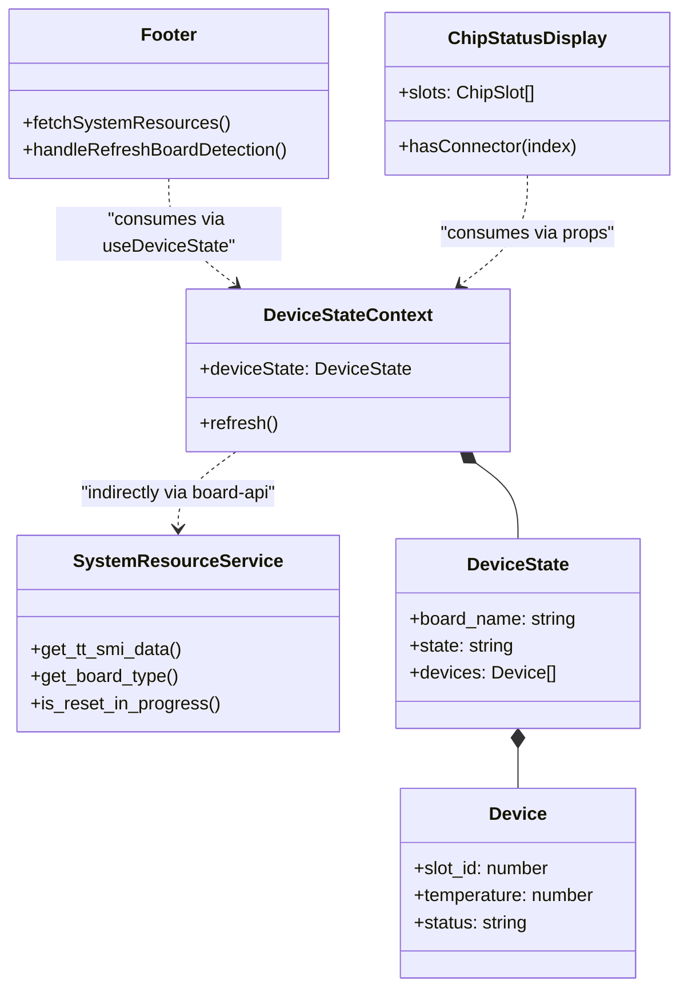

# Board Control & Hardware Monitoring

Relevant source files

<ul>
<li><a href="https://github.com/tenstorrent/tt-studio/blob/c837b829/app/backend/board_control/services.py">app/backend/board_control/services.py</a></li>
<li><a href="https://github.com/tenstorrent/tt-studio/blob/c837b829/app/frontend/src/components/Footer.tsx">app/frontend/src/components/Footer.tsx</a></li>
<li><a href="https://github.com/tenstorrent/tt-studio/blob/c837b829/app/frontend/src/components/imageGen/StableDiffusionChat.tsx">app/frontend/src/components/imageGen/StableDiffusionChat.tsx</a></li>
</ul>

The `board_control` app is responsible for hardware detection, system resource monitoring, and providing real-time telemetry for Tenstorrent devices. It serves as the bridge between the physical hardware and the UI, ensuring that users are informed of chip availability, thermal status, and system-level bottlenecks (CPU/RAM).

## System Architecture & Data Flow

Hardware monitoring in TT-Studio follows a polling architecture where the frontend periodically requests system and device state. The data is aggregated from host-level utilities (for CPU/RAM) and Tenstorrent-specific drivers via `tt-smi` (for chip telemetry).

### Data Aggregation Flow

The following diagram illustrates how hardware data flows from the physical silicon to the `Footer.tsx` and `ChipStatusDisplay.tsx` components.

**Hardware Telemetry Flow**

---

## Core Components

### 1. System Resource Service (`services.py`)
The `SystemResourceService` class is the primary backend logic provider for hardware monitoring.

* **Telemetry Acquisition:** Uses `subprocess.Popen` to execute `tt-smi -s` and parse the resulting JSON output.
* **Caching Strategy:** Implements Django-based caching for `tt-smi` data (`TT_SMI_CACHE_KEY`) and board type (`BOARD_TYPE_CACHE_KEY`) to minimize expensive CLI calls.
* **Reset Monitoring:** Detects if a hardware reset is in progress by checking for a `reset_all_status.json` file in the backend cache root via `_board_reset_job_active` or a specific cache key `DEVICE_RESETTING_KEY`.
* **Board Type Detection:** Identifies the hardware configuration (e.g., Galaxy, Nebula) by inspecting `board_info` in the `tt-smi` data and validating homogeneity across chips.

### 2. Footer Telemetry (`Footer.tsx`)
The `Footer` component acts as a persistent status bar. It aggregates high-level system metrics and hardware health alerts.

* **System Resources:** Fetches CPU usage, memory usage, and total memory via the `fetchSystemResources` function which calls the `/board-api/footer-data/` endpoint.
* **Board State:** Derives board name, state, and average temperature from the `DeviceStateContext`.
* **Health Alerts:** Detects `BAD_STATE` or `NOT_PRESENT` statuses to trigger hardware error UI states.
* **Manual Refresh:** Provides a `handleRefreshBoardDetection` function with a 2-minute cooldown (`REFRESH_COOLDOWN_MS`) to trigger a re-poll of the hardware state via `refreshDeviceState()`.

### 3. Chip Configuration & Status
The system monitors chip availability to prevent resource contention during model deployment.

* **Chip Status Polling:** Components consume `deviceState` which provides real-time updates on chip occupancy and temperature.
* **Slot Management:** The `ChipSlot` interface tracks whether a slot is `available` or `occupied`, its `slot_id`, and identifies if a chip is part of a `is_multi_chip` deployment.
* **Board Grouping:** Certain boards like `P300x2` and `P300Cx4` group chips into physical cards. The `ChipStatusDisplay` handles this using the `CARD_GROUPINGS` constant to map chips to their respective card labels.

---

## Hardware Detection Logic

The application categorizes hardware based on the detected board type, which influences the UI layout and grouping.

| Board Type | Chips Per Card | Card Label |
| :--- | :--- | :--- |
| **P300x2** | 2 | P300 Card |
| **P300Cx4** | 2 | P300 Card |
| **Default** | Flat Layout | N/A |

---

## Implementation Details

### Device State Context
The `DeviceStateContext` is the primary source of truth for hardware health across the frontend. It provides the `deviceState` object which includes:
*   `board_name`: The detected Tenstorrent board (e.g., "Galaxy", "Nebula").
*   `state`: Current operational status (e.g., "ACTIVE", "BAD_STATE", "RESETTING").
*   `devices`: An array of individual chip telemetry (temperature, `slot_id`).

**Code Entity Relationship**

### Manual Re-detection
When hardware is not detected correctly or a "BAD_STATE" is encountered, the `Footer` component allows users to trigger a refresh. This calls `refreshDeviceState()` from the context, which initiates a new backend scan of the PCIe bus and Tenstorrent drivers.

### Visualizing Occupancy
The `ChipStatusDisplay` component visualizes the physical layout of the chips. If two adjacent chips are occupied and marked as `is_multi_chip`, it renders a "connector" line using the `hasConnector` function to indicate they are logically linked for a single model deployment.

