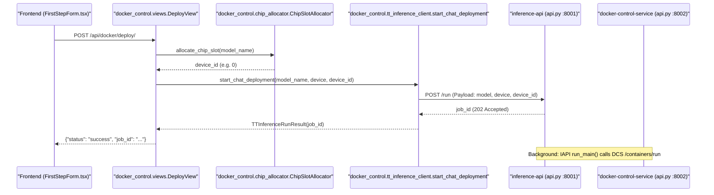

# Docker Control & Container Lifecycle

<details>
<summary>Relevant source files</summary>
<ul>
<li><a href="https://github.com/tenstorrent/tt-studio/blob/c837b829/app/backend/docker_control/apps.py">app/backend/docker_control/apps.py</a></li>
<li><a href="https://github.com/tenstorrent/tt-studio/blob/c837b829/app/backend/docker_control/chip_allocator.py">app/backend/docker_control/chip_allocator.py</a></li>
<li><a href="https://github.com/tenstorrent/tt-studio/blob/c837b829/app/backend/docker_control/deployment_store.py">app/backend/docker_control/deployment_store.py</a></li>
<li><a href="https://github.com/tenstorrent/tt-studio/blob/c837b829/app/backend/docker_control/docker_utils.py">app/backend/docker_control/docker_utils.py</a></li>
<li><a href="https://github.com/tenstorrent/tt-studio/blob/c837b829/app/backend/docker_control/health_monitor.py">app/backend/docker_control/health_monitor.py</a></li>
<li><a href="https://github.com/tenstorrent/tt-studio/blob/c837b829/app/backend/docker_control/serializers.py">app/backend/docker_control/serializers.py</a></li>
<li><a href="https://github.com/tenstorrent/tt-studio/blob/c837b829/app/backend/docker_control/tests.py">app/backend/docker_control/tests.py</a></li>
<li><a href="https://github.com/tenstorrent/tt-studio/blob/c837b829/app/backend/docker_control/tt_inference_client.py">app/backend/docker_control/tt_inference_client.py</a></li>
<li><a href="https://github.com/tenstorrent/tt-studio/blob/c837b829/app/backend/docker_control/urls.py">app/backend/docker_control/urls.py</a></li>
<li><a href="https://github.com/tenstorrent/tt-studio/blob/c837b829/app/backend/docker_control/views.py">app/backend/docker_control/views.py</a></li>
<li><a href="https://github.com/tenstorrent/tt-studio/blob/c837b829/app/backend/model_control/model_utils.py">app/backend/model_control/model_utils.py</a></li>
<li><a href="https://github.com/tenstorrent/tt-studio/blob/c837b829/app/backend/model_control/views.py">app/backend/model_control/views.py</a></li>
<li><a href="https://github.com/tenstorrent/tt-studio/blob/c837b829/app/frontend/src/components/FirstStepForm.tsx">app/frontend/src/components/FirstStepForm.tsx</a></li>
<li><a href="https://github.com/tenstorrent/tt-studio/blob/c837b829/docker-control-service/api.py">docker-control-service/api.py</a></li>
<li><a href="https://github.com/tenstorrent/tt-studio/blob/c837b829/inference-api/api.py">inference-api/api.py</a></li>
</ul>
</details>

The `docker_control` Django app is the core orchestration engine for managing AI model containers within TT-Studio. It manages the full lifecycle of inference containers—from hardware capability detection and chip slot allocation to deployment via the `inference-api` and continuous health monitoring.

## Architecture & Data Flow

The system operates as a bridge between the user-facing Django backend and the hardware-level Docker operations. To maintain security and avoid mounting the Docker socket directly into the web-facing container, all Docker commands are proxied through the `docker-control-service`.

### Deployment Orchestration Flow

This diagram illustrates the flow from a frontend deployment request to a running model container, highlighting the code entities involved in the transition.

"Deployment Orchestration Flow"


## Deployment Store (JSON ORM)

TT-Studio uses a thread-safe JSON-backed store instead of a traditional Django SQLite database for deployment metadata. This ensures that deployment state persists across backend container restarts without requiring complex database migrations.

The `ModelDeployment` class in `deployment_store.py` provides a drop-in ORM-like interface:
* **Location**: Determined by `backend_config.backend_cache_root`, typically within the persistent volume at `tenstorrent/deployments.json`.
* **Managers**: Implements `objects.create()`, `objects.filter()`, and `objects.all()` using a `DeploymentManager`.
* **Concurrency**: Uses `threading.Lock()` to prevent race conditions during file I/O.
* **Normalization**: Automatically handles `device_ids` (multi-chip) vs `device_id` (single-chip) fields to support various board topologies.

## Chip Slot Allocation

The `ChipSlotAllocator` manages the mapping between Tenstorrent hardware (chips) and model containers. It prevents resource over-subscription by tracking which `slot_id` is currently occupied.

| Feature | Description |
| :--- | :--- |
| **Board Detection** | Uses `detect_board_type()` to identify installed hardware via `tt-smi`. |
| **Slot Count** | Maps board types to total available slots (e.g., Galaxy=32, T3K=4, P150X8=8). |
| **Multi-Chip Support** | Models requiring 4 chips (e.g. Llama-3-70B) occupy all slots on a 4-chip card. |
| **Validation** | `_validate_manual_allocation` ensures a user-selected chip is not already occupied. |

## Container Lifecycle Management

### Health Monitoring
The `health_monitor.py` module runs a background thread that polls the status of all containers marked as `running` in the `ModelDeployment` store every 5 seconds.

1. **Unexpected Death Detection**: If `docker_client.get_container()` reports a status other than `running` or `restarting`, the database record is updated to the actual status (e.g., `exited`, `dead`).
2. **Stale Record Cleanup**: Cleans up `starting` records that fail to transition. `pending_*` records are purged after 10 minutes, while FastAPI `job_id` records are timed out after 35 minutes to allow for large weight downloads.

### Deployment Sync
The `deployment_sync.py` module bridges the gap between the `inference-api`'s asynchronous `/run` jobs and the backend's deployment state. 

* **Polling**: It spawns a per-job daemon thread that polls the FastAPI `/run/progress/{job_id}` endpoint.
* **State Transition**: On `completed`, it swaps the `job_id` placeholder for the real Docker `container_id` and marks the status as `running`.
* **User Cancellation**: If a user stops a deployment while it is still in the `starting` phase, `_do_sync` ensures the container is cleaned up immediately upon completion.

## Integration Components

### TT Inference Client
The `tt_inference_client.py` is a specialized wrapper for the `inference-api`. Its primary function, `start_chat_deployment`, sends a standardized payload to the FastAPI service on port 8001.

* **Endpoint**: `http://172.18.0.1:8001/run`.
* **Payload**: Includes `model`, `workflow`, `device`, `device_id`, and `dev_mode` flags.

### Docker Control Client
The `DockerControlClient` communicates with the `docker-control-service` (port 8002) using JWT authentication. It replaces direct Docker SDK usage to ensure the backend container does not require `/var/run/docker.sock` access.

"Docker Control Interface Mapping"
```mermaid
classDiagram
    class "docker_control.docker_control_client.DockerControlClient" {
        +list_containers(all, filters)
        +run_container(image, name, ports, env)
        +stop_container(container_id)
        +get_container(container_id)
    }
    class "docker_control.views.ContainersView" {
        +get(request)
    }
    class "docker_control.docker_utils" {
        +_ensure_network()
        +_run_direct_container(impl, weights_id)
    }

    "docker_control.views.ContainersView" ..> "docker_control.docker_control_client.DockerControlClient" : uses list_containers()
    "docker_control.docker_utils" ..> "docker_control.docker_control_client.DockerControlClient" : uses get_docker_client()
    "docker_control.health_monitor" ..> "docker_control.docker_control_client.DockerControlClient" : uses get_container()
```

## Key Functions Reference

| Function | File | Purpose |
| :--- | :--- | :--- |
| `_poll_deployment_to_completion` | `docker_utils.py` | Blocks until a FastAPI deployment job reaches a terminal state. |
| `map_board_type_to_device_name` | `docker_utils.py` | Converts internal board strings (e.g., "T3K") to Inference Server device names (e.g., "t3k"). |
| `_ensure_network` | `docker_utils.py` | Ensures the `tt_studio_network` exists via the `docker-control-service` on module load. |
| `_run_direct_container` | `docker_utils.py` | Runs containers directly (bypassing Inference Server) for non-chat models like `FACE_RECOGNITION`. |
| `resolve_deploy_image` | `tt_inference_client.py` | Asks the Inference Server which image it will actually deploy for a model to enable accurate pre-pulling. |

