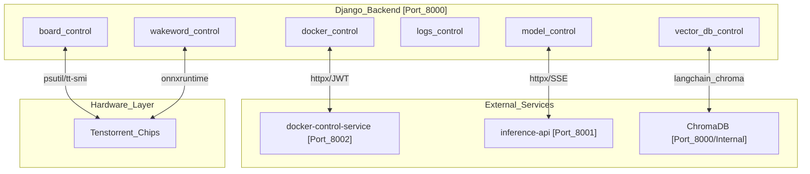
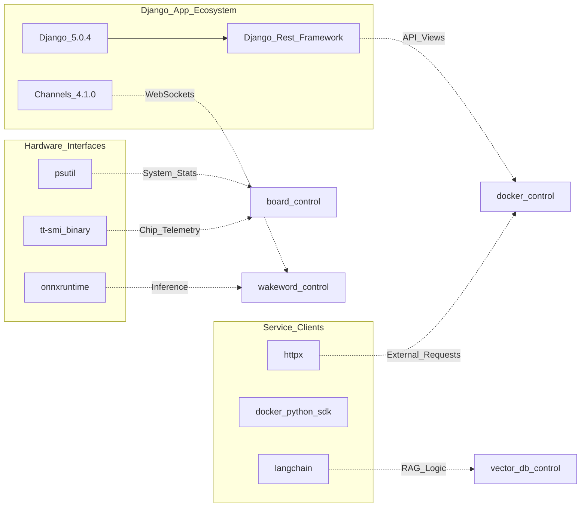

# Backend Services

The TT-Studio Backend is a Django-based application responsible for orchestrating model lifecycles, managing hardware resources, and providing the primary API for the frontend. It operates as a central hub, coordinating between the `docker-control-service`, `inference-api`, and various model containers.

The backend runs inside a Docker container, typically accessible on port `8000`. It utilizes a `python:3.12.8-slim-bookworm` base. Notably, the backend container does not mount `/var/run/docker.sock` directly; all Docker operations are proxied via HTTP with JWT authentication to ensure security.

## Backend Architecture & Service Map

The backend is organized into several specialized Django apps, each handling a distinct domain of the TT-Studio ecosystem. It relies on `uvicorn` and `gunicorn` for serving requests.

### Backend Service Interaction


### Code Entity Mapping: Core Dependencies to App Logic


---

## Subsystems Overview

### Docker Control & Container Lifecycle
The `docker_control` app is the primary interface for managing model containers. It manages the deployment store and translates frontend requests into container lifecycle events (pull, run, stop) via the `docker-control-service`.

*   **Key Logic**: Handles chip slot allocation and volume management for model weights.
* **Implementation**: Uses `httpx` for asynchronous communication with the control proxy.
*   **For details, see [Docker Control & Container Lifecycle](docker-control.md)**.

### Model Control & Inference Pipeline
The `model_control` app manages the high-level inference logic and the model catalog. It routes inference requests to the appropriate model container via the `inference-api` bridge.

*   **Key Logic**: Orchestrates voice pipelines (Whisper to LLM) and tracks performance metrics like TTFT and TPOT.
*   **Model Catalog**: Interprets `ModelImpl` configurations to determine hardware requirements.
*   **For details, see [Model Control & Inference Pipeline](model-control.md)**.

### Vector DB Control (RAG Backend)
This app manages the integration with ChromaDB to provide Retrieval-Augmented Generation (RAG) capabilities. It uses `langchain` and `sentence-transformers` for processing documents.

* **Key Logic**: Handles document ingestion (PDF, Docx), chunking, and embedding generation.
*   **For details, see [Vector DB Control (RAG Backend)](vector-db-control.md)**.

### Board Control & Hardware Monitoring
The `board_control` app provides real-time telemetry for the host system and Tenstorrent hardware. The backend container conditionally installs `tt-smi` (v4.1.2) via Rust to facilitate hardware detection in local mode.

* **Key Logic**: Uses `psutil` for CPU/RAM monitoring and `tt-smi` for Tenstorrent chip telemetry.
*   **For details, see [Board Control & Hardware Monitoring](board-control.md)**.

### Logs Control & Bug Reporting
This app aggregates logs from all services in the `tt_studio_network`. It provides a unified streaming API for the frontend and generates diagnostic bug reports.

*   **Key Logic**: Real-time log streaming and aggregation across multi-container deployments.
*   **For details, see [Logs Control & Bug Reporting](logs-control.md)**.

---

### Core Configuration & Development
The backend environment is strictly controlled. It includes specific workarounds for dependencies like `openwakeword` (v0.6.0), which is installed without dependencies to avoid Python 3.12 wheel conflicts with `tflite-runtime`, relying instead on `onnxruntime`,.

For development, the project includes VS Code settings for consistent formatting via ESLint and Prettier,.

---

:::{admonition} Source files this page was written from
:class: dropdown tt-sources

Captured at commit [`c837b829`](https://github.com/tenstorrent/tt-studio/commit/c837b829), so the linked line numbers match that revision.

- [`.vscode/extensions.json`](https://github.com/tenstorrent/tt-studio/blob/c837b829/.vscode/extensions.json)
- [`.vscode/settings.json`](https://github.com/tenstorrent/tt-studio/blob/c837b829/.vscode/settings.json)
- [`app/backend/Dockerfile`](https://github.com/tenstorrent/tt-studio/blob/c837b829/app/backend/Dockerfile)
- [`app/backend/requirements.txt`](https://github.com/tenstorrent/tt-studio/blob/c837b829/app/backend/requirements.txt)
:::

```{toctree}
:hidden:
:maxdepth: 2

docker-control
model-control
vector-db-control
board-control
logs-control
```
