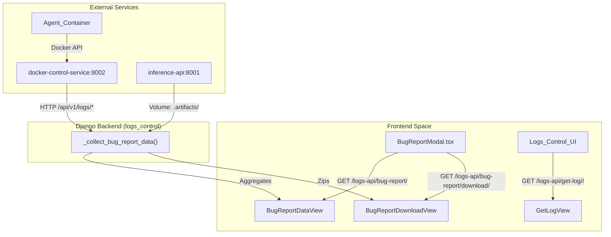
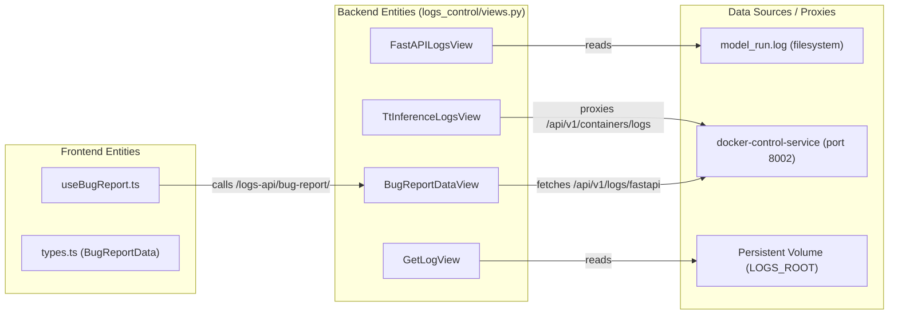

# Logs Control & Bug Reporting

Relevant source files

<ul>
<li><a href="https://github.com/tenstorrent/tt-studio/blob/c837b829/app/backend/docker_control/deployment_sync.py">app/backend/docker_control/deployment_sync.py</a></li>
<li><a href="https://github.com/tenstorrent/tt-studio/blob/c837b829/app/backend/logs_control/views.py">app/backend/logs_control/views.py</a></li>
<li><a href="https://github.com/tenstorrent/tt-studio/blob/c837b829/app/backend/shared_config/models_from_inference_server.json">app/backend/shared_config/models_from_inference_server.json</a></li>
<li><a href="https://github.com/tenstorrent/tt-studio/blob/c837b829/app/frontend/src/components/bug-report/types.ts">app/frontend/src/components/bug-report/types.ts</a></li>
<li><a href="https://github.com/tenstorrent/tt-studio/blob/c837b829/app/frontend/src/components/bug-report/useBugReport.ts">app/frontend/src/components/bug-report/useBugReport.ts</a></li>
<li><a href="https://github.com/tenstorrent/tt-studio/blob/c837b829/docker-control-service/routers/logs.py">docker-control-service/routers/logs.py</a></li>
</ul>

The `logs_control` Django application is responsible for centralizing system diagnostics, providing log retrieval for system services, and orchestrating the generation of comprehensive bug reports. It aggregates data from the backend, the `docker-control-service`, the AI agent, and inference artifacts.

## Architecture & Data Flow

The `logs_control` app acts as an aggregator. While some logs (like the Django backend logs) are stored locally on a persistent volume, others must be fetched via HTTP from sibling services or read from shared Docker volumes.

### Log Aggregation Topology

The following diagram illustrates how `logs_control` gathers data from across the TT-Studio ecosystem to provide a unified view.

**Log Collection Architecture**

Sources: [app/backend/logs_control/views.py:32-47](https://github.com/tenstorrent/tt-studio/blob/c837b829/app/backend/logs_control/views.py#L32-L47), [app/backend/logs_control/views.py:228-232](https://github.com/tenstorrent/tt-studio/blob/c837b829/app/backend/logs_control/views.py#L228-L232), [app/frontend/src/components/bug-report/useBugReport.ts:209-211](https://github.com/tenstorrent/tt-studio/blob/c837b829/app/frontend/src/components/bug-report/useBugReport.ts#L209-L211), [docker-control-service/routers/logs.py:23-45](https://github.com/tenstorrent/tt-studio/blob/c837b829/docker-control-service/routers/logs.py#L23-L45)

## Bug Reporting System

The bug reporting system is designed to simplify troubleshooting by bundling environment state, logs, and hardware telemetry into a single ZIP archive.

### Bug Report Manifest
The system follows a strict manifest defined in `BUG_REPORT_MANIFEST` to ensure all critical debugging information is captured.

| Data Key | Destination in ZIP | Source Mechanism |
| :--- | :--- | :--- |
| `backend_log` | `backend.log` | Persistent volume `backend_volume/python_logs/` |
| `model_run_log` | `model_run.log` | Proxy to `docker-control-service` `/api/v1/logs/fastapi` |
| `model_run_deployment_logs`| `model_run_logs/<name>.log` | Volume mount `TT_STUDIO_ROOT/logs/model_run_logs/` |
| `docker_control_log`| `docker-control-service.log` | Proxy to `docker-control-service` `/api/v1/logs/service` |
| `agent_log` | `agent.log` | Container logs via `docker-control-service` |
| `inference_run_logs`| `inference_artifacts/run_logs/` | Volume `.artifacts/tt-inference-server/workflow_logs/` |
| `tt_smi` | `tt_smi.json` | `board_control.services.SystemResourceService` |
| `deployments` | `deployments.json` | `backend_volume/deployments.json` |
| `current_models` | `current_models.json` | Snapshot of `docker-control` and `model_control` cache |

Sources: [app/backend/logs_control/views.py:32-47](https://github.com/tenstorrent/tt-studio/blob/c837b829/app/backend/logs_control/views.py#L32-L47)

### Implementation Details
1.  **Collection**: The `_collect_bug_report_data` function gathers metadata and small log snippets to show a preview in the UI [app/backend/logs_control/views.py:228-232](https://github.com/tenstorrent/tt-studio/blob/c837b829/app/backend/logs_control/views.py#L228-L232).
2.  **ZIP Generation**: `BugReportDownloadView` performs the heavy lifting. It creates an in-memory ZIP file using `zipfile.ZipFile(io.BytesIO())` [app/backend/logs_control/views.py:461-464](https://github.com/tenstorrent/tt-studio/blob/c837b829/app/backend/logs_control/views.py#L461-L464).
3.  **Frontend Integration**: The `useBugReport` hook manages the multi-step collection process: `form` → `collecting` → `actions` [app/frontend/src/components/bug-report/useBugReport.ts:189-201](https://github.com/tenstorrent/tt-studio/blob/c837b829/app/frontend/src/components/bug-report/useBugReport.ts#L189-L201). It generates a stable `diagnosticsRef` (e.g., `ttbr-abcd...`) to link the ZIP file to a GitHub issue [app/frontend/src/components/bug-report/useBugReport.ts:54-60](https://github.com/tenstorrent/tt-studio/blob/c837b829/app/frontend/src/components/bug-report/useBugReport.ts#L54-L60).

## Log Retrieval & Monitoring

TT-Studio provides access to logs for various system components through specialized views.

### Code Entity Relationship: Log Access
The following diagram maps the frontend UI components to the backend views and the underlying log sources they access.

**Log Access Mapping**

Sources: [app/backend/logs_control/views.py:118-123](https://github.com/tenstorrent/tt-studio/blob/c837b829/app/backend/logs_control/views.py#L118-L123), [app/backend/logs_control/views.py:164-167](https://github.com/tenstorrent/tt-studio/blob/c837b829/app/backend/logs_control/views.py#L164-L167), [app/backend/logs_control/views.py:85-90](https://github.com/tenstorrent/tt-studio/blob/c837b829/app/backend/logs_control/views.py#L85-L90), [app/frontend/src/components/bug-report/types.ts:11-25](https://github.com/tenstorrent/tt-studio/blob/c837b829/app/frontend/src/components/bug-report/types.ts#L11-L25), [docker-control-service/routers/logs.py:39-44](https://github.com/tenstorrent/tt-studio/blob/c837b829/docker-control-service/routers/logs.py#L39-L44)

### Key Functions and Classes

#### Backend: `logs_control/views.py`
*   `ListLogsView`: Recursively builds a JSON tree of all `.log` files found in `LOGS_ROOT` [app/backend/logs_control/views.py:50-82](https://github.com/tenstorrent/tt-studio/blob/c837b829/app/backend/logs_control/views.py#L50-L82).
*   `GetLogView`: Retrieves the raw content of a specific log file, including security checks to prevent directory traversal by validating that the path starts with `LOGS_ROOT` [app/backend/logs_control/views.py:85-115](https://github.com/tenstorrent/tt-studio/blob/c837b829/app/backend/logs_control/views.py#L85-L115).
*   `FastAPILogsView`: Attempts to find and return the last 20 lines of `model_run.log` (formerly `fastapi.log`) from several possible relative and absolute paths [app/backend/logs_control/views.py:118-161](https://github.com/tenstorrent/tt-studio/blob/c837b829/app/backend/logs_control/views.py#L118-L161).
*   `TtInferenceLogsView`: Specifically handles logs for inference containers by proxying requests to the `docker-control-service` [app/backend/logs_control/views.py:164-180](https://github.com/tenstorrent/tt-studio/blob/c837b829/app/backend/logs_control/views.py#L164-L180).
*   `BugReportDownloadView`: Orchestrates the `zipfile` creation, including fetching logs from the `docker-control-service` via `urllib.request` and reading local artifacts [app/backend/logs_control/views.py:448-520](https://github.com/tenstorrent/tt-studio/blob/c837b829/app/backend/logs_control/views.py#L448-L520).

#### Docker Control Service: `routers/logs.py`
*   `get_service_log`: Serves the `docker-control-service.log` using `_read_tail` [docker-control-service/routers/logs.py:23-28](https://github.com/tenstorrent/tt-studio/blob/c837b829/docker-control-service/routers/logs.py#L23-L28).
*   `get_fastapi_log`: Serves the `model_run.log` from the perspective of the control service [docker-control-service/routers/logs.py:39-44](https://github.com/tenstorrent/tt-studio/blob/c837b829/docker-control-service/routers/logs.py#L39-L44).

#### Frontend: `bug-report/`
*   `useBugReport`: A custom hook that encapsulates the logic for calling the bug report endpoints, managing the collection status of various log sources, and handling the ZIP download [app/frontend/src/components/bug-report/useBugReport.ts:188-233](https://github.com/tenstorrent/tt-studio/blob/c837b829/app/frontend/src/components/bug-report/useBugReport.ts#L188-L233).
*   `buildIssueBody`: Generates a concise Markdown body for GitHub issues that includes the `diagnosticsRef` [app/frontend/src/components/bug-report/useBugReport.ts:63-94](https://github.com/tenstorrent/tt-studio/blob/c837b829/app/frontend/src/components/bug-report/useBugReport.ts#L63-L94).

## File System & Environment
The app relies on two primary environment variables for log location:
1.  `INTERNAL_PERSISTENT_STORAGE_VOLUME`: The base path (aliased as `LOGS_ROOT`) for persistent backend logs [app/backend/logs_control/views.py:24](https://github.com/tenstorrent/tt-studio/blob/c837b829/app/backend/logs_control/views.py#L24).
2.  `TT_STUDIO_ROOT`: The root directory used to locate inference artifacts and internal logs [app/backend/logs_control/views.py:25](https://github.com/tenstorrent/tt-studio/blob/c837b829/app/backend/logs_control/views.py#L25).

Sources: [app/backend/logs_control/views.py:24-25](https://github.com/tenstorrent/tt-studio/blob/c837b829/app/backend/logs_control/views.py#L24-L25)
