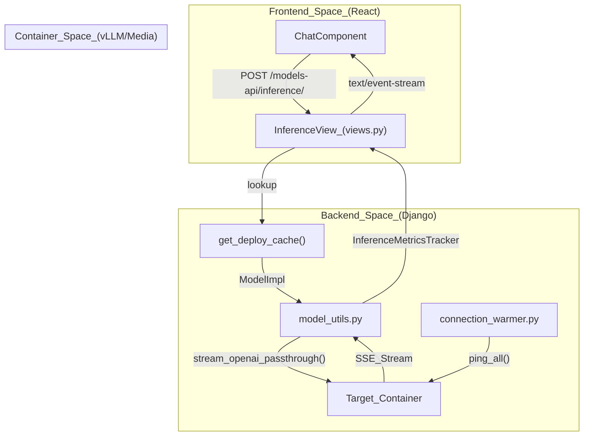
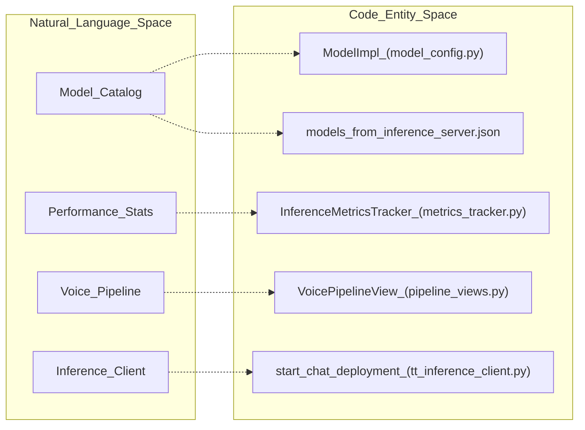

# Model Control & Inference Pipeline

Relevant source files

<ul>
<li><a href="https://github.com/tenstorrent/tt-studio/blob/c837b829/app/backend/docker_control/deployment_sync.py">app/backend/docker_control/deployment_sync.py</a></li>
<li><a href="https://github.com/tenstorrent/tt-studio/blob/c837b829/app/backend/docker_control/tt_inference_client.py">app/backend/docker_control/tt_inference_client.py</a></li>
<li><a href="https://github.com/tenstorrent/tt-studio/blob/c837b829/app/backend/logs_control/views.py">app/backend/logs_control/views.py</a></li>
<li><a href="https://github.com/tenstorrent/tt-studio/blob/c837b829/app/backend/model_control/connection_warmer.py">app/backend/model_control/connection_warmer.py</a></li>
<li><a href="https://github.com/tenstorrent/tt-studio/blob/c837b829/app/backend/model_control/model_utils.py">app/backend/model_control/model_utils.py</a></li>
<li><a href="https://github.com/tenstorrent/tt-studio/blob/c837b829/app/backend/model_control/pipeline_views.py">app/backend/model_control/pipeline_views.py</a></li>
<li><a href="https://github.com/tenstorrent/tt-studio/blob/c837b829/app/backend/model_control/urls.py">app/backend/model_control/urls.py</a></li>
<li><a href="https://github.com/tenstorrent/tt-studio/blob/c837b829/app/backend/shared_config/models_from_inference_server.json">app/backend/shared_config/models_from_inference_server.json</a></li>
<li><a href="https://github.com/tenstorrent/tt-studio/blob/c837b829/app/frontend/src/components/FirstStepForm.tsx">app/frontend/src/components/FirstStepForm.tsx</a></li>
<li><a href="https://github.com/tenstorrent/tt-studio/blob/c837b829/inference-api/api.py">inference-api/api.py</a></li>
</ul>

The `model_control` Django app is the central orchestrator for model metadata, inference request routing, and performance tracking. It manages the lifecycle of inference requests from the frontend to deployed model containers, handles Server-Sent Events (SSE) streaming, and implements a multi-stage voice pipeline.

## Model Configuration & Catalog

TT-Studio uses a structured catalog to define model capabilities, hardware requirements, and container environments.

### ModelImpl and Metadata
The `ModelImpl` dataclass [app/backend/shared_config/model_config.py:44-67](https://github.com/tenstorrent/tt-studio/blob/c837b829/app/backend/shared_config/model_config.py#L44-L67) is the primary configuration entity. It encapsulates:
*   **Hardware Compatibility**: Defined via `device_configurations` (e.g., `GALAXY`, `N150`, `T3K`) [app/backend/shared_config/model_config.py:51](https://github.com/tenstorrent/tt-studio/blob/c837b829/app/backend/shared_config/model_config.py#L51).
*   **Docker Runtime**: Includes `image_name`, `shm_size` (defaulting to 32G), and volume mounts for weights [app/backend/shared_config/model_config.py:49-73](https://github.com/tenstorrent/tt-studio/blob/c837b829/app/backend/shared_config/model_config.py#L49-L73).
*   **Environment Injection**: Automatically configures `HF_HOME` and `WH_ARCH_YAML` based on the selected hardware [app/backend/shared_config/model_config.py:75-89](https://github.com/tenstorrent/tt-studio/blob/c837b829/app/backend/shared_config/model_config.py#L75-L89).
*   **Service Interface**: Defines the `service_route` (e.g., `/v1/chat/completions`) and `health_route` [app/backend/shared_config/model_config.py:53-64](https://github.com/tenstorrent/tt-studio/blob/c837b829/app/backend/shared_config/model_config.py#L53-L64).

### The Model Catalog
The system loads model definitions from `models_from_inference_server.json`. This file maps high-level model names (e.g., "Llama-3.1-8B-Instruct") to specific implementation details required for deployment [app/backend/shared_config/models_from_inference_server.json:64-94](https://github.com/tenstorrent/tt-studio/blob/c837b829/app/backend/shared_config/models_from_inference_server.json#L64-L94).

| Field | Description |
| :--- | :--- |
| `model_type` | Category (e.g., `CHAT`, `IMAGE_GENERATION`, `SPEECH_RECOGNITION`) [app/backend/shared_config/models_from_inference_server.json:65](https://github.com/tenstorrent/tt-studio/blob/c837b829/app/backend/shared_config/models_from_inference_server.json#L65) |
| `inference_engine` | The underlying server (e.g., `vLLM`, `media`, `forge`) [app/backend/shared_config/models_from_inference_server.json:81](https://github.com/tenstorrent/tt-studio/blob/c837b829/app/backend/shared_config/models_from_inference_server.json#L81) |
| `docker_image` | The specific GHCR image reference for the model version [app/backend/shared_config/models_from_inference_server.json:84](https://github.com/tenstorrent/tt-studio/blob/c837b829/app/backend/shared_config/models_from_inference_server.json#L84) |

**Sources:** [app/backend/shared_config/model_config.py:44-89](https://github.com/tenstorrent/tt-studio/blob/c837b829/app/backend/shared_config/model_config.py#L44-L89), [app/backend/shared_config/models_from_inference_server.json:1-231](https://github.com/tenstorrent/tt-studio/blob/c837b829/app/backend/shared_config/models_from_inference_server.json#L1-L231), [app/backend/model_control/apps.py:18-22](https://github.com/tenstorrent/tt-studio/blob/c837b829/app/backend/model_control/apps.py#L18-L22)

---

## Inference Execution Flow

Inference requests are handled through a multi-layered bridge that connects the React frontend to the model containers.

### Deployment Initiation
When a user selects a model in `FirstStepForm.tsx` [app/frontend/src/components/FirstStepForm.tsx:173-202](https://github.com/tenstorrent/tt-studio/blob/c837b829/app/frontend/src/components/FirstStepForm.tsx#L173-L202), the backend uses the `tt_inference_client` to start the deployment. The `start_chat_deployment` function sends a POST request to the `inference-api` (port 8001) `/run` endpoint [app/backend/docker_control/tt_inference_client.py:84-123](https://github.com/tenstorrent/tt-studio/blob/c837b829/app/backend/docker_control/tt_inference_client.py#L84-L123). This bridge uses `TTInferenceRunResult` to communicate deployment status and `job_id` back to the UI [app/backend/docker_control/tt_inference_client.py:16-21](https://github.com/tenstorrent/tt-studio/blob/c837b829/app/backend/docker_control/tt_inference_client.py#L16-L21).

### Lifecycle Synchronization
Because deployments are asynchronous, the `deployment_sync.py` module manages the transition from a "starting" placeholder to a "running" state [app/backend/docker_control/deployment_sync.py:5-22](https://github.com/tenstorrent/tt-studio/blob/c837b829/app/backend/docker_control/deployment_sync.py#L5-L22). The `_poll_and_sync` function polls the FastAPI `/run/progress/{job_id}` endpoint [app/backend/docker_control/deployment_sync.py:120-132](https://github.com/tenstorrent/tt-studio/blob/c837b829/app/backend/docker_control/deployment_sync.py#L120-L132) and updates the `ModelDeployment` record with the real Docker `container_id` once the job is "completed" [app/backend/docker_control/deployment_sync.py:63-93](https://github.com/tenstorrent/tt-studio/blob/c837b829/app/backend/docker_control/deployment_sync.py#L63-L93).

### Request Routing & Proxying
The `model_control` app routes inference requests based on the `internal_url` stored in the deployment cache [app/backend/model_control/model_utils.py:111-145](https://github.com/tenstorrent/tt-studio/blob/c837b829/app/backend/model_control/model_utils.py#L111-L145). It uses `_vllm_client` (an `httpx.AsyncClient`) with connection pooling to manage high-concurrency streaming to vLLM or Cloud providers [app/backend/model_control/model_utils.py:31-38](https://github.com/tenstorrent/tt-studio/blob/c837b829/app/backend/model_control/model_utils.py#L31-L38).

To minimize cold-start latency, a `connection_warmer` background thread performs periodic `GET /health` pings every 500ms and dummy `max_tokens=1` inference requests every 30s to keep TCP sockets and vLLM pipelines active [app/backend/model_control/connection_warmer.py:5-17](https://github.com/tenstorrent/tt-studio/blob/c837b829/app/backend/model_control/connection_warmer.py#L5-L17).

**Inference Pipeline Diagram**

**Sources:** [app/backend/model_control/model_utils.py:31-145](https://github.com/tenstorrent/tt-studio/blob/c837b829/app/backend/model_control/model_utils.py#L31-L145), [app/backend/docker_control/tt_inference_client.py:84-167](https://github.com/tenstorrent/tt-studio/blob/c837b829/app/backend/docker_control/tt_inference_client.py#L84-L167), [app/backend/docker_control/deployment_sync.py:47-160](https://github.com/tenstorrent/tt-studio/blob/c837b829/app/backend/docker_control/deployment_sync.py#L47-L160), [app/backend/model_control/connection_warmer.py:5-156](https://github.com/tenstorrent/tt-studio/blob/c837b829/app/backend/model_control/connection_warmer.py#L5-L156)

---

## Inference Metrics Tracking

The `InferenceMetricsTracker` class [app/backend/model_control/metrics_tracker.py:22-38](https://github.com/tenstorrent/tt-studio/blob/c837b829/app/backend/model_control/metrics_tracker.py#L22-L38) provides high-fidelity performance monitoring following the vLLM measurement methodology.

### Key Metrics Implementation
*   **TTFT (Time to First Token)**: Calculated as the duration from request start to the arrival of the first content token [app/backend/model_control/metrics_tracker.py:101-107](https://github.com/tenstorrent/tt-studio/blob/c837b829/app/backend/model_control/metrics_tracker.py#L101-L107).
*   **ITL (Inter-Token Latency)**: A list of intervals between consecutive content chunks [app/backend/model_control/metrics_tracker.py:62](https://github.com/tenstorrent/tt-studio/blob/c837b829/app/backend/model_control/metrics_tracker.py#L62).
*   **TPOT (Time Per Output Token)**: Calculated as the mean of the ITL list [app/backend/model_control/metrics_tracker.py:109-118](https://github.com/tenstorrent/tt-studio/blob/c837b829/app/backend/model_control/metrics_tracker.py#L109-L118).
*   **TPS (Tokens Per Second)**: Derived from `total_time` and `tokens_decoded` in the final stats [app/backend/model_control/metrics_tracker.py:137-147](https://github.com/tenstorrent/tt-studio/blob/c837b829/app/backend/model_control/metrics_tracker.py#L137-L147).

### Thinking/Reasoning Support
The tracker explicitly handles reasoning tokens (e.g., `<think>` blocks). It tracks `thinking_start_time` and `thinking_end_time` to provide separate stats for "Thinking Duration" vs. actual generation [app/backend/model_control/metrics_tracker.py:40-54](https://github.com/tenstorrent/tt-studio/blob/c837b829/app/backend/model_control/metrics_tracker.py#L40-L54). This is supported by `REASONING_MODELS` configuration which identifies models requiring a `--reasoning-parser` [app/backend/shared_config/coding_agent_config.py:25-27](https://github.com/tenstorrent/tt-studio/blob/c837b829/app/backend/shared_config/coding_agent_config.py#L25-L27).

**Sources:** [app/backend/model_control/metrics_tracker.py:22-147](https://github.com/tenstorrent/tt-studio/blob/c837b829/app/backend/model_control/metrics_tracker.py#L22-L147), [app/backend/shared_config/coding_agent_config.py:25-27](https://github.com/tenstorrent/tt-studio/blob/c837b829/app/backend/shared_config/coding_agent_config.py#L25-L27)

---

## Voice & Specialized Pipelines

TT-Studio supports complex multi-model pipelines, specifically for voice-to-voice interaction via `VoicePipelineView` [app/backend/model_control/pipeline_views.py:26-38](https://github.com/tenstorrent/tt-studio/blob/c837b829/app/backend/model_control/pipeline_views.py#L26-L38).

### Voice Pipeline (Whisper → LLM → TTS)
The voice pipeline orchestrates three distinct model types in a streaming sequence:
1.  **Speech-to-Text (STT)**: Sends an `audio_file` to a Whisper container (e.g., `distil-large-v3`) [app/backend/model_control/pipeline_views.py:72-85](https://github.com/tenstorrent/tt-studio/blob/c837b829/app/backend/model_control/pipeline_views.py#L72-L85).
2.  **LLM**: Processes the transcript and streams chunks back to the client while accumulating the full response [app/backend/model_control/pipeline_views.py:118-143](https://github.com/tenstorrent/tt-studio/blob/c837b829/app/backend/model_control/pipeline_views.py#L118-L143).
3.  **Text-to-Speech (TTS)**: (Optional) Converts the final LLM text to audio using either OpenAI-style or Enqueue-style endpoints [app/backend/model_control/pipeline_views.py:157-172](https://github.com/tenstorrent/tt-studio/blob/c837b829/app/backend/model_control/pipeline_views.py#L157-L172).

### Health Monitoring
Before routing requests, `model_utils.py` performs a `health_check` [app/backend/model_control/model_utils.py:148-167](https://github.com/tenstorrent/tt-studio/blob/c837b829/app/backend/model_control/model_utils.py#L148-L167). It specifically handles HTTP 503 "not ready" or HTTP 405 "Model is not ready" responses, which indicate that a model is still warming up or loading weights into Tenstorrent SRAM/DRAM [app/backend/model_control/model_utils.py:169-179](https://github.com/tenstorrent/tt-studio/blob/c837b829/app/backend/model_control/model_utils.py#L169-L179).

**Entity Association Diagram**

**Sources:** [app/backend/model_control/model_utils.py:148-179](https://github.com/tenstorrent/tt-studio/blob/c837b829/app/backend/model_control/model_utils.py#L148-L179), [app/backend/model_control/pipeline_views.py:26-172](https://github.com/tenstorrent/tt-studio/blob/c837b829/app/backend/model_control/pipeline_views.py#L26-L172), [app/backend/shared_config/model_config.py:44-67](https://github.com/tenstorrent/tt-studio/blob/c837b829/app/backend/shared_config/model_config.py#L44-L67), [app/backend/shared_config/models_from_inference_server.json:7-220](https://github.com/tenstorrent/tt-studio/blob/c837b829/app/backend/shared_config/models_from_inference_server.json#L7-L220), [app/backend/docker_control/tt_inference_client.py:84-167](https://github.com/tenstorrent/tt-studio/blob/c837b829/app/backend/docker_control/tt_inference_client.py#L84-L167)1e:T1b38,# Vector DB Control (RAG Backend)
