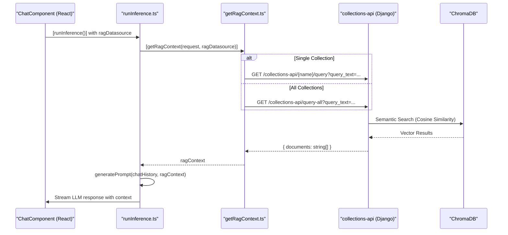

# Vector DB Control (RAG Backend)

<details>
<summary>Relevant source files</summary>
<ul>
<li><a href="https://github.com/tenstorrent/tt-studio/blob/c837b829/app/backend/vector_db_control/data.py">app/backend/vector_db_control/data.py</a></li>
<li><a href="https://github.com/tenstorrent/tt-studio/blob/c837b829/app/docker-compose.yml">app/docker-compose.yml</a></li>
</ul>
</details>

The `vector_db_control` system provides Retrieval-Augmented Generation (RAG) capabilities to TT-Studio. It manages the lifecycle of vector collections, document ingestion (chunking and embedding), and semantic search queries. The backend utilizes **ChromaDB** as the primary vector store and exposes a REST API for the frontend to manage knowledge sources and retrieve context during chat sessions.

## System Architecture & Data Flow

The RAG backend bridges natural language queries with stored document embeddings. When a user sends a message with a RAG data source selected, the system performs a similarity search in ChromaDB and injects the retrieved text into the LLM prompt.

### RAG Integration Flow
The following diagram illustrates how the frontend components interact with the backend API to perform context retrieval.

**Diagram: RAG Context Retrieval Flow**


## ChromaDB Integration

The system deploys ChromaDB as a separate container service (`tt_studio_chroma`) within the Docker topology.

| Configuration | Value / Source |
| :--- | :--- |
| **Image** | `chromadb/chroma:0.5.3` |
| **Port** | `8111` |
| **Persistence** | Data is persisted to `${HOST_PERSISTENT_STORAGE_VOLUME}/chroma` |
| **Embedding Model** | `all-MiniLM-L6-v2` (downloaded on first boot) |
| **Backend Connection** | `CHROMA_DB_HOST=tt_studio_chroma` |

The `tt_studio_backend` includes a healthcheck that waits for ChromaDB to be ready before starting, ensuring that embedding models can be downloaded and initialized.

## Collection Management

TT-Studio organizes knowledge into "Collections". Each collection corresponds to a ChromaDB collection and is isolated by a `X-Browser-ID` header to support session-based or user-based partitioning.

### Key Operations
*   **Creation:** Users can create new collections. Names must be alphanumeric.
* **Querying All:** A special collection ID `special-all` allows querying across all available collections simultaneously.
* **Context Retrieval:** Results from `query-all` are formatted to include the source collection name: `[From {collection_name}]\n{document_text}`.

### Browser Identification
To maintain data privacy and session persistence, the frontend generates a unique UUID stored in `localStorage` as `tt_studio_browser_id`. This ID is injected into the `X-Browser-ID` header for all RAG-related requests to the backend.

## API Endpoints (Collections API)

The Django backend exposes several endpoints for managing and querying the vector database.

### Querying Endpoints
* **`GET /collections-api/{name}/query`**: Performs a similarity search within a specific collection using the `query_text` parameter.
* **`GET /collections-api/query-all`**: Aggregates results from all available collections. The response includes the source collection name for each document.

### Internal Knowledge & Security
* **RAG Admin:** Access to management interfaces can be restricted via `VITE_ENABLE_RAG_ADMIN` and protected by `RAG_ADMIN_PASSWORD`.
* **Persistent Storage:** Collections are stored in the internal volume defined by `INTERNAL_PERSISTENT_STORAGE_VOLUME`.

## Internal Knowledge Sources

The RAG backend includes pre-configured internal data sources to provide the AI agents with knowledge about the Tenstorrent ecosystem. This includes technical details about the `tt-inference-server`, available LLM models (e.g., QwQ-32B, DeepSeek-R1, Qwen2.5), and hardware compatibility.

## Frontend Components

The RAG UI is integrated into the `ChatComponent` and specialized management views.

**Diagram: RAG Frontend Entity Map**
```mermaid
classDiagram
    class "RagManagement.tsx" {
        +fetchCollections()
        +uploadDocument()
    }
    class "getRagContext.ts" {
        +axios.get(/query)
        +browserId: localStorage
    }
    class "runInference.ts" {
        +getRagContext()
        +generatePrompt()
    }

    "ChatComponent.tsx" ..> "runInference.ts" : "calls on send"
    "runInference.ts" ..> "getRagContext.ts" : "retrieves context"
    "getRagContext.ts" ..> "collections-api" : "REST request"
```

### Context Injection Logic
When `runInference` is triggered, it checks for a `ragDatasource`. If present, it calls `getRagContext` which returns an array of document strings.
* **Single Collection:** Returns raw strings or document objects from the specific collection.
* **All Collections:** Returns strings prefixed with their source collection name.

