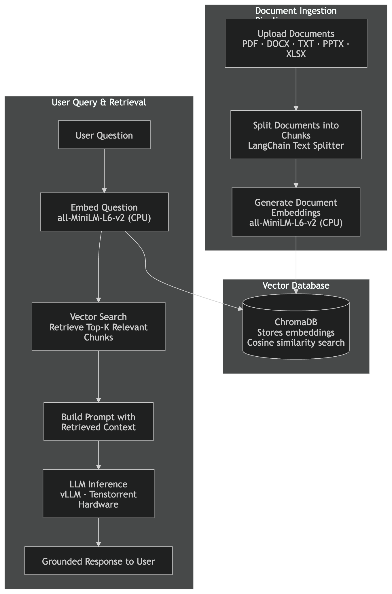

# RAG — Retrieval-Augmented Generation

Query your documents with AI-powered semantic search. This blueprint combines an LLM deployed on Tenstorrent hardware with ChromaDB vector storage to ground model responses in your own data.

## Use This Blueprint When

- You need LLM answers grounded in your private documents, not just training data
- You want to query PDFs, Word documents, or spreadsheets with natural language
- You need responses with citations and source traceability

## Architecture

## How It Works

1. **Upload** — Documents are uploaded through the experience layer (PDF, DOCX, TXT, PPTX, XLSX supported)
2. **Chunk** — Documents are split into chunks using LangChain text splitters
3. **Embed** — Chunks are embedded using SentenceTransformer models and stored in ChromaDB
4. **Query** — User questions trigger a semantic search across stored embeddings
5. **Generate** — Retrieved context is injected into the LLM prompt for grounded responses

## Key Features

- Multi-format document ingestion (PDF, DOCX, TXT, PPTX, XLSX)
- User-scoped collections with session isolation
- Cosine similarity search across document embeddings
- Context injection into LLM chat completions
- Admin interface for collection management

## Models Used

| Role | Model | Runtime | Notes |
|------|-------|---------|-------|
| Generation | Any deployed LLM (e.g. Llama-3.1-8B-Instruct) | Tenstorrent hardware (vLLM) | Selected from model catalog |
| Embedding | all-MiniLM-L6-v2 | CPU (SentenceTransformers) | Built-in; no deployment needed |

Embeddings are generated on CPU using `all-MiniLM-L6-v2` via ChromaDB's built-in SentenceTransformer integration. No separate embedding model deployment is required — this runs automatically as part of the RAG service. Only the LLM runs on Tenstorrent hardware.

> **Future:** TT-Inference-Server supports hardware-accelerated embedding models (e.g. `bge-large-en-v1.5`, `Qwen3-Embedding-4B`) that could replace the CPU embedding path. See [tt-inference-server embedding support](https://github.com/tenstorrent/tt-inference-server/blob/main/docs/model_support/embedding/README.md). This is not yet integrated into TT-Studio.

See the full [Model Catalog](../model-catalog.md) for all compatible models and hardware.

## Minimum Hardware

Hardware is only required for the **LLM (generation)** component. Embeddings run on CPU automatically — no Tenstorrent device needed for that part.

| Device | LLM Models Supported |
|--------|----------------------|
| N150 | 1B–8B parameter models |
| N300 | Up to ~34B parameter models |
| T3K | Full catalog including 70B+ models |

> **Future:** Hardware-accelerated embedding on Tenstorrent devices is supported by [TT-Inference-Server](https://github.com/tenstorrent/tt-inference-server/blob/main/docs/model_support/embedding/README.md) but not yet integrated into TT-Studio. When available, similar hardware tiers will apply to the embedding component.

## API Endpoints

| Endpoint | Method | Description |
|----------|--------|-------------|
| `/api/collections/` | POST | Create a new collection |
| `/api/collections/` | GET | List user's collections |
| `/api/collections/{name}/insert_document` | POST | Upload document to collection |
| `/api/collections/{name}/query` | GET | Query collection with semantic search |
| `/api/collections/query-all` | GET | Query across all user collections |

## Software Stack

**Tenstorrent Technology**
- TT Inference Server (LLM serving via vLLM)
- TT-Metal (execution framework)

**Third-Party**
- ChromaDB (vector storage)
- SentenceTransformers (embedding)
- LangChain (document chunking)

## Quick Start

1. Deploy TT-Studio: `python3 run.py`
2. Deploy an LLM from the model catalog
3. Navigate to **RAG Management** in the web interface
4. Create a collection and upload documents
5. Switch to **Chat** and query with RAG context enabled

See the [Quick Start Guide](../quickstart.md) for full provisioning details.

## Related Blueprints

- [LLM Chat](llm-chat.md) — RAG injects retrieved context into the same chat interface; combine both for grounded conversations
