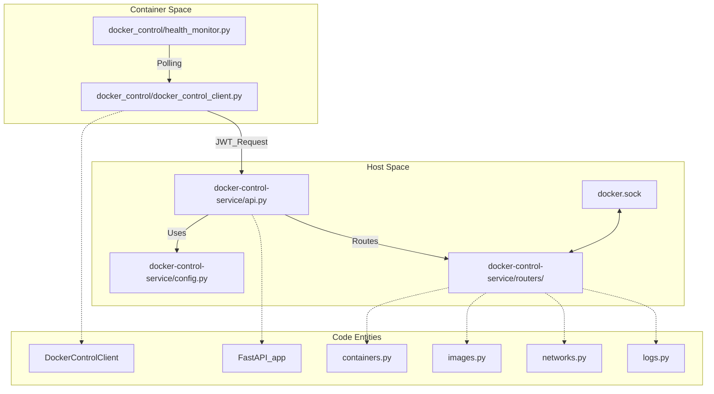
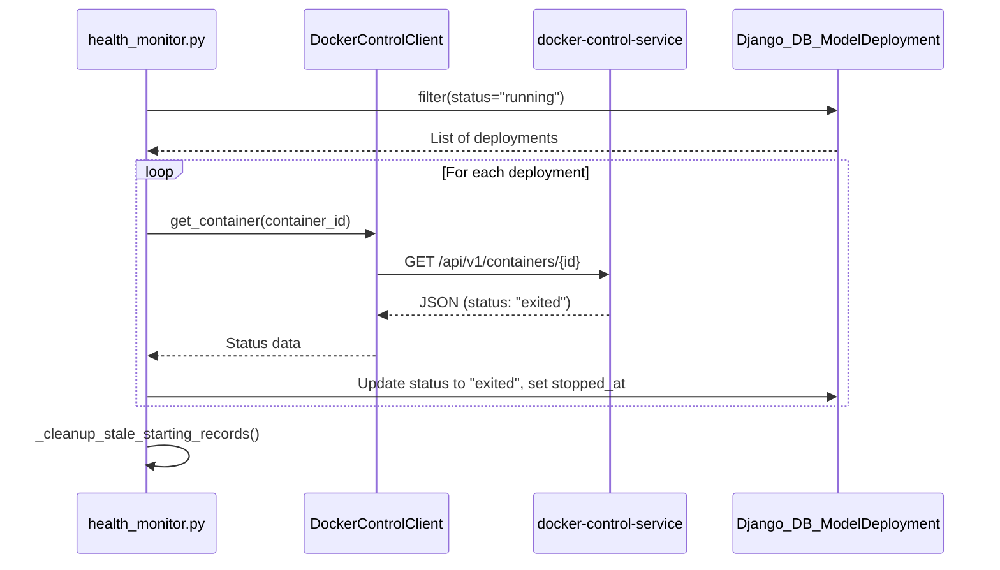

# Docker Control Service API & Security

Relevant source files

<ul>
<li><a href="https://github.com/tenstorrent/tt-studio/blob/c837b829/app/backend/docker_control/docker_control_client.py">app/backend/docker_control/docker_control_client.py</a></li>
<li><a href="https://github.com/tenstorrent/tt-studio/blob/c837b829/app/backend/docker_control/health_monitor.py">app/backend/docker_control/health_monitor.py</a></li>
<li><a href="https://github.com/tenstorrent/tt-studio/blob/c837b829/app/docker-compose.dev-mode.yml">app/docker-compose.dev-mode.yml</a></li>
<li><a href="https://github.com/tenstorrent/tt-studio/blob/c837b829/docker-control-service/api.py">docker-control-service/api.py</a></li>
<li><a href="https://github.com/tenstorrent/tt-studio/blob/c837b829/docker-control-service/config.py">docker-control-service/config.py</a></li>
<li><a href="https://github.com/tenstorrent/tt-studio/blob/c837b829/docker-control-service/routers/logs.py">docker-control-service/routers/logs.py</a></li>
</ul>

The `docker-control-service` is a standalone FastAPI application running on port 8002 that acts as a secure proxy for Docker operations. In TT-Studio, backend services do not mount the Docker socket directly for security reasons; instead, they communicate with this service via a REST API protected by JWT authentication. This architecture ensures that container lifecycle management, image pulling, and network configurations are governed by strict security policies.

## Service Architecture and Data Flow

The `docker-control-service` runs on the host machine (outside the primary container network) to maintain direct access to `/var/run/docker.sock` while exposing a controlled interface to the `tt_studio_backend` and other internal services. This migration from direct socket mounting to a proxy pattern prevents containerized applications from gaining full root-level control over the host Docker daemon.

### System Entity Mapping
The following diagram maps the high-level service concepts to the specific code entities implementing them.

**Diagram: Service Entity Mapping**

Sources: [docker-control-service/api.py:1-60](https://github.com/tenstorrent/tt-studio/blob/c837b829/docker-control-service/api.py#L1-L60), [app/backend/docker_control/docker_control_client.py:22-41](https://github.com/tenstorrent/tt-studio/blob/c837b829/app/backend/docker_control/docker_control_client.py#L22-L41), [docker-control-service/config.py:12-56](https://github.com/tenstorrent/tt-studio/blob/c837b829/docker-control-service/config.py#L12-L56)

---

## REST API Endpoints

The service provides a comprehensive API for managing the Docker environment required for AI model deployments.

### Container Management
- `GET /api/v1/containers`: Lists containers with optional filters for status and names [app/backend/docker_control/docker_control_client.py:75-93](https://github.com/tenstorrent/tt-studio/blob/c837b829/app/backend/docker_control/docker_control_client.py#L75-L93).
- `POST /api/v1/containers/run`: Deploys a new container. This endpoint enforces resource limits and image whitelisting [app/backend/docker_control/docker_control_client.py:100-149](https://github.com/tenstorrent/tt-studio/blob/c837b829/app/backend/docker_control/docker_control_client.py#L100-L149).
- `POST /api/v1/containers/{id}/stop`: Gracefully stops a running container with a configurable timeout [app/backend/docker_control/docker_control_client.py:151-155](https://github.com/tenstorrent/tt-studio/blob/c837b829/app/backend/docker_control/docker_control_client.py#L151-L155).
- `POST /api/v1/containers/{id}/remove`: Deletes a container and its associated volumes [app/backend/docker_control/docker_control_client.py:157-161](https://github.com/tenstorrent/tt-studio/blob/c837b829/app/backend/docker_control/docker_control_client.py#L157-L161).
- `POST /api/v1/containers/{id}/dir-size`: Recursive byte count of a path inside a container, used for monitoring model weight download progress [app/backend/docker_control/docker_control_client.py:172-194](https://github.com/tenstorrent/tt-studio/blob/c837b829/app/backend/docker_control/docker_control_client.py#L172-L194).

### Image and Network Operations
- `GET /api/v1/images`: Lists available local images.
- `POST /api/v1/images/pull`: Pulls an image from a registry, subject to the `ALLOWED_IMAGES` whitelist [docker-control-service/config.py:24-31](https://github.com/tenstorrent/tt-studio/blob/c837b829/docker-control-service/config.py#L24-L31).
- `GET /api/v1/networks`: Lists Docker networks. Only networks in the `ALLOWED_NETWORKS` list (e.g., `tt_studio_network`) can be targeted for container attachments [docker-control-service/config.py:33-37](https://github.com/tenstorrent/tt-studio/blob/c837b829/docker-control-service/config.py#L33-L37).

### Log Access
The service also provides access to host-level logs that are otherwise inaccessible to containerized services through the `logs` router [docker-control-service/routers/logs.py:9-45](https://github.com/tenstorrent/tt-studio/blob/c837b829/docker-control-service/routers/logs.py#L9-L45):
- `GET /api/v1/logs/service`: Tail of the Docker Control Service logs [docker-control-service/routers/logs.py:23-28](https://github.com/tenstorrent/tt-studio/blob/c837b829/docker-control-service/routers/logs.py#L23-L28).
- `GET /api/v1/logs/startup`: Tail of the system startup logs [docker-control-service/routers/logs.py:31-37](https://github.com/tenstorrent/tt-studio/blob/c837b829/docker-control-service/routers/logs.py#L31-L37).
- `GET /api/v1/logs/fastapi`: Tail of the FastAPI inference bridge logs [docker-control-service/routers/logs.py:39-44](https://github.com/tenstorrent/tt-studio/blob/c837b829/docker-control-service/routers/logs.py#L39-L44).

Sources: [app/backend/docker_control/docker_control_client.py:73-200](https://github.com/tenstorrent/tt-studio/blob/c837b829/app/backend/docker_control/docker_control_client.py#L73-L200), [docker-control-service/routers/logs.py:1-45](https://github.com/tenstorrent/tt-studio/blob/c837b829/docker-control-service/routers/logs.py#L1-L45)

---

## Security Policies and Implementation

Security is implemented through a combination of authentication, resource constraints, and operation whitelisting defined in the `Settings` class [docker-control-service/config.py:12-56](https://github.com/tenstorrent/tt-studio/blob/c837b829/docker-control-service/config.py#L12-L56).

### JWT Authentication
Every request to the service must include a valid JWT in the `Authorization` header.
- **Generation**: The `DockerControlClient` in the backend generates tokens using `HS256` and the `DOCKER_CONTROL_JWT_SECRET` [app/backend/docker_control/docker_control_client.py:43-53](https://github.com/tenstorrent/tt-studio/blob/c837b829/app/backend/docker_control/docker_control_client.py#L43-L53).
- **Validation**: The service uses `authenticate_request` middleware to verify tokens before passing the request to routers [docker-control-service/api.py:51-52](https://github.com/tenstorrent/tt-studio/blob/c837b829/docker-control-service/api.py#L51-L52).

### Hardened Configuration
The service enforces several safety limits to prevent resource exhaustion or unauthorized access:

| Policy | Value / Constraint | Code Reference |
| :--- | :--- | :--- |
| **Image Whitelist** | `ghcr.io/tenstorrent/`, `alpine:`, `ubuntu:`, etc. | [docker-control-service/config.py:24-31](https://github.com/tenstorrent/tt-studio/blob/c837b829/docker-control-service/config.py#L24-L31) |
| **Network Whitelist** | `tt_studio_network`, `bridge`, `host` | [docker-control-service/config.py:33-37](https://github.com/tenstorrent/tt-studio/blob/c837b829/docker-control-service/config.py#L33-L37) |
| **Memory Limit** | Max 16GB per container | [docker-control-service/config.py:40](https://github.com/tenstorrent/tt-studio/blob/c837b829/docker-control-service/config.py#L40) |
| **CPU Limit** | Max 8 CPUs per container | [docker-control-service/config.py:41](https://github.com/tenstorrent/tt-studio/blob/c837b829/docker-control-service/config.py#L41) |
| **CORS** | Restricted to `localhost:8000` and `tt-studio-backend-api` | [docker-control-service/api.py:39-49](https://github.com/tenstorrent/tt-studio/blob/c837b829/docker-control-service/api.py#L39-L49) |

### Implementation of Health Monitoring
The `health_monitor.py` module uses the `DockerControlClient` to poll the service and synchronize the state of `ModelDeployment` records in the database with actual container states on the host [app/backend/docker_control/health_monitor.py:91-110](https://github.com/tenstorrent/tt-studio/blob/c837b829/app/backend/docker_control/health_monitor.py#L91-L110). It also handles the cleanup of stale "starting" records that might block hardware chip slots via `_cleanup_stale_starting_records` [app/backend/docker_control/health_monitor.py:19-74](https://github.com/tenstorrent/tt-studio/blob/c837b829/app/backend/docker_control/health_monitor.py#L19-L74).

**Diagram: Health Monitoring Logic**

Sources: [app/backend/docker_control/health_monitor.py:76-128](https://github.com/tenstorrent/tt-studio/blob/c837b829/app/backend/docker_control/health_monitor.py#L76-L128), [docker-control-service/config.py:12-56](https://github.com/tenstorrent/tt-studio/blob/c837b829/docker-control-service/config.py#L12-L56), [docker-control-service/api.py:39-52](https://github.com/tenstorrent/tt-studio/blob/c837b829/docker-control-service/api.py#L39-L52)

---

## Configuration and Environment

The service behavior is controlled via environment variables typically set in the `.env` file or passed by `run.py`.

- `DOCKER_CONTROL_JWT_SECRET`: The shared secret used to sign and verify JWTs [docker-control-service/config.py:21](https://github.com/tenstorrent/tt-studio/blob/c837b829/docker-control-service/config.py#L21).
- `DEV_MODE`: If `true`, enables FastAPI auto-reload and more verbose logging [docker-control-service/config.py:18](https://github.com/tenstorrent/tt-studio/blob/c837b829/docker-control-service/config.py#L18).
- `DOCKER_CONTROL_SERVICE_URL`: Used by the backend to locate the service. In development, the backend container uses `extra_hosts` to resolve the host's IP [app/backend/docker_control/docker_control_client.py:33](https://github.com/tenstorrent/tt-studio/blob/c837b829/app/backend/docker_control/docker_control_client.py#L33), [app/docker-compose.dev-mode.yml:20-21](https://github.com/tenstorrent/tt-studio/blob/c837b829/app/docker-compose.dev-mode.yml#L20-L21).

The service logs its own operations and can also serve logs from other system components by reading the paths defined in `SERVICE_LOG_FILE`, `STARTUP_LOG_FILE`, and `MODEL_RUN_LOG_FILE` [docker-control-service/config.py:48-52](https://github.com/tenstorrent/tt-studio/blob/c837b829/docker-control-service/config.py#L48-L52).

Sources: [docker-control-service/config.py:1-56](https://github.com/tenstorrent/tt-studio/blob/c837b829/docker-control-service/config.py#L1-L56), [app/backend/docker_control/docker_control_client.py:25-40](https://github.com/tenstorrent/tt-studio/blob/c837b829/app/backend/docker_control/docker_control_client.py#L25-L40), [app/docker-compose.dev-mode.yml:7-21](https://github.com/tenstorrent/tt-studio/blob/c837b829/app/docker-compose.dev-mode.yml#L7-L21)23:T1c15,# Inference API (FastAPI Bridge)
