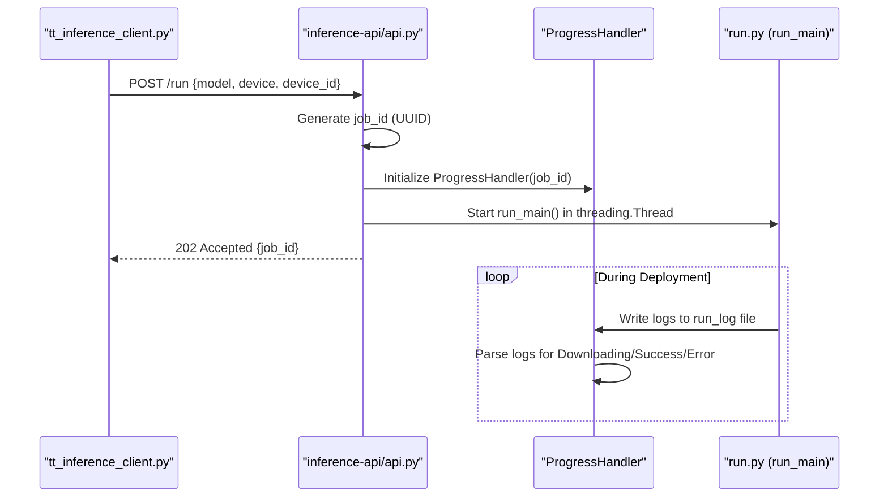
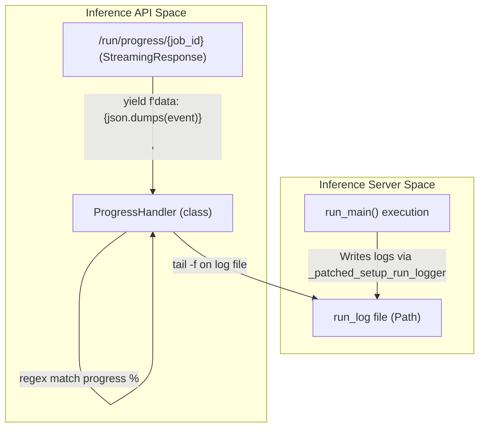

# Inference API (FastAPI Bridge)

Relevant source files

<ul>
<li><a href="https://github.com/tenstorrent/tt-studio/blob/c837b829/app/backend/docker_control/tt_inference_client.py">app/backend/docker_control/tt_inference_client.py</a></li>
<li><a href="https://github.com/tenstorrent/tt-studio/blob/c837b829/app/backend/model_control/model_utils.py">app/backend/model_control/model_utils.py</a></li>
<li><a href="https://github.com/tenstorrent/tt-studio/blob/c837b829/app/docker-compose.yml">app/docker-compose.yml</a></li>
<li><a href="https://github.com/tenstorrent/tt-studio/blob/c837b829/app/frontend/src/components/FirstStepForm.tsx">app/frontend/src/components/FirstStepForm.tsx</a></li>
<li><a href="https://github.com/tenstorrent/tt-studio/blob/c837b829/inference-api/api.py">inference-api/api.py</a></li>
</ul>

The **Inference API** is a standalone FastAPI service (running on port 8001) that acts as a bridge between the TT-Studio Backend and the `tt-inference-server` artifact. Its primary responsibility is to orchestrate the deployment of model containers, monitor weights downloading progress, and provide real-time status updates via Server-Sent Events (SSE).

## 1. Service Overview and Integration
The Inference API integrates the `tt-inference-server` repository (either as a submodule or a downloaded artifact) into the TT-Studio ecosystem. It patches internal utilities of the inference server to ensure logs and environment variables are correctly routed within the Docker topology [inference-api/api.py:27-51](https://github.com/tenstorrent/tt-studio/blob/c837b829/inference-api/api.py#L27-L51).

### Key Components:
*   **FastAPI App**: Provides REST endpoints for initiating deployments and SSE endpoints for progress tracking [inference-api/api.py:246-250](https://github.com/tenstorrent/tt-studio/blob/c837b829/inference-api/api.py#L246-L250).
*   **ProgressHandler**: A specialized class that monitors `run_log` files to extract percentage-based progress and status transitions [inference-api/api.py:441-450](https://github.com/tenstorrent/tt-studio/blob/c837b829/inference-api/api.py#L441-L450).
*   **Background Orchestrator**: Uses Python threading to execute `run_main()` from the inference server without blocking the API [inference-api/api.py:734-740](https://github.com/tenstorrent/tt-studio/blob/c837b829/inference-api/api.py#L734-L740).
*   **Process Isolation**: Patches `subprocess.Popen` with `start_new_session=True` to ensure model containers survive FastAPI service restarts. This is critical for LLM containers which would otherwise be terminated by signal cascades [inference-api/api.py:141-160](https://github.com/tenstorrent/tt-studio/blob/c837b829/inference-api/api.py#L141-L160).

Sources: [inference-api/api.py:27-51](https://github.com/tenstorrent/tt-studio/blob/c837b829/inference-api/api.py#L27-L51), [inference-api/api.py:141-160](https://github.com/tenstorrent/tt-studio/blob/c837b829/inference-api/api.py#L141-L160), [inference-api/api.py:246-250](https://github.com/tenstorrent/tt-studio/blob/c837b829/inference-api/api.py#L246-L250), [inference-api/api.py:441-450](https://github.com/tenstorrent/tt-studio/blob/c837b829/inference-api/api.py#L441-L450), [inference-api/api.py:734-740](https://github.com/tenstorrent/tt-studio/blob/c837b829/inference-api/api.py#L734-L740)

## 2. Deployment Workflow (/run)
The `/run` endpoint is the entry point for deploying a model. It accepts hardware configurations (device type, chip IDs) and model identifiers. The backend communicates with this service via the `tt_inference_client` [app/backend/docker_control/tt_inference_client.py:84-97](https://github.com/tenstorrent/tt-studio/blob/c837b829/app/backend/docker_control/tt_inference_client.py#L84-L97).

### Natural Language to Code Entity Mapping (Deployment)
This table maps the logical deployment steps to the specific code entities responsible for execution.

| Logical Step | Code Entity | File |
| :--- | :--- | :--- |
| **Request Initiation** | `start_chat_deployment()` | [app/backend/docker_control/tt_inference_client.py:84-97](https://github.com/tenstorrent/tt-studio/blob/c837b829/app/backend/docker_control/tt_inference_client.py#L84-L97) |
| **API Entry Point** | `@app.post("/run")` | [inference-api/api.py:657-658](https://github.com/tenstorrent/tt-studio/blob/c837b829/inference-api/api.py#L657-L658) |
| **Validation** | `get_runtime_model_spec()` | [inference-api/api.py:694-696](https://github.com/tenstorrent/tt-studio/blob/c837b829/inference-api/api.py#L694-L696) |
| **Execution Thread** | `threading.Thread(target=run_model_task)` | [inference-api/api.py:734-740](https://github.com/tenstorrent/tt-studio/blob/c837b829/inference-api/api.py#L734-L740) |
| **Core Logic** | `run_main()` (from `tt-inference-server`) | [inference-api/api.py:164-165](https://github.com/tenstorrent/tt-studio/blob/c837b829/inference-api/api.py#L164-L165) |

### Deployment Sequence
"Deployment Logic Flow"

Sources: [app/backend/docker_control/tt_inference_client.py:84-167](https://github.com/tenstorrent/tt-studio/blob/c837b829/app/backend/docker_control/tt_inference_client.py#L84-L167), [inference-api/api.py:657-750](https://github.com/tenstorrent/tt-studio/blob/c837b829/inference-api/api.py#L657-L750), [inference-api/api.py:441-450](https://github.com/tenstorrent/tt-studio/blob/c837b829/inference-api/api.py#L441-L450)

## 3. Progress Orchestration and SSE
Because model deployments involve multi-gigabyte weight downloads and container builds, the Inference API provides a streaming progress interface via the `ProgressHandler`. The frontend tracks this via `useModels` and the deployment stepper components [app/frontend/src/components/FirstStepForm.tsx:117-121](https://github.com/tenstorrent/tt-studio/blob/c837b829/app/frontend/src/components/FirstStepForm.tsx#L117-L121).

### ProgressHandler Mechanism
The `ProgressHandler` monitors the log files generated by the `run_main` task. It uses regular expressions to detect:
1.  **Weights Download**: Captures percentage updates (e.g., `[ 45%]`) from HuggingFace or S3 download logs [inference-api/api.py:494-500](https://github.com/tenstorrent/tt-studio/blob/c837b829/inference-api/api.py#L494-L500).
2.  **State Transitions**: Detects when the system moves from `downloading` to `starting` to `running` [inference-api/api.py:480-490](https://github.com/tenstorrent/tt-studio/blob/c837b829/inference-api/api.py#L480-L490).
3.  **Errors**: Captures tracebacks and fatal errors to report back to the UI [inference-api/api.py:515-520](https://github.com/tenstorrent/tt-studio/blob/c837b829/inference-api/api.py#L515-L520).

### Progress Code Mapping
"Log-to-UI Progress Mapping"

Sources: [inference-api/api.py:441-550](https://github.com/tenstorrent/tt-studio/blob/c837b829/inference-api/api.py#L441-L550), [inference-api/api.py:753-760](https://github.com/tenstorrent/tt-studio/blob/c837b829/inference-api/api.py#L753-L760), [inference-api/api.py:113-139](https://github.com/tenstorrent/tt-studio/blob/c837b829/inference-api/api.py#L113-L139)

## 4. Artifact Integration (`tt-inference-server`)
The service dynamically locates the `tt-inference-server` code to allow for flexible deployment environments.

*   **Search Path**: It checks `TT_INFERENCE_ARTIFACT_PATH`, then `.artifacts/tt-inference-server`, and finally the local directory [inference-api/api.py:32-35](https://github.com/tenstorrent/tt-studio/blob/c837b829/inference-api/api.py#L32-L35).
*   **Monkey Patching**: To ensure the inference server behaves correctly inside the Studio's Docker network, the API patches:
    *   `workflows.utils.get_repo_root_path`: Returns the artifact directory [inference-api/api.py:59-63](https://github.com/tenstorrent/tt-studio/blob/c837b829/inference-api/api.py#L59-L63).
    *   `workflows.log_setup.setup_run_logger`: Ensures `run_log` file handlers are correctly attached for `ProgressHandler` to read [inference-api/api.py:113-136](https://github.com/tenstorrent/tt-studio/blob/c837b829/inference-api/api.py#L113-L136).
    *   `workflows_utils.default_dotenv_path`: Points to the artifact's `.env` [inference-api/api.py:70-71](https://github.com/tenstorrent/tt-studio/blob/c837b829/inference-api/api.py#L70-L71).

Sources: [inference-api/api.py:32-139](https://github.com/tenstorrent/tt-studio/blob/c837b829/inference-api/api.py#L32-L139)

## 5. API Reference Summary

| Endpoint | Method | Purpose |
| :--- | :--- | :--- |
| `/run` | POST | Starts a model deployment task via `run_model_task`. Returns a `job_id` [inference-api/api.py:657](https://github.com/tenstorrent/tt-studio/blob/c837b829/inference-api/api.py#L657). |
| `/run/progress/{job_id}` | GET | SSE stream of deployment progress, logs, and status via `ProgressHandler` [inference-api/api.py:753](https://github.com/tenstorrent/tt-studio/blob/c837b829/inference-api/api.py#L753). |
| `/run/stop/{job_id}` | POST | Terminates a running deployment task thread [inference-api/api.py:804](https://github.com/tenstorrent/tt-studio/blob/c837b829/inference-api/api.py#L804). |
| `/models` | GET | Returns the list of supported models from `MODEL_SPECS` [inference-api/api.py:642](https://github.com/tenstorrent/tt-studio/blob/c837b829/inference-api/api.py#L642). |
| `/resolve-image` | GET | Returns the specific Docker image tag for a model/device combo via `get_runtime_model_spec` [inference-api/api.py:618](https://github.com/tenstorrent/tt-studio/blob/c837b829/inference-api/api.py#L618). |

Sources: [inference-api/api.py:618-815](https://github.com/tenstorrent/tt-studio/blob/c837b829/inference-api/api.py#L618-L815)24:T14b6,# AI Agent Service
