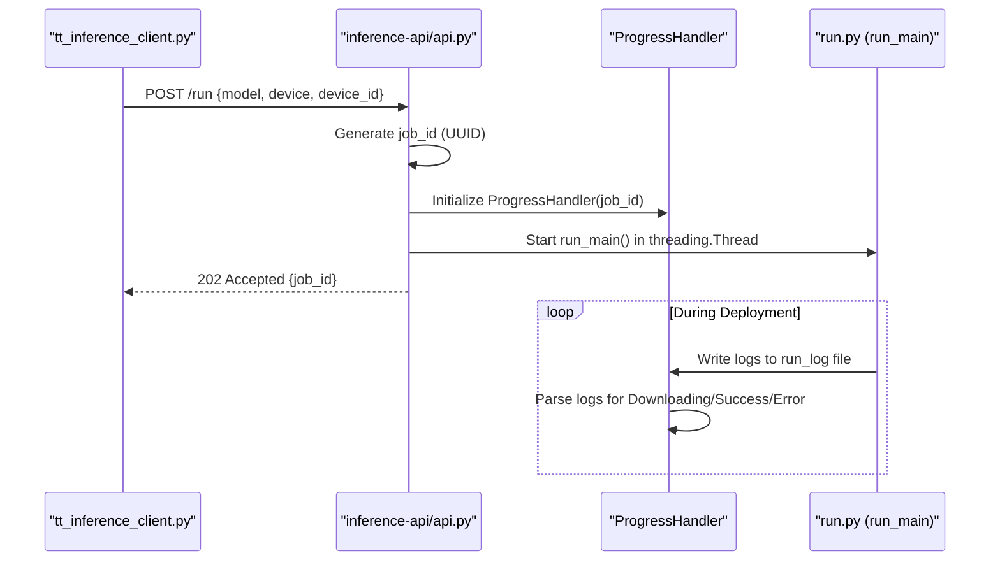
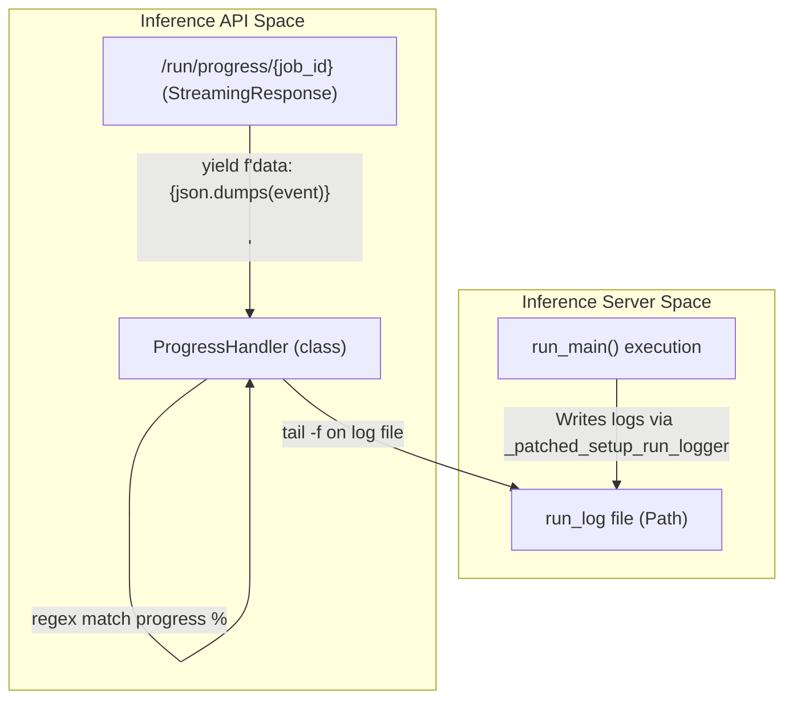

# Inference API (FastAPI Bridge)

The **Inference API** is a standalone FastAPI service (running on port 8001) that acts as a bridge between the TT-Studio Backend and the `tt-inference-server` artifact. Its primary responsibility is to orchestrate the deployment of model containers, monitor weights downloading progress, and provide real-time status updates via Server-Sent Events (SSE).

## 1. Service Overview and Integration
The Inference API integrates the `tt-inference-server` repository (either as a submodule or a downloaded artifact) into the TT-Studio ecosystem. It patches internal utilities of the inference server to ensure logs and environment variables are correctly routed within the Docker topology.

### Key Components:
* **FastAPI App**: Provides REST endpoints for initiating deployments and SSE endpoints for progress tracking.
* **ProgressHandler**: A specialized class that monitors `run_log` files to extract percentage-based progress and status transitions.
* **Background Orchestrator**: Uses Python threading to execute `run_main()` from the inference server without blocking the API.
* **Process Isolation**: Patches `subprocess.Popen` with `start_new_session=True` to ensure model containers survive FastAPI service restarts. This is critical for LLM containers which would otherwise be terminated by signal cascades.

## 2. Deployment Workflow (/run)
The `/run` endpoint is the entry point for deploying a model. It accepts hardware configurations (device type, chip IDs) and model identifiers. The backend communicates with this service via the `tt_inference_client`.

### Natural Language to Code Entity Mapping (Deployment)
This table maps the logical deployment steps to the specific code entities responsible for execution.

| Logical Step | Code Entity | File |
| :--- | :--- | :--- |
| **Request Initiation** | `start_chat_deployment()` | |
| **API Entry Point** | `@app.post("/run")` | |
| **Validation** | `get_runtime_model_spec()` | |
| **Execution Thread** | `threading.Thread(target=run_model_task)` | |
| **Core Logic** | `run_main()` (from `tt-inference-server`) | |

### Deployment Sequence
"Deployment Logic Flow"

## 3. Progress Orchestration and SSE
Because model deployments involve multi-gigabyte weight downloads and container builds, the Inference API provides a streaming progress interface via the `ProgressHandler`. The frontend tracks this via `useModels` and the deployment stepper components.

### ProgressHandler Mechanism
The `ProgressHandler` monitors the log files generated by the `run_main` task. It uses regular expressions to detect:
1. **Weights Download**: Captures percentage updates (e.g., `[ 45%]`) from HuggingFace or S3 download logs.
2. **State Transitions**: Detects when the system moves from `downloading` to `starting` to `running`.
3. **Errors**: Captures tracebacks and fatal errors to report back to the UI.

### Progress Code Mapping
"Log-to-UI Progress Mapping"

## 4. Artifact Integration (`tt-inference-server`)
The service dynamically locates the `tt-inference-server` code to allow for flexible deployment environments.

* **Search Path**: It checks `TT_INFERENCE_ARTIFACT_PATH`, then `.artifacts/tt-inference-server`, and finally the local directory.
*   **Monkey Patching**: To ensure the inference server behaves correctly inside the Studio's Docker network, the API patches:
 * `workflows.utils.get_repo_root_path`: Returns the artifact directory.
 * `workflows.log_setup.setup_run_logger`: Ensures `run_log` file handlers are correctly attached for `ProgressHandler` to read.
 * `workflows_utils.default_dotenv_path`: Points to the artifact's `.env`.

## 5. API Reference Summary

| Endpoint | Method | Purpose |
| :--- | :--- | :--- |
| `/run` | POST | Starts a model deployment task via `run_model_task`. Returns a `job_id`. |
| `/run/progress/{job_id}` | GET | SSE stream of deployment progress, logs, and status via `ProgressHandler`. |
| `/run/stop/{job_id}` | POST | Terminates a running deployment task thread. |
| `/models` | GET | Returns the list of supported models from `MODEL_SPECS`. |
| `/resolve-image` | GET | Returns the specific Docker image tag for a model/device combo via `get_runtime_model_spec`. |

---

:::{admonition} Source files this page was written from
:class: dropdown tt-sources

Captured at commit [`c837b829`](https://github.com/tenstorrent/tt-studio/commit/c837b829), so the linked line numbers match that revision.

- [`app/backend/docker_control/tt_inference_client.py`](https://github.com/tenstorrent/tt-studio/blob/c837b829/app/backend/docker_control/tt_inference_client.py)
- [`app/backend/model_control/model_utils.py`](https://github.com/tenstorrent/tt-studio/blob/c837b829/app/backend/model_control/model_utils.py)
- [`app/docker-compose.yml`](https://github.com/tenstorrent/tt-studio/blob/c837b829/app/docker-compose.yml)
- [`app/frontend/src/components/FirstStepForm.tsx`](https://github.com/tenstorrent/tt-studio/blob/c837b829/app/frontend/src/components/FirstStepForm.tsx)
- [`inference-api/api.py`](https://github.com/tenstorrent/tt-studio/blob/c837b829/inference-api/api.py)
:::
