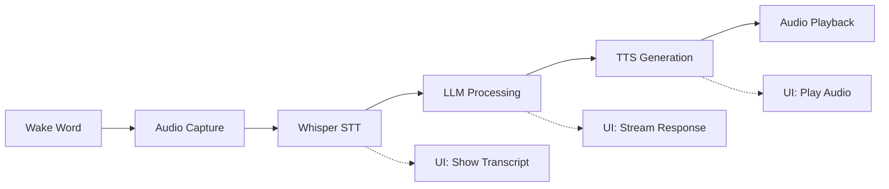

# EPIC 4 — Wake Word → STT → LLM → TTS Pipeline

**Status:** 📋 Planned  
**Priority:** Medium  
**Owner:** TBD

---

## 🎯 Goal

End-to-end conversational pipeline inside TT-Studio, enabling voice-driven AI interactions.

---

## Background

Create a seamless voice interaction system that demonstrates the full capabilities of TT-Studio by chaining multiple AI models together in a conversational pipeline.

---

## Issues

### Issue 4.1 — Integrate OpenWakeWord

**Status:** 📋 Not Started  
**Priority:** Medium

**Description**

Add wake word detection to trigger the conversational pipeline.

**Sub-Tasks**

- [ ] Add wake word listener service
- [ ] Background audio capture
- [ ] Trigger inference pipeline on wake word
- [ ] Add sensitivity configuration
- [ ] Handle false positives

**Acceptance Criteria**

- [ ] Wake word reliably triggers pipeline
- [ ] Configurable sensitivity
- [ ] Low CPU/memory overhead when idle

**Estimated Effort:** 3-5 days

**Dependencies:** None

---

### Issue 4.2 — Unified Audio Pipeline

**Status:** 📋 Not Started  
**Priority:** High

**Description**

Create an integrated UI and backend system for the complete audio conversation flow.

**Sub-Tasks**

- [ ] Record speech after wake word
- [ ] Send to Whisper (STT)
- [ ] Stream LLM response
- [ ] Send to TTS
- [ ] Auto-play output
- [ ] Add stage indicator UI:
  - [ ] 🎤 Listening
  - [ ] 📝 Transcribing
  - [ ] 🧠 Generating
  - [ ] 🔊 Speaking

**Acceptance Criteria**

- [ ] Complete flow works end-to-end
- [ ] UI provides clear feedback at each stage
- [ ] Latency < 3 seconds for full pipeline

**Estimated Effort:** 5-7 days

**Dependencies:** Issue 4.1

---

### Issue 4.3 — Backend Pipeline Orchestration

**Status:** 📋 Not Started  
**Priority:** High

**Description**

Build the backend orchestration layer that manages the multi-model pipeline.

**Sub-Tasks**

- [ ] Create `/api/pipeline/voice`
- [ ] Chain:
  - [ ] STT (Whisper)
  - [ ] LLM (Text generation)
  - [ ] TTS (Text to speech)
- [ ] Support streaming intermediate results
- [ ] Add timeout handling
- [ ] Add error recovery
- [ ] Implement retry logic

**Acceptance Criteria**

- [ ] Pipeline handles partial failures gracefully
- [ ] Streaming works for LLM responses
- [ ] Proper error messages propagate to UI

**Estimated Effort:** 5-7 days

**Dependencies:** Issue 4.2

---

## Technical Design

### Pipeline Architecture

```typescript
interface VoicePipeline {
  id: string;
  stages: PipelineStage[];
  status: PipelineStatus;
  created_at: string;
}

interface PipelineStage {
  name: string; // "wake_word" | "stt" | "llm" | "tts"
  status: StageStatus;
  model_id?: string;
  input?: any;
  output?: any;
  error?: string;
  duration_ms?: number;
}

enum PipelineStatus {
  IDLE = "idle",
  LISTENING = "listening",
  TRANSCRIBING = "transcribing",
  GENERATING = "generating",
  SPEAKING = "speaking",
  COMPLETE = "complete",
  ERROR = "error"
}
```

### API Endpoints

- `POST /api/pipeline/voice/start` - Start listening
- `POST /api/pipeline/voice/stop` - Stop current pipeline
- `GET /api/pipeline/voice/status` - Get current status
- `WS /api/pipeline/voice/stream` - WebSocket for real-time updates

### Data Flow



---

## UI Design

### Pipeline Status Component

```typescript
interface PipelineStatusProps {
  currentStage: PipelineStatus;
  transcript?: string;
  llmResponse?: string;
  error?: string;
}

const PipelineStatus: React.FC<PipelineStatusProps> = ({
  currentStage,
  transcript,
  llmResponse,
  error
}) => {
  return (
    <div className="pipeline-status">
      <StageIndicator 
        stage="listening" 
        active={currentStage === "listening"} 
        icon="🎤"
      />
      <StageIndicator 
        stage="transcribing" 
        active={currentStage === "transcribing"} 
        icon="📝"
      />
      <StageIndicator 
        stage="generating" 
        active={currentStage === "generating"} 
        icon="🧠"
      />
      <StageIndicator 
        stage="speaking" 
        active={currentStage === "speaking"} 
        icon="🔊"
      />
      
      {transcript && <TranscriptDisplay text={transcript} />}
      {llmResponse && <ResponseDisplay text={llmResponse} />}
      {error && <ErrorDisplay error={error} />}
    </div>
  );
};
```

---

## Success Metrics

- [ ] End-to-end latency < 3 seconds (STT → LLM → TTS)
- [ ] Wake word detection accuracy > 95%
- [ ] Pipeline completion rate > 90%
- [ ] User satisfaction score > 4/5

---

## Configuration

### Wake Word Settings

```yaml
wake_word:
  model: "hey_jarvis"  # or custom wake word
  sensitivity: 0.5      # 0.0 to 1.0
  timeout_ms: 5000      # max listening time
```

### Pipeline Settings

```yaml
pipeline:
  stt:
    model: "whisper-base"
    language: "en"
  llm:
    model: "llama-2-7b"
    max_tokens: 256
    temperature: 0.7
  tts:
    model: "coqui-tts"
    voice: "default"
```

---

## Risks and Mitigation

| Risk | Impact | Mitigation |
|------|--------|------------|
| High latency | High | Optimize model loading, use streaming |
| Wake word false positives | Medium | Tunable sensitivity, confirmation prompt |
| Audio device conflicts | Medium | Proper device handling and cleanup |
| Model deployment failures | High | Automatic retry and fallback models |

---

## Demo Scenario

### Voice Assistant Demo

1. **User says:** "Hey TT-Studio"
2. **System:** Wake word detected, starts listening (UI shows 🎤)
3. **User says:** "What's the weather like today?"
4. **System:** 
   - Transcribing (UI shows 📝)
   - Shows transcript: "What's the weather like today?"
   - Generating response (UI shows 🧠)
   - Streams LLM response
   - Converts to speech (UI shows 🔊)
   - Plays audio response
5. **User hears:** Synthesized voice response

---

## Related Documentation

- [Main EPIC Roadmap](../ROADMAP_EPICS.md)
- [Model Interface](../model-interface.md)

---

## Timeline

- **Week 1-2:** Issue 4.1 - OpenWakeWord Integration
- **Week 2-3:** Issue 4.2 - Unified Audio Pipeline
- **Week 3-4:** Issue 4.3 - Backend Orchestration
- **Week 4:** Testing and refinement

**Total Estimated Duration:** 4-5 weeks
