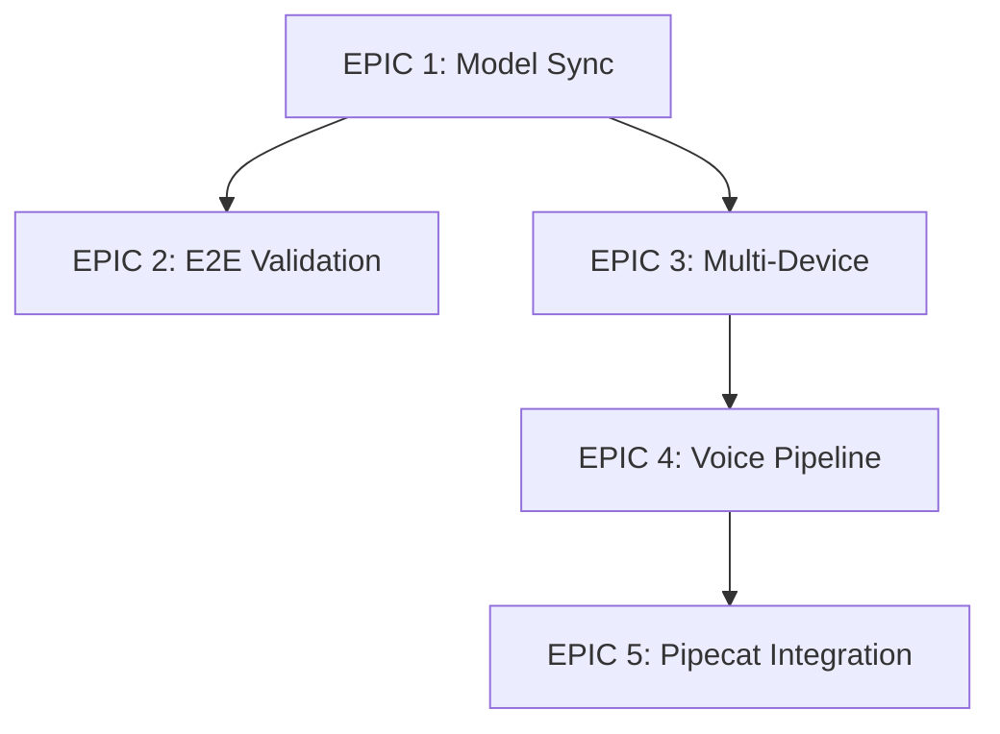

# TT-Studio EPICs

This directory contains detailed documentation for major development initiatives (EPICs) in TT-Studio.

## Overview

Each EPIC represents a significant feature area with multiple related issues and tasks. These documents provide comprehensive planning, technical design, and tracking information.

## EPICs

### [EPIC 1 - Model Type Synchronization](./EPIC-1-Model-Synchronization.md)
**Status:** 📋 Planned | **Priority:** High

Ensure TT-Studio fully synchronizes, understands, and supports all model types exposed by Inference Server.

**Key Features:**
- Dynamic model type discovery
- Extensible display type system
- State management for model catalog

**Duration:** 4-5 weeks

---

### [EPIC 2 - End-to-End Model Validation](./EPIC-2-E2E-Model-Validation.md)
**Status:** 📋 Planned | **Priority:** High

End-to-end validation of every model type with complete UI workflow testing.

**Key Features:**
- Standardized E2E test protocol
- Comprehensive coverage for all model types (LLM, VLLM, Image, Video, Audio, Embeddings, CNN)
- Automated testing infrastructure

**Duration:** 6-7 weeks

---

### [EPIC 3 - Multi-Device Pipeline](./EPIC-3-Multi-Device-Pipeline.md)
**Status:** 📋 Planned | **Priority:** High

Support real multi-device inference orchestration with UI-driven chip selection.

**Key Features:**
- Dynamic device enumeration
- UI-driven device selection
- Multi-device workflow orchestration
- Persistent deployment registry

**Duration:** 6-7 weeks

---

### [EPIC 4 - Voice Pipeline](./EPIC-4-Voice-Pipeline.md)
**Status:** 📋 Planned | **Priority:** Medium

End-to-end conversational pipeline: Wake Word → STT → LLM → TTS.

**Key Features:**
- Wake word detection (OpenWakeWord)
- Unified audio pipeline
- Backend orchestration
- Real-time UI feedback

**Duration:** 4-5 weeks

---

### [EPIC 5 - Pipecat Integration](./EPIC-5-Pipecat-Integration.md)
**Status:** 📋 Planned | **Priority:** Medium

Transform TT-Studio into a hardware-aware conversational blueprint with Pipecat integration.

**Key Features:**
- Pluggable backend architecture
- Pipecat service integration
- Comprehensive blueprint documentation
- Performance benchmarking

**Duration:** 9-10 weeks

---

## Total Timeline

**Estimated Total Duration:** 29-34 weeks (7-8 months)

This assumes some parallel work on independent EPICs. The actual timeline may vary based on:
- Team size and availability
- Priority changes
- Dependencies and blockers
- Testing and refinement needs

---

## How to Use These Documents

### For Project Managers
- Track progress using the checklists in each EPIC
- Monitor dependencies between EPICs
- Adjust priorities based on business needs

### For Developers
- Review technical designs before implementation
- Use acceptance criteria to validate work
- Reference API specifications and schemas

### For QA Engineers
- Use test protocols and acceptance criteria
- Create test plans based on EPIC requirements
- Validate against success metrics

### For Documentation Writers
- Extract user-facing features for documentation
- Create guides based on technical designs
- Update documentation as EPICs are completed

---

## Creating GitHub Issues

To create GitHub issues from these EPICs:

1. Use the [EPIC issue template](../../.github/ISSUE_TEMPLATE/epic.md) for the main EPIC
2. Create individual issues for each sub-task
3. Link all issues to the parent EPIC
4. Add appropriate labels (epic, priority, component)
5. Assign to relevant team members

### Recommended Labels

- `epic` - For main EPIC issues
- `priority:high`, `priority:medium`, `priority:low` - Priority levels
- `component:backend`, `component:frontend`, `component:infra` - Component areas
- `status:planned`, `status:in-progress`, `status:review`, `status:done` - Status tracking

---

## Progress Tracking

Update the status in each EPIC document as work progresses:

- 📋 **Planned** - Not yet started
- 🚧 **In Progress** - Active development
- 👀 **In Review** - Code review or testing
- ✅ **Complete** - Fully implemented and validated
- ⏸️ **Blocked** - Waiting on dependencies
- ❌ **Cancelled** - No longer pursuing

---

## Dependencies

### Dependency Notes
- EPIC 2 benefits from EPIC 1 being complete for comprehensive testing
- EPIC 4 can proceed independently but benefits from EPIC 3
- EPIC 5 builds upon the voice pipeline from EPIC 4

---

## Related Documentation

- [Main Roadmap](../ROADMAP_EPICS.md) - High-level overview
- [Development Guide](../development.md) - Setup and development workflow
- [Model Interface](../model-interface.md) - Model integration patterns
- [FAQ](../FAQ.md) - Common questions and answers

---

## Contributing

When working on an EPIC:

1. Read the full EPIC document before starting
2. Follow the technical design specifications
3. Use the acceptance criteria to validate your work
4. Update the EPIC document as you discover new requirements
5. Create detailed issue comments with progress updates
6. Link PRs to the relevant EPIC issues

---

## Questions or Feedback

For questions about these EPICs or to suggest changes:

1. Open an issue in the repository
2. Tag relevant team members
3. Reference the specific EPIC document
4. Provide context and rationale for changes

---

**Last Updated:** 2026-02-27
