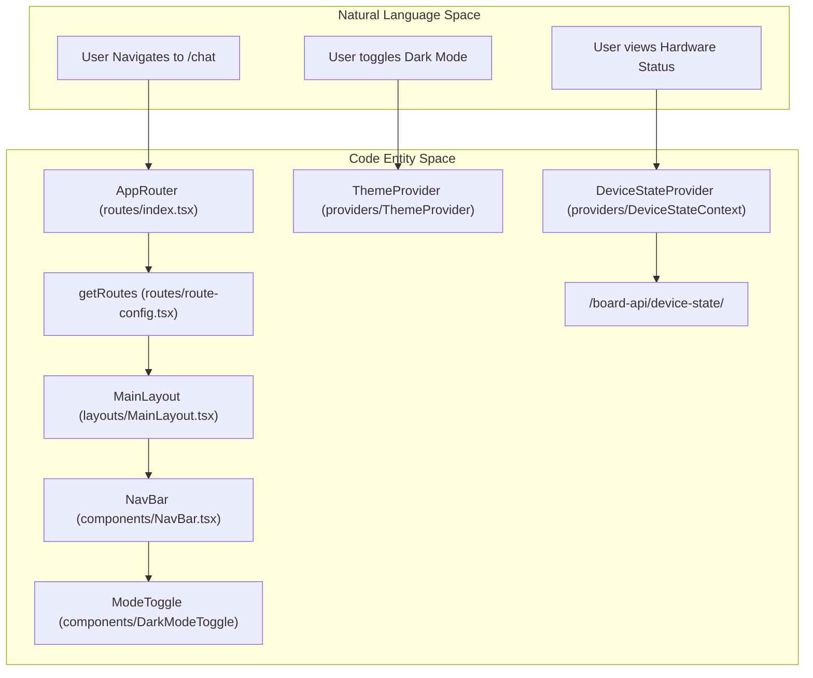
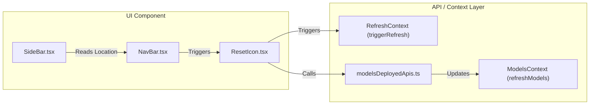

# Application Shell: Routing, Layout & Providers

The application shell of TT-Studio is built using React 18, utilizing a provider-heavy architecture to manage global state across hardware monitoring, model deployments, and UI theming. It provides a consistent layout with a persistent navigation bar and footer, while handling dynamic routing based on the state of deployed AI models.

## Application Entry & Providers

The entry point of the frontend application is `App.tsx`, which establishes the global provider hierarchy. These providers manage cross-cutting concerns such as theming, hardware telemetry, and model registry synchronization.

### Provider Hierarchy
The application wraps the router in several layers of context to ensure data availability across all routes:

1. **`ThemeProvider`**: Manages light/dark mode state and provides theme-switching logic.
2. **`QueryClientProvider`**: Integrates `@tanstack/react-query` for server-state management and caching.
3. **`HeroSectionProvider`**: Manages the visibility and state of the home page hero section.
4. **`FooterVisibilityProvider`**: Controls whether the hardware monitoring footer is rendered, persisting state in local storage.
5. **`DeviceStateProvider`**: Tracks the health and telemetry of Tenstorrent hardware devices, implementing adaptive polling intervals.
6. **`RefreshProvider`**: Provides a global trigger mechanism (`triggerRefresh`, `triggerResetAll`) to force re-fetching of data across components.
7. **`ModelsProvider`**: The central registry for deployed model containers and their operational status.

### Data Flow: ModelsContext
The `ModelsProvider` is critical for the application's shell as it determines which navigation items are visible. It polls the canonical deployments endpoint every 5 seconds to maintain a fresh state of active models, pausing only during hardware resets.

| Function / Property | Description |
| :--- | :--- |
| `refreshModels` | Fetches `fetchDeployments` and filters for managed, non-pending deployments with a valid `model_impl`. |
| `canonicalToModel` | Transforms backend `CanonicalDeployment` objects into the frontend `Model` interface, including port mapping. |
| `hasDeployedModels` | Boolean flag indicating if any managed AI models are currently running. |
| `userStoppedModel` | Persisted state in `sessionStorage` tracking if the user manually terminated a session to suppress auto-navigation. |

## Routing & Layout

TT-Studio uses `react-router-dom` for client-side navigation. Routes are defined centrally in `route-config.tsx` and managed by the `AppRouter`.

### Route Configuration
Routes are generated via `getRoutes()`, which allows for conditional rendering based on environment variables. For example, `isDeployedEnabled` (from `VITE_ENABLE_DEPLOYED`) determines whether the root path `/` shows the standard `HomePage` or the `DeployedHomePage`.

Key routes include:
*   `/chat`: The `ChatUI` interface.
*   `/models-deployed`: Management view for active containers.
*   `/rag-management`: Interface for document ingestion.
*   Specialized pages for `object-detection`, `voice-agent`, `image-generation`, and `coding-agents`.

### Navigation Flow Diagram
The following diagram illustrates how the `AppRouter` maps routes to the constituent shell components and providers.

**TT-Studio Shell Mapping**

## Shell Components: NavBar, SideBar & Reset

### NavBar
The `NavBar` is the primary interaction point. It uses `framer-motion` for animated transitions and `lucide-react` for iconography.

* **Dynamic Links**: Navigation items change based on whether the current view is the "Chat UI" to maximize screen real estate.
* **Model-Type Routing**: It uses `getDestinationFromModelType` to resolve internal routes (e.g., mapping an `ObjectDetection` model type to the `/object-detection` route).
* **Utility Actions**: Contains the `ModeToggle`, `ResetIcon`, and `BugReportButton`.

### ResetIcon & Hardware Recovery
The `ResetIcon` component provides a critical interface for hardware recovery. It manages a two-step process:
1. **Stop Containers**: Calls `deleteModel` for all active deployments.
2. **Board Reset**: Executes `streamResetAction` via `/docker-api/reset_board/stream/` to perform a hardware-level reset using `tt-smi`.

### SideBar (Help System)
The `SideBar` serves as a context-aware help panel. It is toggled via the `NavBar` but its content is determined by the current `location.pathname`.

| Path | Content Displayed |
| :--- | :--- |
| `/` | Deployment wizard instructions (Model Selection, Deploy). |
| `/rag-management` | Document upload and collection management help. |
| `/chat` | Interaction and query input guides. |
| `/models-deployed` | Health monitoring and container management info. |

## Component Interactions

The shell components bridge the gap between UI interactions and backend API calls.

**Interaction Logic Diagram**

---

:::{admonition} Source files this page was written from
:class: dropdown tt-sources

Captured at commit [`c837b829`](https://github.com/tenstorrent/tt-studio/commit/c837b829), so the linked line numbers match that revision.

- [`LICENSE`](https://github.com/tenstorrent/tt-studio/blob/c837b829/LICENSE)
- [`app/frontend/src/App.tsx`](https://github.com/tenstorrent/tt-studio/blob/c837b829/app/frontend/src/App.tsx)
- [`app/frontend/src/components/ModelsDeployedTable.tsx`](https://github.com/tenstorrent/tt-studio/blob/c837b829/app/frontend/src/components/ModelsDeployedTable.tsx)
- [`app/frontend/src/components/NavBar.tsx`](https://github.com/tenstorrent/tt-studio/blob/c837b829/app/frontend/src/components/NavBar.tsx)
- [`app/frontend/src/components/ResetIcon.tsx`](https://github.com/tenstorrent/tt-studio/blob/c837b829/app/frontend/src/components/ResetIcon.tsx)
- [`app/frontend/src/components/SideBar.tsx`](https://github.com/tenstorrent/tt-studio/blob/c837b829/app/frontend/src/components/SideBar.tsx)
- [`app/frontend/src/components/chatui/ChatExamples.tsx`](https://github.com/tenstorrent/tt-studio/blob/c837b829/app/frontend/src/components/chatui/ChatExamples.tsx)
- [`app/frontend/src/contexts/ModelsContext.ts`](https://github.com/tenstorrent/tt-studio/blob/c837b829/app/frontend/src/contexts/ModelsContext.ts)
- [`app/frontend/src/contexts/RefreshContext.ts`](https://github.com/tenstorrent/tt-studio/blob/c837b829/app/frontend/src/contexts/RefreshContext.ts)
- [`app/frontend/src/providers/DeviceStateContext.tsx`](https://github.com/tenstorrent/tt-studio/blob/c837b829/app/frontend/src/providers/DeviceStateContext.tsx)
- [`app/frontend/src/providers/ModelsContext.tsx`](https://github.com/tenstorrent/tt-studio/blob/c837b829/app/frontend/src/providers/ModelsContext.tsx)
- [`app/frontend/src/providers/RefreshContext.tsx`](https://github.com/tenstorrent/tt-studio/blob/c837b829/app/frontend/src/providers/RefreshContext.tsx)
- [`app/frontend/src/routes/index.tsx`](https://github.com/tenstorrent/tt-studio/blob/c837b829/app/frontend/src/routes/index.tsx)
- [`app/frontend/src/routes/route-config.tsx`](https://github.com/tenstorrent/tt-studio/blob/c837b829/app/frontend/src/routes/route-config.tsx)
:::
