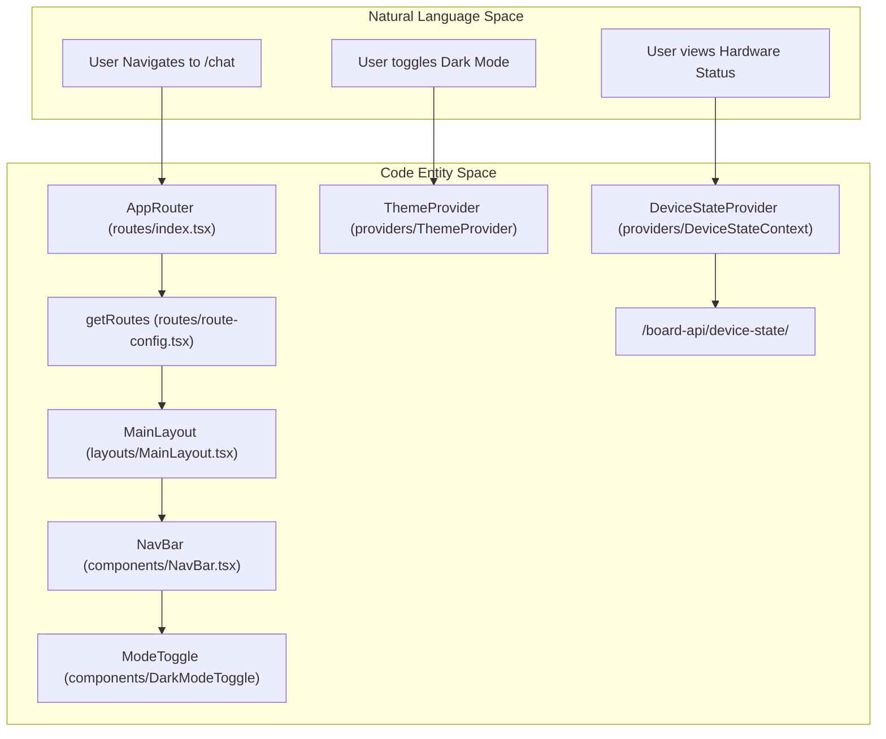
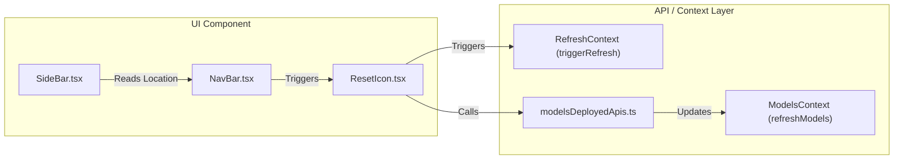

# Application Shell: Routing, Layout & Providers

Relevant source files

<ul>
<li><a href="https://github.com/tenstorrent/tt-studio/blob/c837b829/LICENSE">LICENSE</a></li>
<li><a href="https://github.com/tenstorrent/tt-studio/blob/c837b829/app/frontend/src/App.tsx">app/frontend/src/App.tsx</a></li>
<li><a href="https://github.com/tenstorrent/tt-studio/blob/c837b829/app/frontend/src/components/ModelsDeployedTable.tsx">app/frontend/src/components/ModelsDeployedTable.tsx</a></li>
<li><a href="https://github.com/tenstorrent/tt-studio/blob/c837b829/app/frontend/src/components/NavBar.tsx">app/frontend/src/components/NavBar.tsx</a></li>
<li><a href="https://github.com/tenstorrent/tt-studio/blob/c837b829/app/frontend/src/components/ResetIcon.tsx">app/frontend/src/components/ResetIcon.tsx</a></li>
<li><a href="https://github.com/tenstorrent/tt-studio/blob/c837b829/app/frontend/src/components/SideBar.tsx">app/frontend/src/components/SideBar.tsx</a></li>
<li><a href="https://github.com/tenstorrent/tt-studio/blob/c837b829/app/frontend/src/components/chatui/ChatExamples.tsx">app/frontend/src/components/chatui/ChatExamples.tsx</a></li>
<li><a href="https://github.com/tenstorrent/tt-studio/blob/c837b829/app/frontend/src/contexts/ModelsContext.ts">app/frontend/src/contexts/ModelsContext.ts</a></li>
<li><a href="https://github.com/tenstorrent/tt-studio/blob/c837b829/app/frontend/src/contexts/RefreshContext.ts">app/frontend/src/contexts/RefreshContext.ts</a></li>
<li><a href="https://github.com/tenstorrent/tt-studio/blob/c837b829/app/frontend/src/providers/DeviceStateContext.tsx">app/frontend/src/providers/DeviceStateContext.tsx</a></li>
<li><a href="https://github.com/tenstorrent/tt-studio/blob/c837b829/app/frontend/src/providers/ModelsContext.tsx">app/frontend/src/providers/ModelsContext.tsx</a></li>
<li><a href="https://github.com/tenstorrent/tt-studio/blob/c837b829/app/frontend/src/providers/RefreshContext.tsx">app/frontend/src/providers/RefreshContext.tsx</a></li>
<li><a href="https://github.com/tenstorrent/tt-studio/blob/c837b829/app/frontend/src/routes/index.tsx">app/frontend/src/routes/index.tsx</a></li>
<li><a href="https://github.com/tenstorrent/tt-studio/blob/c837b829/app/frontend/src/routes/route-config.tsx">app/frontend/src/routes/route-config.tsx</a></li>
</ul>

The application shell of TT-Studio is built using React 18, utilizing a provider-heavy architecture to manage global state across hardware monitoring, model deployments, and UI theming. It provides a consistent layout with a persistent navigation bar and footer, while handling dynamic routing based on the state of deployed AI models.

## Application Entry & Providers

The entry point of the frontend application is `App.tsx`, which establishes the global provider hierarchy. These providers manage cross-cutting concerns such as theming, hardware telemetry, and model registry synchronization.

### Provider Hierarchy
The application wraps the router in several layers of context to ensure data availability across all routes:

1.  **`ThemeProvider`**: Manages light/dark mode state and provides theme-switching logic [app/frontend/src/App.tsx:5-5](https://github.com/tenstorrent/tt-studio/blob/c837b829/app/frontend/src/App.tsx#L5-L5), [app/frontend/src/App.tsx:25-25](https://github.com/tenstorrent/tt-studio/blob/c837b829/app/frontend/src/App.tsx#L25-L25).
2.  **`QueryClientProvider`**: Integrates `@tanstack/react-query` for server-state management and caching [app/frontend/src/App.tsx:7-7](https://github.com/tenstorrent/tt-studio/blob/c837b829/app/frontend/src/App.tsx#L7-L7), [app/frontend/src/App.tsx:26-26](https://github.com/tenstorrent/tt-studio/blob/c837b829/app/frontend/src/App.tsx#L26-L26).
3.  **`HeroSectionProvider`**: Manages the visibility and state of the home page hero section [app/frontend/src/App.tsx:9-9](https://github.com/tenstorrent/tt-studio/blob/c837b829/app/frontend/src/App.tsx#L9-L9), [app/frontend/src/App.tsx:27-27](https://github.com/tenstorrent/tt-studio/blob/c837b829/app/frontend/src/App.tsx#L27-L27).
4.  **`FooterVisibilityProvider`**: Controls whether the hardware monitoring footer is rendered, persisting state in local storage [app/frontend/src/App.tsx:10-10](https://github.com/tenstorrent/tt-studio/blob/c837b829/app/frontend/src/App.tsx#L10-L10), [app/frontend/src/App.tsx:28-28](https://github.com/tenstorrent/tt-studio/blob/c837b829/app/frontend/src/App.tsx#L28-L28).
5.  **`DeviceStateProvider`**: Tracks the health and telemetry of Tenstorrent hardware devices, implementing adaptive polling intervals [app/frontend/src/routes/index.tsx:7-7](https://github.com/tenstorrent/tt-studio/blob/c837b829/app/frontend/src/routes/index.tsx#L7-L7), [app/frontend/src/routes/index.tsx:22-22](https://github.com/tenstorrent/tt-studio/blob/c837b829/app/frontend/src/routes/index.tsx#L22-L22).
6.  **`RefreshProvider`**: Provides a global trigger mechanism (`triggerRefresh`, `triggerResetAll`) to force re-fetching of data across components [app/frontend/src/providers/RefreshContext.tsx:7-51](https://github.com/tenstorrent/tt-studio/blob/c837b829/app/frontend/src/providers/RefreshContext.tsx#L7-L51).
7.  **`ModelsProvider`**: The central registry for deployed model containers and their operational status [app/frontend/src/providers/ModelsContext.tsx:41-43](https://github.com/tenstorrent/tt-studio/blob/c837b829/app/frontend/src/providers/ModelsContext.tsx#L41-L43).

### Data Flow: ModelsContext
The `ModelsProvider` is critical for the application's shell as it determines which navigation items are visible. It polls the canonical deployments endpoint every 5 seconds to maintain a fresh state of active models, pausing only during hardware resets [app/frontend/src/providers/ModelsContext.tsx:107-114](https://github.com/tenstorrent/tt-studio/blob/c837b829/app/frontend/src/providers/ModelsContext.tsx#L107-L114).

| Function / Property | Description |
| :--- | :--- |
| `refreshModels` | Fetches `fetchDeployments` and filters for managed, non-pending deployments with a valid `model_impl` [app/frontend/src/providers/ModelsContext.tsx:64-74](https://github.com/tenstorrent/tt-studio/blob/c837b829/app/frontend/src/providers/ModelsContext.tsx#L64-L74). |
| `canonicalToModel` | Transforms backend `CanonicalDeployment` objects into the frontend `Model` interface, including port mapping [app/frontend/src/providers/ModelsContext.tsx:26-39](https://github.com/tenstorrent/tt-studio/blob/c837b829/app/frontend/src/providers/ModelsContext.tsx#L26-L39). |
| `hasDeployedModels` | Boolean flag indicating if any managed AI models are currently running [app/frontend/src/providers/ModelsContext.tsx:45-45](https://github.com/tenstorrent/tt-studio/blob/c837b829/app/frontend/src/providers/ModelsContext.tsx#L45-L45). |
| `userStoppedModel` | Persisted state in `sessionStorage` tracking if the user manually terminated a session to suppress auto-navigation [app/frontend/src/providers/ModelsContext.tsx:46-48](https://github.com/tenstorrent/tt-studio/blob/c837b829/app/frontend/src/providers/ModelsContext.tsx#L46-L48). |

**Sources:** [app/frontend/src/App.tsx:5-34](https://github.com/tenstorrent/tt-studio/blob/c837b829/app/frontend/src/App.tsx#L5-L34), [app/frontend/src/providers/ModelsContext.tsx:4-123](https://github.com/tenstorrent/tt-studio/blob/c837b829/app/frontend/src/providers/ModelsContext.tsx#L4-L123), [app/frontend/src/providers/RefreshContext.tsx:7-51](https://github.com/tenstorrent/tt-studio/blob/c837b829/app/frontend/src/providers/RefreshContext.tsx#L7-L51), [app/frontend/src/routes/index.tsx:22-41](https://github.com/tenstorrent/tt-studio/blob/c837b829/app/frontend/src/routes/index.tsx#L22-L41)

## Routing & Layout

TT-Studio uses `react-router-dom` for client-side navigation. Routes are defined centrally in `route-config.tsx` and managed by the `AppRouter`.

### Route Configuration
Routes are generated via `getRoutes()`, which allows for conditional rendering based on environment variables. For example, `isDeployedEnabled` (from `VITE_ENABLE_DEPLOYED`) determines whether the root path `/` shows the standard `HomePage` or the `DeployedHomePage` [app/frontend/src/routes/index.tsx:16-19](https://github.com/tenstorrent/tt-studio/blob/c837b829/app/frontend/src/routes/index.tsx#L16-L19), [app/frontend/src/routes/route-config.tsx:8-8](https://github.com/tenstorrent/tt-studio/blob/c837b829/app/frontend/src/routes/route-config.tsx#L8-L8).

Key routes include:
*   `/chat`: The `ChatUI` interface.
*   `/models-deployed`: Management view for active containers.
*   `/rag-management`: Interface for document ingestion.
*   Specialized pages for `object-detection`, `voice-agent`, `image-generation`, and `coding-agents`.

### Navigation Flow Diagram
The following diagram illustrates how the `AppRouter` maps routes to the constituent shell components and providers.

**TT-Studio Shell Mapping**

**Sources:** [app/frontend/src/routes/index.tsx:11-42](https://github.com/tenstorrent/tt-studio/blob/c837b829/app/frontend/src/routes/index.tsx#L11-L42), [app/frontend/src/App.tsx:6-29](https://github.com/tenstorrent/tt-studio/blob/c837b829/app/frontend/src/App.tsx#L6-L29), [app/frontend/src/components/NavBar.tsx:40-40](https://github.com/tenstorrent/tt-studio/blob/c837b829/app/frontend/src/components/NavBar.tsx#L40-L40), [app/frontend/src/providers/RefreshContext.tsx:25-30](https://github.com/tenstorrent/tt-studio/blob/c837b829/app/frontend/src/providers/RefreshContext.tsx#L25-L30)

## Shell Components: NavBar, SideBar & Reset

### NavBar
The `NavBar` is the primary interaction point. It uses `framer-motion` for animated transitions and `lucide-react` for iconography [app/frontend/src/components/NavBar.tsx:4-24](https://github.com/tenstorrent/tt-studio/blob/c837b829/app/frontend/src/components/NavBar.tsx#L4-L24).

*   **Dynamic Links**: Navigation items change based on whether the current view is the "Chat UI" to maximize screen real estate [app/frontend/src/components/NavBar.tsx:132-152](https://github.com/tenstorrent/tt-studio/blob/c837b829/app/frontend/src/components/NavBar.tsx#L132-L152).
*   **Model-Type Routing**: It uses `getDestinationFromModelType` to resolve internal routes (e.g., mapping an `ObjectDetection` model type to the `/object-detection` route) [app/frontend/src/components/NavBar.tsx:48-53](https://github.com/tenstorrent/tt-studio/blob/c837b829/app/frontend/src/components/NavBar.tsx#L48-L53).
*   **Utility Actions**: Contains the `ModeToggle`, `ResetIcon`, and `BugReportButton` [app/frontend/src/components/NavBar.tsx:40-42](https://github.com/tenstorrent/tt-studio/blob/c837b829/app/frontend/src/components/NavBar.tsx#L40-L42).

### ResetIcon & Hardware Recovery
The `ResetIcon` component provides a critical interface for hardware recovery. It manages a two-step process:
1.  **Stop Containers**: Calls `deleteModel` for all active deployments [app/frontend/src/components/ResetIcon.tsx:158-160](https://github.com/tenstorrent/tt-studio/blob/c837b829/app/frontend/src/components/ResetIcon.tsx#L158-L160).
2.  **Board Reset**: Executes `streamResetAction` via `/docker-api/reset_board/stream/` to perform a hardware-level reset using `tt-smi` [app/frontend/src/components/ResetIcon.tsx:163-168](https://github.com/tenstorrent/tt-studio/blob/c837b829/app/frontend/src/components/ResetIcon.tsx#L163-L168).

### SideBar (Help System)
The `SideBar` serves as a context-aware help panel. It is toggled via the `NavBar` but its content is determined by the current `location.pathname` [app/frontend/src/components/SideBar.tsx:15-21](https://github.com/tenstorrent/tt-studio/blob/c837b829/app/frontend/src/components/SideBar.tsx#L15-L21).

| Path | Content Displayed |
| :--- | :--- |
| `/` | Deployment wizard instructions (Model Selection, Deploy) [app/frontend/src/components/SideBar.tsx:28-58](https://github.com/tenstorrent/tt-studio/blob/c837b829/app/frontend/src/components/SideBar.tsx#L28-L58). |
| `/rag-management` | Document upload and collection management help [app/frontend/src/components/SideBar.tsx:59-95](https://github.com/tenstorrent/tt-studio/blob/c837b829/app/frontend/src/components/SideBar.tsx#L59-L95). |
| `/chat` | Interaction and query input guides [app/frontend/src/components/SideBar.tsx:98-123](https://github.com/tenstorrent/tt-studio/blob/c837b829/app/frontend/src/components/SideBar.tsx#L98-L123). |
| `/models-deployed` | Health monitoring and container management info [app/frontend/src/components/SideBar.tsx:124-150](https://github.com/tenstorrent/tt-studio/blob/c837b829/app/frontend/src/components/SideBar.tsx#L124-L150). |

**Sources:** [app/frontend/src/components/NavBar.tsx:4-190](https://github.com/tenstorrent/tt-studio/blob/c837b829/app/frontend/src/components/NavBar.tsx#L4-L190), [app/frontend/src/components/SideBar.tsx:12-153](https://github.com/tenstorrent/tt-studio/blob/c837b829/app/frontend/src/components/SideBar.tsx#L12-L153), [app/frontend/src/components/ResetIcon.tsx:106-184](https://github.com/tenstorrent/tt-studio/blob/c837b829/app/frontend/src/components/ResetIcon.tsx#L106-L184)

## Component Interactions

The shell components bridge the gap between UI interactions and backend API calls.

**Interaction Logic Diagram**

**Sources:** [app/frontend/src/components/NavBar.tsx:257-265](https://github.com/tenstorrent/tt-studio/blob/c837b829/app/frontend/src/components/NavBar.tsx#L257-L265), [app/frontend/src/components/ResetIcon.tsx:27-33](https://github.com/tenstorrent/tt-studio/blob/c837b829/app/frontend/src/components/ResetIcon.tsx#L27-L33), [app/frontend/src/providers/ModelsContext.tsx:64-100](https://github.com/tenstorrent/tt-studio/blob/c837b829/app/frontend/src/providers/ModelsContext.tsx#L64-L100), [app/frontend/src/providers/RefreshContext.tsx:13-16](https://github.com/tenstorrent/tt-studio/blob/c837b829/app/frontend/src/providers/RefreshContext.tsx#L13-L16)
