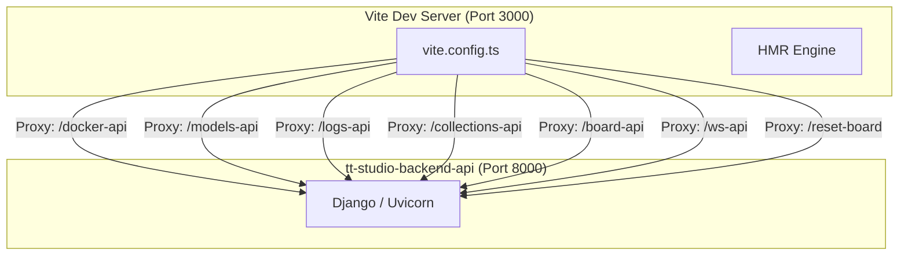
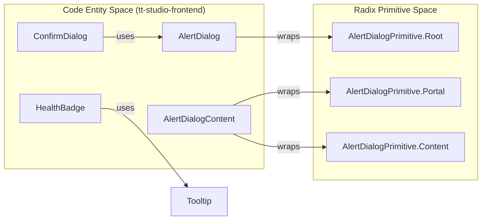

# Frontend Build, Tooling & UI Component Library

This section covers the frontend infrastructure of TT-Studio, detailing the build pipeline, the architectural choices for styling and UI primitives, and the enforcement of development standards through linting and license header management.

## Build Pipeline & Development Environment

TT-Studio utilizes **Vite** as the primary build tool and development server, providing a fast Hot Module Replacement (HMR) experience. The pipeline is strictly typed using **TypeScript**.

### Vite Configuration & Proxy Architecture
The `vite.config.ts` file orchestrates the frontend's connection to the backend services. Because the frontend and backend run in separate containers during development, Vite acts as a reverse proxy to bypass CORS issues and handle specific protocol requirements like Server-Sent Events (SSE).

**Vite Proxy Data Flow**

**Key Proxy Features:**
* **SSE Support:** The proxy is configured to detect `text/event-stream` headers, ensuring `Cache-Control: no-cache` and `Connection: keep-alive` are maintained for real-time inference streaming.
* **Path Rewriting:** Virtual paths used by the frontend (e.g., `/models-api`) are mapped to the actual Django app routes (e.g., `/models/`) using `VITE_BACKEND_PROXY_MAPPING`.
* **Static Asset Handling:** The `vite-plugin-static-copy` plugin ensures that ONNX models and WASM binaries for Silero VAD and ONNX Runtime are available at the root for browser-side inference.
* **Environment Injection:** The application version from `package.json` is injected into the frontend runtime via `import.meta.env.VITE_PACKAGE_VERSION`.

---

## Styling Architecture

TT-Studio uses **Tailwind CSS v4** for its styling engine. The architecture follows a "utility-first" approach combined with CSS variables for theming.

### Theming & Layers
The CSS entry point `index.css` organizes styles into Tailwind layers:
1. **Base Layer:** Defines global font families (Inter, Roboto Mono, Bricolage Grotesque) and resets default border colors to maintain compatibility between Tailwind v3 and v4.
2. **Utility Layer:** Defines custom animations (e.g., `animate-line-shadow`) and complex background patterns (e.g., `bg-grid-pattern`).
3. **Variable-Based Theming:** Light and Dark modes are controlled via CSS variables (e.g., `--background`, `--primary`) defined within the `:root` and `.dark` selectors.

### Custom Utilities & Components
The application extends Tailwind with specialized utilities for AI-specific UI elements, such as `chat-bubble` styles and scrollbar overrides for dark/light modes.

---

## UI Component Library

The UI library is built on **Radix UI** primitives, which provide unstyled, accessible components that are then styled using Tailwind CSS and `class-variance-authority` (CVA).

### Component Composition
Most UI components follow a pattern of wrapping Radix primitives in a `React.forwardRef` to ensure they can be used with animation libraries like `framer-motion` or form libraries like `react-hook-form`.

| Component | Base Primitive / Library | Purpose |
| :--- | :--- | :--- |
| `Dialog` | `@radix-ui/react-dialog` | General purpose modal overlays |
| `AlertDialog` | `@radix-ui/react-alert-dialog` | Destructive action confirmations (e.g., deleting deployments) |
| `ScrollArea` | `@radix-ui/react-scroll-area` | Custom scrollable containers for chat and logs with themed scrollbars |
| `ConfirmDialog` | Custom Wrapper | A reusable abstraction over `AlertDialog` for common "Confirm/Cancel" patterns |
| `Badge` | Custom CVA | Status indicators for hardware and deployment with status dots |
| `HealthBadge` | Custom Component | Dynamic status badge that polls `/models-api/health/` every 3s |

### Implementation Pattern: Alert Dialog
The `AlertDialog` implementation demonstrates how Radix primitives are extended with Tailwind classes. For example, `AlertDialogContent` applies centering logic and theme-aware borders.

**UI Component Architecture**

---

## Production Serving & Nginx

In production, the frontend is served as static assets by **Nginx**. The `nginx.conf` handles client-side routing and mirrors the Vite proxy configuration for API requests.

**Nginx Configuration Logic:**
* **API Proxying:** Requests to `/models-api/`, `/docker-api/`, etc., are proxied to the `tt-studio-backend-api` container.
* **SSE Support:** Nginx disables buffering (`proxy_buffering off`) and increases timeouts to 1200s for long-running model deployment and inference streams.
* **SPA Routing:** The `try_files` directive ensures that deep links (e.g., `/chat/123`) are handled by `index.html`, allowing React Router to take over.
* **Security Headers:** Standard headers like `X-Frame-Options: SAMEORIGIN` and `X-Content-Type-Options: nosniff` are applied globally.

---

## Tooling & Standards Enforcement

The project enforces strict coding standards and legal compliance through automated scripts and linting configurations.

### ESLint & Prettier
The project uses ESLint 9+ with the Flat Config system. Key plugins include:
* `@typescript-eslint`: For type-aware linting.
* `eslint-plugin-react-hooks`: To enforce React's hook rules.
* `eslint-plugin-prettier`: To integrate formatting checks into the linting process.

### SPDX Header Enforcement
TT-Studio requires every source file to contain an SPDX license header. This is managed via:
* **`eslint-plugin-headers`**: Automates the check during the `npm run lint` phase.
*   **Custom Scripts**:
 * `header:check:changed`: Uses `scripts/check-headers-changed.js` to verify headers only on modified files.
 * `header:fix`: Runs `scripts/add-headers.js` to automatically prepend missing headers to files.

### License Auditing
The project includes a script to generate a comprehensive third-party license file, ensuring compliance with open-source dependencies.

---

:::{admonition} Source files this page was written from
:class: dropdown tt-sources

Captured at commit [`c837b829`](https://github.com/tenstorrent/tt-studio/commit/c837b829), so the linked line numbers match that revision.

- [`app/frontend/nginx.conf`](https://github.com/tenstorrent/tt-studio/blob/c837b829/app/frontend/nginx.conf)
- [`app/frontend/package-lock.json`](https://github.com/tenstorrent/tt-studio/blob/c837b829/app/frontend/package-lock.json)
- [`app/frontend/package.json`](https://github.com/tenstorrent/tt-studio/blob/c837b829/app/frontend/package.json)
- [`app/frontend/src/components/ConfirmDialog.tsx`](https://github.com/tenstorrent/tt-studio/blob/c837b829/app/frontend/src/components/ConfirmDialog.tsx)
- [`app/frontend/src/components/CopyableText.tsx`](https://github.com/tenstorrent/tt-studio/blob/c837b829/app/frontend/src/components/CopyableText.tsx)
- [`app/frontend/src/components/HealthBadge.tsx`](https://github.com/tenstorrent/tt-studio/blob/c837b829/app/frontend/src/components/HealthBadge.tsx)
- [`app/frontend/src/components/StatusBadge.tsx`](https://github.com/tenstorrent/tt-studio/blob/c837b829/app/frontend/src/components/StatusBadge.tsx)
- [`app/frontend/src/components/speechToText/mainContent.tsx`](https://github.com/tenstorrent/tt-studio/blob/c837b829/app/frontend/src/components/speechToText/mainContent.tsx)
- [`app/frontend/src/components/ui/alert-dialog.tsx`](https://github.com/tenstorrent/tt-studio/blob/c837b829/app/frontend/src/components/ui/alert-dialog.tsx)
- [`app/frontend/src/components/ui/alert.tsx`](https://github.com/tenstorrent/tt-studio/blob/c837b829/app/frontend/src/components/ui/alert.tsx)
- [`app/frontend/src/components/ui/badge.tsx`](https://github.com/tenstorrent/tt-studio/blob/c837b829/app/frontend/src/components/ui/badge.tsx)
- [`app/frontend/src/components/ui/card.tsx`](https://github.com/tenstorrent/tt-studio/blob/c837b829/app/frontend/src/components/ui/card.tsx)
- [`app/frontend/src/components/ui/dialog.tsx`](https://github.com/tenstorrent/tt-studio/blob/c837b829/app/frontend/src/components/ui/dialog.tsx)
- [`app/frontend/src/components/ui/scroll-area.tsx`](https://github.com/tenstorrent/tt-studio/blob/c837b829/app/frontend/src/components/ui/scroll-area.tsx)
- [`app/frontend/src/components/ui/tooltip.tsx`](https://github.com/tenstorrent/tt-studio/blob/c837b829/app/frontend/src/components/ui/tooltip.tsx)
- [`app/frontend/src/index.css`](https://github.com/tenstorrent/tt-studio/blob/c837b829/app/frontend/src/index.css)
- [`app/frontend/vite.config.ts`](https://github.com/tenstorrent/tt-studio/blob/c837b829/app/frontend/vite.config.ts)
:::
