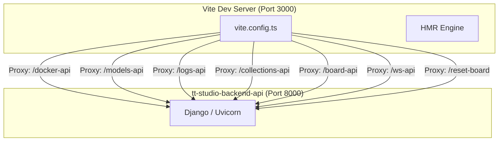
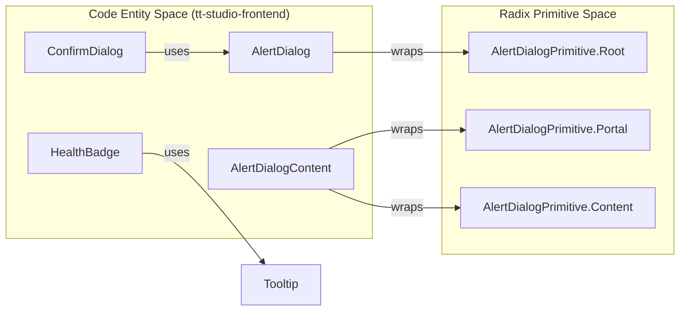

# Frontend Build, Tooling & UI Component Library

Relevant source files

<ul>
<li><a href="https://github.com/tenstorrent/tt-studio/blob/c837b829/app/frontend/nginx.conf">app/frontend/nginx.conf</a></li>
<li><a href="https://github.com/tenstorrent/tt-studio/blob/c837b829/app/frontend/package-lock.json">app/frontend/package-lock.json</a></li>
<li><a href="https://github.com/tenstorrent/tt-studio/blob/c837b829/app/frontend/package.json">app/frontend/package.json</a></li>
<li><a href="https://github.com/tenstorrent/tt-studio/blob/c837b829/app/frontend/src/components/ConfirmDialog.tsx">app/frontend/src/components/ConfirmDialog.tsx</a></li>
<li><a href="https://github.com/tenstorrent/tt-studio/blob/c837b829/app/frontend/src/components/CopyableText.tsx">app/frontend/src/components/CopyableText.tsx</a></li>
<li><a href="https://github.com/tenstorrent/tt-studio/blob/c837b829/app/frontend/src/components/HealthBadge.tsx">app/frontend/src/components/HealthBadge.tsx</a></li>
<li><a href="https://github.com/tenstorrent/tt-studio/blob/c837b829/app/frontend/src/components/StatusBadge.tsx">app/frontend/src/components/StatusBadge.tsx</a></li>
<li><a href="https://github.com/tenstorrent/tt-studio/blob/c837b829/app/frontend/src/components/speechToText/mainContent.tsx">app/frontend/src/components/speechToText/mainContent.tsx</a></li>
<li><a href="https://github.com/tenstorrent/tt-studio/blob/c837b829/app/frontend/src/components/ui/alert-dialog.tsx">app/frontend/src/components/ui/alert-dialog.tsx</a></li>
<li><a href="https://github.com/tenstorrent/tt-studio/blob/c837b829/app/frontend/src/components/ui/alert.tsx">app/frontend/src/components/ui/alert.tsx</a></li>
<li><a href="https://github.com/tenstorrent/tt-studio/blob/c837b829/app/frontend/src/components/ui/badge.tsx">app/frontend/src/components/ui/badge.tsx</a></li>
<li><a href="https://github.com/tenstorrent/tt-studio/blob/c837b829/app/frontend/src/components/ui/card.tsx">app/frontend/src/components/ui/card.tsx</a></li>
<li><a href="https://github.com/tenstorrent/tt-studio/blob/c837b829/app/frontend/src/components/ui/dialog.tsx">app/frontend/src/components/ui/dialog.tsx</a></li>
<li><a href="https://github.com/tenstorrent/tt-studio/blob/c837b829/app/frontend/src/components/ui/scroll-area.tsx">app/frontend/src/components/ui/scroll-area.tsx</a></li>
<li><a href="https://github.com/tenstorrent/tt-studio/blob/c837b829/app/frontend/src/components/ui/tooltip.tsx">app/frontend/src/components/ui/tooltip.tsx</a></li>
<li><a href="https://github.com/tenstorrent/tt-studio/blob/c837b829/app/frontend/src/index.css">app/frontend/src/index.css</a></li>
<li><a href="https://github.com/tenstorrent/tt-studio/blob/c837b829/app/frontend/vite.config.ts">app/frontend/vite.config.ts</a></li>
</ul>

This section covers the frontend infrastructure of TT-Studio, detailing the build pipeline, the architectural choices for styling and UI primitives, and the enforcement of development standards through linting and license header management.

## Build Pipeline & Development Environment

TT-Studio utilizes **Vite** as the primary build tool and development server, providing a fast Hot Module Replacement (HMR) experience [app/frontend/package.json:7-10](https://github.com/tenstorrent/tt-studio/blob/c837b829/app/frontend/package.json#L7-L10). The pipeline is strictly typed using **TypeScript** [app/frontend/package.json:101](https://github.com/tenstorrent/tt-studio/blob/c837b829/app/frontend/package.json#L101).

### Vite Configuration & Proxy Architecture
The `vite.config.ts` file orchestrates the frontend's connection to the backend services. Because the frontend and backend run in separate containers during development, Vite acts as a reverse proxy to bypass CORS issues and handle specific protocol requirements like Server-Sent Events (SSE).

**Vite Proxy Data Flow**

**Key Proxy Features:**
*   **SSE Support:** The proxy is configured to detect `text/event-stream` headers, ensuring `Cache-Control: no-cache` and `Connection: keep-alive` are maintained for real-time inference streaming [app/frontend/vite.config.ts:48-52](https://github.com/tenstorrent/tt-studio/blob/c837b829/app/frontend/vite.config.ts#L48-L52).
*   **Path Rewriting:** Virtual paths used by the frontend (e.g., `/models-api`) are mapped to the actual Django app routes (e.g., `/models/`) using `VITE_BACKEND_PROXY_MAPPING` [app/frontend/vite.config.ts:12-20](https://github.com/tenstorrent/tt-studio/blob/c837b829/app/frontend/vite.config.ts#L12-L20).
*   **Static Asset Handling:** The `vite-plugin-static-copy` plugin ensures that ONNX models and WASM binaries for Silero VAD and ONNX Runtime are available at the root for browser-side inference [app/frontend/vite.config.ts:131-139](https://github.com/tenstorrent/tt-studio/blob/c837b829/app/frontend/vite.config.ts#L131-L139).
*   **Environment Injection:** The application version from `package.json` is injected into the frontend runtime via `import.meta.env.VITE_PACKAGE_VERSION` [app/frontend/vite.config.ts:141-146](https://github.com/tenstorrent/tt-studio/blob/c837b829/app/frontend/vite.config.ts#L141-L146).

**Sources:** [app/frontend/package.json:1-105](https://github.com/tenstorrent/tt-studio/blob/c837b829/app/frontend/package.json#L1-L105), [app/frontend/vite.config.ts:1-163](https://github.com/tenstorrent/tt-studio/blob/c837b829/app/frontend/vite.config.ts#L1-L163)

---

## Styling Architecture

TT-Studio uses **Tailwind CSS v4** for its styling engine [app/frontend/package.json:80](https://github.com/tenstorrent/tt-studio/blob/c837b829/app/frontend/package.json#L80). The architecture follows a "utility-first" approach combined with CSS variables for theming.

### Theming & Layers
The CSS entry point `index.css` organizes styles into Tailwind layers:
1.  **Base Layer:** Defines global font families (Inter, Roboto Mono, Bricolage Grotesque) and resets default border colors to maintain compatibility between Tailwind v3 and v4 [app/frontend/src/index.css:1-27](https://github.com/tenstorrent/tt-studio/blob/c837b829/app/frontend/src/index.css#L1-L27).
2.  **Utility Layer:** Defines custom animations (e.g., `animate-line-shadow`) and complex background patterns (e.g., `bg-grid-pattern`) [app/frontend/src/index.css:29-50](https://github.com/tenstorrent/tt-studio/blob/c837b829/app/frontend/src/index.css#L29-L50).
3.  **Variable-Based Theming:** Light and Dark modes are controlled via CSS variables (e.g., `--background`, `--primary`) defined within the `:root` and `.dark` selectors [app/frontend/src/index.css:195-262](https://github.com/tenstorrent/tt-studio/blob/c837b829/app/frontend/src/index.css#L195-L262).

### Custom Utilities & Components
The application extends Tailwind with specialized utilities for AI-specific UI elements, such as `chat-bubble` styles and scrollbar overrides for dark/light modes [app/frontend/src/index.css:55-128](https://github.com/tenstorrent/tt-studio/blob/c837b829/app/frontend/src/index.css#L55-L128).

**Sources:** [app/frontend/src/index.css:1-262](https://github.com/tenstorrent/tt-studio/blob/c837b829/app/frontend/src/index.css#L1-L262), [app/frontend/package.json:80](https://github.com/tenstorrent/tt-studio/blob/c837b829/app/frontend/package.json#L80)

---

## UI Component Library

The UI library is built on **Radix UI** primitives, which provide unstyled, accessible components that are then styled using Tailwind CSS and `class-variance-authority` (CVA).

### Component Composition
Most UI components follow a pattern of wrapping Radix primitives in a `React.forwardRef` to ensure they can be used with animation libraries like `framer-motion` or form libraries like `react-hook-form`.

| Component | Base Primitive / Library | Purpose |
| :--- | :--- | :--- |
| `Dialog` | `@radix-ui/react-dialog` | General purpose modal overlays [app/frontend/src/components/ui/dialog.tsx:11](https://github.com/tenstorrent/tt-studio/blob/c837b829/app/frontend/src/components/ui/dialog.tsx#L11) |
| `AlertDialog` | `@radix-ui/react-alert-dialog` | Destructive action confirmations (e.g., deleting deployments) [app/frontend/src/components/ui/alert-dialog.tsx:9](https://github.com/tenstorrent/tt-studio/blob/c837b829/app/frontend/src/components/ui/alert-dialog.tsx#L9) |
| `ScrollArea` | `@radix-ui/react-scroll-area` | Custom scrollable containers for chat and logs with themed scrollbars [app/frontend/src/components/ui/scroll-area.tsx:8](https://github.com/tenstorrent/tt-studio/blob/c837b829/app/frontend/src/components/ui/scroll-area.tsx#L8) |
| `ConfirmDialog` | Custom Wrapper | A reusable abstraction over `AlertDialog` for common "Confirm/Cancel" patterns [app/frontend/src/components/ConfirmDialog.tsx:15](https://github.com/tenstorrent/tt-studio/blob/c837b829/app/frontend/src/components/ConfirmDialog.tsx#L15) |
| `Badge` | Custom CVA | Status indicators for hardware and deployment with status dots [app/frontend/src/components/ui/badge.tsx:16](https://github.com/tenstorrent/tt-studio/blob/c837b829/app/frontend/src/components/ui/badge.tsx#L16) |
| `HealthBadge` | Custom Component | Dynamic status badge that polls `/models-api/health/` every 3s [app/frontend/src/components/HealthBadge.tsx:56-150](https://github.com/tenstorrent/tt-studio/blob/c837b829/app/frontend/src/components/HealthBadge.tsx#L56-L150) |

### Implementation Pattern: Alert Dialog
The `AlertDialog` implementation demonstrates how Radix primitives are extended with Tailwind classes. For example, `AlertDialogContent` applies centering logic and theme-aware borders [app/frontend/src/components/ui/alert-dialog.tsx:44](https://github.com/tenstorrent/tt-studio/blob/c837b829/app/frontend/src/components/ui/alert-dialog.tsx#L44).

**UI Component Architecture**

**Sources:** [app/frontend/src/components/ui/alert-dialog.tsx:1-146](https://github.com/tenstorrent/tt-studio/blob/c837b829/app/frontend/src/components/ui/alert-dialog.tsx#L1-L146), [app/frontend/src/components/ui/scroll-area.tsx:1-59](https://github.com/tenstorrent/tt-studio/blob/c837b829/app/frontend/src/components/ui/scroll-area.tsx#L1-L59), [app/frontend/src/components/ConfirmDialog.tsx:1-52](https://github.com/tenstorrent/tt-studio/blob/c837b829/app/frontend/src/components/ConfirmDialog.tsx#L1-L52), [app/frontend/src/components/HealthBadge.tsx:1-217](https://github.com/tenstorrent/tt-studio/blob/c837b829/app/frontend/src/components/HealthBadge.tsx#L1-L217)

---

## Production Serving & Nginx

In production, the frontend is served as static assets by **Nginx**. The `nginx.conf` handles client-side routing and mirrors the Vite proxy configuration for API requests.

**Nginx Configuration Logic:**
*   **API Proxying:** Requests to `/models-api/`, `/docker-api/`, etc., are proxied to the `tt-studio-backend-api` container [app/frontend/nginx.conf:8-66](https://github.com/tenstorrent/tt-studio/blob/c837b829/app/frontend/nginx.conf#L8-L66).
*   **SSE Support:** Nginx disables buffering (`proxy_buffering off`) and increases timeouts to 1200s for long-running model deployment and inference streams [app/frontend/nginx.conf:16-18](https://github.com/tenstorrent/tt-studio/blob/c837b829/app/frontend/nginx.conf#L16-L18).
*   **SPA Routing:** The `try_files` directive ensures that deep links (e.g., `/chat/123`) are handled by `index.html`, allowing React Router to take over [app/frontend/nginx.conf:73](https://github.com/tenstorrent/tt-studio/blob/c837b829/app/frontend/nginx.conf#L73).
*   **Security Headers:** Standard headers like `X-Frame-Options: SAMEORIGIN` and `X-Content-Type-Options: nosniff` are applied globally [app/frontend/nginx.conf:77-79](https://github.com/tenstorrent/tt-studio/blob/c837b829/app/frontend/nginx.conf#L77-L79).

**Sources:** [app/frontend/nginx.conf:1-80](https://github.com/tenstorrent/tt-studio/blob/c837b829/app/frontend/nginx.conf#L1-L80)

---

## Tooling & Standards Enforcement

The project enforces strict coding standards and legal compliance through automated scripts and linting configurations.

### ESLint & Prettier
The project uses ESLint 9+ with the Flat Config system. Key plugins include:
*   `@typescript-eslint`: For type-aware linting [app/frontend/package.json:88-89](https://github.com/tenstorrent/tt-studio/blob/c837b829/app/frontend/package.json#L88-L89).
*   `eslint-plugin-react-hooks`: To enforce React's hook rules [app/frontend/package.json:96](https://github.com/tenstorrent/tt-studio/blob/c837b829/app/frontend/package.json#L96).
*   `eslint-plugin-prettier`: To integrate formatting checks into the linting process [app/frontend/package.json:94](https://github.com/tenstorrent/tt-studio/blob/c837b829/app/frontend/package.json#L94).

### SPDX Header Enforcement
TT-Studio requires every source file to contain an SPDX license header. This is managed via:
*   **`eslint-plugin-headers`**: Automates the check during the `npm run lint` phase [app/frontend/package.json:93](https://github.com/tenstorrent/tt-studio/blob/c837b829/app/frontend/package.json#L93).
*   **Custom Scripts**:
    *   `header:check:changed`: Uses `scripts/check-headers-changed.js` to verify headers only on modified files [app/frontend/package.json:21](https://github.com/tenstorrent/tt-studio/blob/c837b829/app/frontend/package.json#L21).
    *   `header:fix`: Runs `scripts/add-headers.js` to automatically prepend missing headers to files [app/frontend/package.json:23](https://github.com/tenstorrent/tt-studio/blob/c837b829/app/frontend/package.json#L23).

### License Auditing
The project includes a script to generate a comprehensive third-party license file, ensuring compliance with open-source dependencies [app/frontend/package.json:17](https://github.com/tenstorrent/tt-studio/blob/c837b829/app/frontend/package.json#L17).

**Sources:** [app/frontend/package.json:11-28](https://github.com/tenstorrent/tt-studio/blob/c837b829/app/frontend/package.json#L11-L28), [app/frontend/package.json:63-104](https://github.com/tenstorrent/tt-studio/blob/c837b829/app/frontend/package.json#L63-L104)
