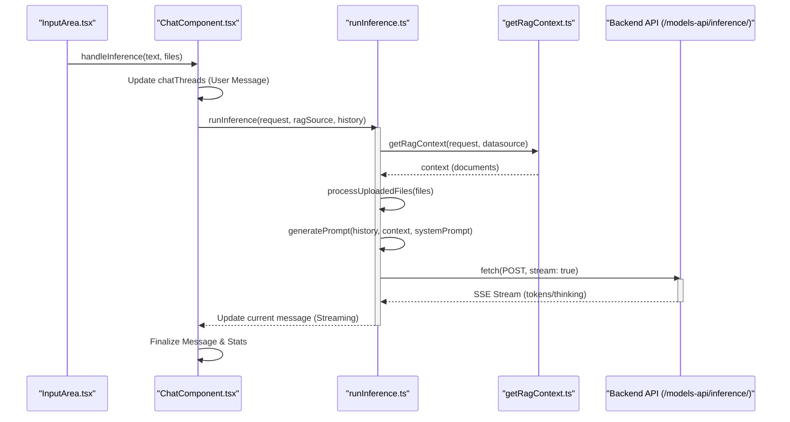
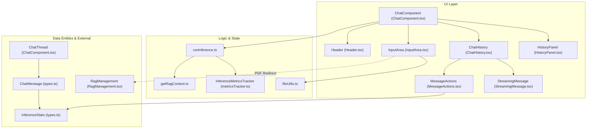
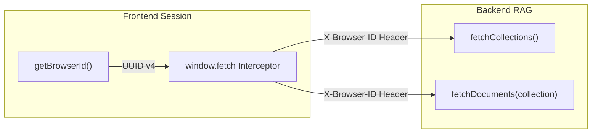

# Chat UI

Relevant source files

<ul>
<li><a href="https://github.com/tenstorrent/tt-studio/blob/c837b829/app/frontend/src/components/CustomToaster.tsx">app/frontend/src/components/CustomToaster.tsx</a></li>
<li><a href="https://github.com/tenstorrent/tt-studio/blob/c837b829/app/frontend/src/components/chatui/ChatComponent.tsx">app/frontend/src/components/chatui/ChatComponent.tsx</a></li>
<li><a href="https://github.com/tenstorrent/tt-studio/blob/c837b829/app/frontend/src/components/chatui/ChatHistory.tsx">app/frontend/src/components/chatui/ChatHistory.tsx</a></li>
<li><a href="https://github.com/tenstorrent/tt-studio/blob/c837b829/app/frontend/src/components/chatui/FileDisplay.tsx">app/frontend/src/components/chatui/FileDisplay.tsx</a></li>
<li><a href="https://github.com/tenstorrent/tt-studio/blob/c837b829/app/frontend/src/components/chatui/Header.tsx">app/frontend/src/components/chatui/Header.tsx</a></li>
<li><a href="https://github.com/tenstorrent/tt-studio/blob/c837b829/app/frontend/src/components/chatui/HistoryPanel.tsx">app/frontend/src/components/chatui/HistoryPanel.tsx</a></li>
<li><a href="https://github.com/tenstorrent/tt-studio/blob/c837b829/app/frontend/src/components/chatui/ImagePreview.tsx">app/frontend/src/components/chatui/ImagePreview.tsx</a></li>
<li><a href="https://github.com/tenstorrent/tt-studio/blob/c837b829/app/frontend/src/components/chatui/InferenceStats.tsx">app/frontend/src/components/chatui/InferenceStats.tsx</a></li>
<li><a href="https://github.com/tenstorrent/tt-studio/blob/c837b829/app/frontend/src/components/chatui/InputArea.tsx">app/frontend/src/components/chatui/InputArea.tsx</a></li>
<li><a href="https://github.com/tenstorrent/tt-studio/blob/c837b829/app/frontend/src/components/chatui/MessageActions.tsx">app/frontend/src/components/chatui/MessageActions.tsx</a></li>
<li><a href="https://github.com/tenstorrent/tt-studio/blob/c837b829/app/frontend/src/components/chatui/StreamingMessage.tsx">app/frontend/src/components/chatui/StreamingMessage.tsx</a></li>
<li><a href="https://github.com/tenstorrent/tt-studio/blob/c837b829/app/frontend/src/components/chatui/fileUtils.tsx">app/frontend/src/components/chatui/fileUtils.tsx</a></li>
<li><a href="https://github.com/tenstorrent/tt-studio/blob/c837b829/app/frontend/src/components/chatui/processUploadedFiles.tsx">app/frontend/src/components/chatui/processUploadedFiles.tsx</a></li>
<li><a href="https://github.com/tenstorrent/tt-studio/blob/c837b829/app/frontend/src/components/chatui/runInference.ts">app/frontend/src/components/chatui/runInference.ts</a></li>
<li><a href="https://github.com/tenstorrent/tt-studio/blob/c837b829/app/frontend/src/components/chatui/types.ts">app/frontend/src/components/chatui/types.ts</a></li>
<li><a href="https://github.com/tenstorrent/tt-studio/blob/c837b829/app/frontend/src/components/rag/RagManagement.tsx">app/frontend/src/components/rag/RagManagement.tsx</a></li>
<li><a href="https://github.com/tenstorrent/tt-studio/blob/c837b829/app/frontend/src/components/rag/index.ts">app/frontend/src/components/rag/index.ts</a></li>
<li><a href="https://github.com/tenstorrent/tt-studio/blob/c837b829/app/frontend/src/pages/ChatUIPage.tsx">app/frontend/src/pages/ChatUIPage.tsx</a></li>
<li><a href="https://github.com/tenstorrent/tt-studio/blob/c837b829/app/frontend/tsconfig.json">app/frontend/tsconfig.json</a></li>
</ul>

The Chat UI is the primary interface for interacting with deployed models in TT-Studio. It provides a multi-modal, stateful chat experience supporting streaming responses, RAG (Retrieval-Augmented Generation) context injection, file handling, and real-time hardware performance metrics.

## Architecture & Data Flow

The Chat interface is centered around `ChatComponent`, which orchestrates the conversation state, model selection, and inference execution.

### Inference Execution Flow
The following diagram illustrates the data flow from user input to the backend inference services, highlighting the integration of RAG and multi-modal processing.

**Chat Inference Sequence**

---

## Key Components

### 1. ChatComponent
The root container for the chat interface. It manages:
* **Persistent State:** Uses `usePersistentState` to store `chat_threads` (array of `ChatThread`) and `current_thread_index` in local storage ``.
* **Model Management:** Fetches deployed models via `fetchDeployedModelsInfo` and allows switching via the `Header` ``.
* **Inference Control:** Maintains an `inferenceController` (AbortController) to stop streaming requests ``.
* **Hardware Awareness:** Detects board name via `useDeviceState` and injects `hardwareContext` into the inference prompt ``.

### 2. Header (Model & RAG Selection)
The `Header` component provides controls for the environment of the current chat session:
* **ModelSelector:** A dropdown to switch between currently active model deployments ``.
* **Knowledge Base (RAG):** A `Select` component (`ForwardedSelect`) to choose a specific ChromaDB collection or "Search All Collections" ``.
* **Agent Toggle:** A switch to route requests to the `tt_studio_agent` service instead of direct LLM inference ``.

### 3. InputArea (Multi-modal Input)
Handles user interactions for sending messages and files:
* **File Handling:** Supports images and text files. Text files are processed as RAG context during inference ``.
* **PDF Detection:** Specifically detects PDF uploads via `PdfDetectionDialog` and prompts the user to use the RAG Management page, as PDFs require backend chunking/embedding ``.
* **Voice Input:** Integrates `VoiceInput` for speech-to-text capabilities ``.
* **Dynamic Sizing:** Automatically adjusts textarea height based on content ``.

### 4. ChatHistory & StreamingMessage
Displays the conversation thread:
* **ChatHistory:** Manages the list of messages and responsive bubble widths ``.
* **StreamingMessage:** Handles the rendering of incoming tokens. It uses `processContent` to strip thinking tokens and extract reasoning blocks found between `<think>` tags ``. It also handles live auto-scrolling for "thinking" blocks ``.
*   **MessageActions:** Provides per-message utilities including:
 * **Clipboard:** Copying message content ``.
 * **Feedback:** Thumbs up/down tracking with toast notifications ``.
 * **Thinking Toggle:** For models with reasoning capabilities, this toggles the visibility of the `Brain` icon and the associated thinking panel ``.

---

## Inference Implementation (`runInference.ts`)

The `runInference` function is the core logic for executing requests. It transforms the UI state into a format compatible with the backend inference API.

| Step | Description | Code Reference |
| :--- | :--- | :--- |
| **RAG Retrieval** | If a `ragDatasource` is selected, it calls `getRagContext` to fetch document chunks. | `` |
| **Prompt Assembly** | Uses `generatePrompt` to combine chat history, RAG context, and system prompts. | `` |
| **Multi-modal Prep** | Encodes images to `image_url` message structures or treats text files as local RAG context. | `` |
| **Route Selection** | Determines API endpoint based on `isAgentSelected` or `VITE_ENABLE_DEPLOYED` (Cloud vs Local). | `` |
| **Metric Tracking** | Uses `InferenceMetricsTracker` to calculate TTFT and tokens per second. | `` |

---

## Hardware Metrics & Stats

TT-Studio emphasizes performance transparency. The `InferenceStats` component visualizes metrics returned by the backend or calculated by the client.

### Data Structure (`InferenceStats`)
The system tracks several key performance indicators (KPIs) defined in `types.ts`:
*   **`user_ttft_s`**: Backend-measured Time to First Token (seconds).
* **`client_ttft_ms`**: Client-measured TTFT including network latency ``.
*   **`user_tpot`**: Time Per Output Token.
* **`thinking_duration_ms`**: Time spent in the reasoning phase ``.
* **`token_timestamps`**: Array of `TokenTimestamp` used to calculate median, p95, and p99 token latencies ``.

---

## Component Relationship Diagram

This diagram maps UI components to their underlying logic, types, and the external RAG system.

## RAG Integration and Browser Session

RAG management uses a unique `X-Browser-ID` to track sessions across requests.

