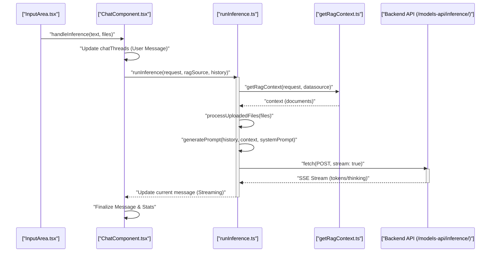
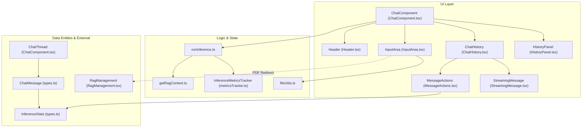
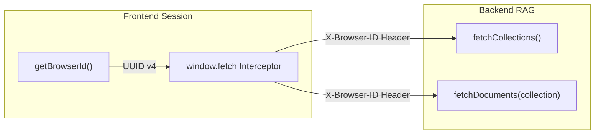

# Chat UI

Relevant source files

<ul>
<li><a href="https://github.com/tenstorrent/tt-studio/blob/c837b829/app/frontend/src/components/CustomToaster.tsx">app/frontend/src/components/CustomToaster.tsx</a></li>
<li><a href="https://github.com/tenstorrent/tt-studio/blob/c837b829/app/frontend/src/components/chatui/ChatComponent.tsx">app/frontend/src/components/chatui/ChatComponent.tsx</a></li>
<li><a href="https://github.com/tenstorrent/tt-studio/blob/c837b829/app/frontend/src/components/chatui/ChatHistory.tsx">app/frontend/src/components/chatui/ChatHistory.tsx</a></li>
<li><a href="https://github.com/tenstorrent/tt-studio/blob/c837b829/app/frontend/src/components/chatui/FileDisplay.tsx">app/frontend/src/components/chatui/FileDisplay.tsx</a></li>
<li><a href="https://github.com/tenstorrent/tt-studio/blob/c837b829/app/frontend/src/components/chatui/Header.tsx">app/frontend/src/components/chatui/Header.tsx</a></li>
<li><a href="https://github.com/tenstorrent/tt-studio/blob/c837b829/app/frontend/src/components/chatui/HistoryPanel.tsx">app/frontend/src/components/chatui/HistoryPanel.tsx</a></li>
<li><a href="https://github.com/tenstorrent/tt-studio/blob/c837b829/app/frontend/src/components/chatui/ImagePreview.tsx">app/frontend/src/components/chatui/ImagePreview.tsx</a></li>
<li><a href="https://github.com/tenstorrent/tt-studio/blob/c837b829/app/frontend/src/components/chatui/InferenceStats.tsx">app/frontend/src/components/chatui/InferenceStats.tsx</a></li>
<li><a href="https://github.com/tenstorrent/tt-studio/blob/c837b829/app/frontend/src/components/chatui/InputArea.tsx">app/frontend/src/components/chatui/InputArea.tsx</a></li>
<li><a href="https://github.com/tenstorrent/tt-studio/blob/c837b829/app/frontend/src/components/chatui/MessageActions.tsx">app/frontend/src/components/chatui/MessageActions.tsx</a></li>
<li><a href="https://github.com/tenstorrent/tt-studio/blob/c837b829/app/frontend/src/components/chatui/StreamingMessage.tsx">app/frontend/src/components/chatui/StreamingMessage.tsx</a></li>
<li><a href="https://github.com/tenstorrent/tt-studio/blob/c837b829/app/frontend/src/components/chatui/fileUtils.tsx">app/frontend/src/components/chatui/fileUtils.tsx</a></li>
<li><a href="https://github.com/tenstorrent/tt-studio/blob/c837b829/app/frontend/src/components/chatui/processUploadedFiles.tsx">app/frontend/src/components/chatui/processUploadedFiles.tsx</a></li>
<li><a href="https://github.com/tenstorrent/tt-studio/blob/c837b829/app/frontend/src/components/chatui/runInference.ts">app/frontend/src/components/chatui/runInference.ts</a></li>
<li><a href="https://github.com/tenstorrent/tt-studio/blob/c837b829/app/frontend/src/components/chatui/types.ts">app/frontend/src/components/chatui/types.ts</a></li>
<li><a href="https://github.com/tenstorrent/tt-studio/blob/c837b829/app/frontend/src/components/rag/RagManagement.tsx">app/frontend/src/components/rag/RagManagement.tsx</a></li>
<li><a href="https://github.com/tenstorrent/tt-studio/blob/c837b829/app/frontend/src/components/rag/index.ts">app/frontend/src/components/rag/index.ts</a></li>
<li><a href="https://github.com/tenstorrent/tt-studio/blob/c837b829/app/frontend/src/pages/ChatUIPage.tsx">app/frontend/src/pages/ChatUIPage.tsx</a></li>
<li><a href="https://github.com/tenstorrent/tt-studio/blob/c837b829/app/frontend/tsconfig.json">app/frontend/tsconfig.json</a></li>
</ul>

The Chat UI is the primary interface for interacting with deployed models in TT-Studio. It provides a multi-modal, stateful chat experience supporting streaming responses, RAG (Retrieval-Augmented Generation) context injection, file handling, and real-time hardware performance metrics.

## Architecture & Data Flow

The Chat interface is centered around `ChatComponent`, which orchestrates the conversation state, model selection, and inference execution.

### Inference Execution Flow
The following diagram illustrates the data flow from user input to the backend inference services, highlighting the integration of RAG and multi-modal processing.

**Chat Inference Sequence**

Sources: `[app/frontend/src/components/chatui/ChatComponent.tsx:40-135](https://github.com/tenstorrent/tt-studio/blob/c837b829/app/frontend/src/components/chatui/ChatComponent.tsx#L40-L135)`, `[app/frontend/src/components/chatui/runInference.ts:18-36](https://github.com/tenstorrent/tt-studio/blob/c837b829/app/frontend/src/components/chatui/runInference.ts#L18-L36)`, `[app/frontend/src/components/chatui/runInference.ts:181-185](https://github.com/tenstorrent/tt-studio/blob/c837b829/app/frontend/src/components/chatui/runInference.ts#L181-L185)`, `[app/frontend/src/components/chatui/runInference.ts:53-55](https://github.com/tenstorrent/tt-studio/blob/c837b829/app/frontend/src/components/chatui/runInference.ts#L53-L55)`

---

## Key Components

### 1. ChatComponent
The root container for the chat interface. It manages:
*   **Persistent State:** Uses `usePersistentState` to store `chat_threads` (array of `ChatThread`) and `current_thread_index` in local storage `[app/frontend/src/components/chatui/ChatComponent.tsx:77-83](https://github.com/tenstorrent/tt-studio/blob/c837b829/app/frontend/src/components/chatui/ChatComponent.tsx#L77-L83)`.
*   **Model Management:** Fetches deployed models via `fetchDeployedModelsInfo` and allows switching via the `Header` `[app/frontend/src/components/chatui/ChatComponent.tsx:204-210](https://github.com/tenstorrent/tt-studio/blob/c837b829/app/frontend/src/components/chatui/ChatComponent.tsx#L204-L210)`.
*   **Inference Control:** Maintains an `inferenceController` (AbortController) to stop streaming requests `[app/frontend/src/components/chatui/ChatComponent.tsx:132-134](https://github.com/tenstorrent/tt-studio/blob/c837b829/app/frontend/src/components/chatui/ChatComponent.tsx#L132-L134)`.
*   **Hardware Awareness:** Detects board name via `useDeviceState` and injects `hardwareContext` into the inference prompt `[app/frontend/src/components/chatui/ChatComponent.tsx:43-49](https://github.com/tenstorrent/tt-studio/blob/c837b829/app/frontend/src/components/chatui/ChatComponent.tsx#L43-L49)`.

### 2. Header (Model & RAG Selection)
The `Header` component provides controls for the environment of the current chat session:
*   **ModelSelector:** A dropdown to switch between currently active model deployments `[app/frontend/src/components/chatui/Header.tsx:84-114](https://github.com/tenstorrent/tt-studio/blob/c837b829/app/frontend/src/components/chatui/Header.tsx#L84-L114)`.
*   **Knowledge Base (RAG):** A `Select` component (`ForwardedSelect`) to choose a specific ChromaDB collection or "Search All Collections" `[app/frontend/src/components/chatui/Header.tsx:123-167](https://github.com/tenstorrent/tt-studio/blob/c837b829/app/frontend/src/components/chatui/Header.tsx#L123-L167)`.
*   **Agent Toggle:** A switch to route requests to the `tt_studio_agent` service instead of direct LLM inference `[app/frontend/src/components/chatui/ChatComponent.tsx:93-96](https://github.com/tenstorrent/tt-studio/blob/c837b829/app/frontend/src/components/chatui/ChatComponent.tsx#L93-L96)`.

### 3. InputArea (Multi-modal Input)
Handles user interactions for sending messages and files:
*   **File Handling:** Supports images and text files. Text files are processed as RAG context during inference `[app/frontend/src/components/chatui/runInference.ts:57-66](https://github.com/tenstorrent/tt-studio/blob/c837b829/app/frontend/src/components/chatui/runInference.ts#L57-L66)`.
*   **PDF Detection:** Specifically detects PDF uploads via `PdfDetectionDialog` and prompts the user to use the RAG Management page, as PDFs require backend chunking/embedding `[app/frontend/src/components/chatui/InputArea.tsx:48-119](https://github.com/tenstorrent/tt-studio/blob/c837b829/app/frontend/src/components/chatui/InputArea.tsx#L48-L119)`.
*   **Voice Input:** Integrates `VoiceInput` for speech-to-text capabilities `[app/frontend/src/components/chatui/InputArea.tsx:18-18](https://github.com/tenstorrent/tt-studio/blob/c837b829/app/frontend/src/components/chatui/InputArea.tsx#L18-L18)`.
*   **Dynamic Sizing:** Automatically adjusts textarea height based on content `[app/frontend/src/components/chatui/InputArea.tsx:198-216](https://github.com/tenstorrent/tt-studio/blob/c837b829/app/frontend/src/components/chatui/InputArea.tsx#L198-L216)`.

### 4. ChatHistory & StreamingMessage
Displays the conversation thread:
*   **ChatHistory:** Manages the list of messages and responsive bubble widths `[app/frontend/src/components/chatui/ChatHistory.tsx:111-201](https://github.com/tenstorrent/tt-studio/blob/c837b829/app/frontend/src/components/chatui/ChatHistory.tsx#L111-L201)`.
*   **StreamingMessage:** Handles the rendering of incoming tokens. It uses `processContent` to strip thinking tokens and extract reasoning blocks found between `<think>` tags `[app/frontend/src/components/chatui/StreamingMessage.tsx:22-49](https://github.com/tenstorrent/tt-studio/blob/c837b829/app/frontend/src/components/chatui/StreamingMessage.tsx#L22-L49)`. It also handles live auto-scrolling for "thinking" blocks `[app/frontend/src/components/chatui/StreamingMessage.tsx:154-159](https://github.com/tenstorrent/tt-studio/blob/c837b829/app/frontend/src/components/chatui/StreamingMessage.tsx#L154-L159)`.
*   **MessageActions:** Provides per-message utilities including:
    *   **Clipboard:** Copying message content `[app/frontend/src/components/chatui/MessageActions.tsx:61-71](https://github.com/tenstorrent/tt-studio/blob/c837b829/app/frontend/src/components/chatui/MessageActions.tsx#L61-L71)`.
    *   **Feedback:** Thumbs up/down tracking with toast notifications `[app/frontend/src/components/chatui/MessageActions.tsx:73-99](https://github.com/tenstorrent/tt-studio/blob/c837b829/app/frontend/src/components/chatui/MessageActions.tsx#L73-L99)`.
    *   **Thinking Toggle:** For models with reasoning capabilities, this toggles the visibility of the `Brain` icon and the associated thinking panel `[app/frontend/src/components/chatui/MessageActions.tsx:155-174](https://github.com/tenstorrent/tt-studio/blob/c837b829/app/frontend/src/components/chatui/MessageActions.tsx#L155-L174)`.

---

## Inference Implementation (`runInference.ts`)

The `runInference` function is the core logic for executing requests. It transforms the UI state into a format compatible with the backend inference API.

| Step | Description | Code Reference |
| :--- | :--- | :--- |
| **RAG Retrieval** | If a `ragDatasource` is selected, it calls `getRagContext` to fetch document chunks. | `[app/frontend/src/components/chatui/runInference.ts:44-50](https://github.com/tenstorrent/tt-studio/blob/c837b829/app/frontend/src/components/chatui/runInference.ts#L44-L50)` |
| **Prompt Assembly** | Uses `generatePrompt` to combine chat history, RAG context, and system prompts. | `[app/frontend/src/components/chatui/runInference.ts:143-150](https://github.com/tenstorrent/tt-studio/blob/c837b829/app/frontend/src/components/chatui/runInference.ts#L143-L150)` |
| **Multi-modal Prep** | Encodes images to `image_url` message structures or treats text files as local RAG context. | `[app/frontend/src/components/chatui/runInference.ts:57-106](https://github.com/tenstorrent/tt-studio/blob/c837b829/app/frontend/src/components/chatui/runInference.ts#L57-L106)` |
| **Route Selection** | Determines API endpoint based on `isAgentSelected` or `VITE_ENABLE_DEPLOYED` (Cloud vs Local). | `[app/frontend/src/components/chatui/runInference.ts:181-185](https://github.com/tenstorrent/tt-studio/blob/c837b829/app/frontend/src/components/chatui/runInference.ts#L181-L185)` |
| **Metric Tracking** | Uses `InferenceMetricsTracker` to calculate TTFT and tokens per second. | `[app/frontend/src/components/chatui/runInference.ts:16-16](https://github.com/tenstorrent/tt-studio/blob/c837b829/app/frontend/src/components/chatui/runInference.ts#L16-L16)` |

Sources: `[app/frontend/src/components/chatui/runInference.ts:1-220](https://github.com/tenstorrent/tt-studio/blob/c837b829/app/frontend/src/components/chatui/runInference.ts#L1-L220)`

---

## Hardware Metrics & Stats

TT-Studio emphasizes performance transparency. The `InferenceStats` component visualizes metrics returned by the backend or calculated by the client.

### Data Structure (`InferenceStats`)
The system tracks several key performance indicators (KPIs) defined in `types.ts`:
*   **`user_ttft_s`**: Backend-measured Time to First Token (seconds).
*   **`client_ttft_ms`**: Client-measured TTFT including network latency `[app/frontend/src/components/chatui/types.ts:128-128](https://github.com/tenstorrent/tt-studio/blob/c837b829/app/frontend/src/components/chatui/types.ts#L128-L128)`.
*   **`user_tpot`**: Time Per Output Token.
*   **`thinking_duration_ms`**: Time spent in the reasoning phase `[app/frontend/src/components/chatui/types.ts:135-135](https://github.com/tenstorrent/tt-studio/blob/c837b829/app/frontend/src/components/chatui/types.ts#L135-L135)`.
*   **`token_timestamps`**: Array of `TokenTimestamp` used to calculate median, p95, and p99 token latencies `[app/frontend/src/components/chatui/types.ts:99-104](https://github.com/tenstorrent/tt-studio/blob/c837b829/app/frontend/src/components/chatui/types.ts#L99-L104)`.

Sources: `[app/frontend/src/components/chatui/types.ts:112-136](https://github.com/tenstorrent/tt-studio/blob/c837b829/app/frontend/src/components/chatui/types.ts#L112-L136)`, `[app/frontend/src/components/chatui/MessageActions.tsx:178-184](https://github.com/tenstorrent/tt-studio/blob/c837b829/app/frontend/src/components/chatui/MessageActions.tsx#L178-L184)`

---

## Component Relationship Diagram

This diagram maps UI components to their underlying logic, types, and the external RAG system.

Sources: `[app/frontend/src/components/chatui/ChatComponent.tsx:13-31](https://github.com/tenstorrent/tt-studio/blob/c837b829/app/frontend/src/components/chatui/ChatComponent.tsx#L13-L31)`, `[app/frontend/src/components/chatui/types.ts:32-42](https://github.com/tenstorrent/tt-studio/blob/c837b829/app/frontend/src/components/chatui/types.ts#L32-L42)`, `[app/frontend/src/components/chatui/runInference.ts:12-16](https://github.com/tenstorrent/tt-studio/blob/c837b829/app/frontend/src/components/chatui/runInference.ts#L12-L16)`, `[app/frontend/src/components/chatui/InputArea.tsx:170-172](https://github.com/tenstorrent/tt-studio/blob/c837b829/app/frontend/src/components/chatui/InputArea.tsx#L170-L172)`, `[app/frontend/src/components/chatui/HistoryPanel.tsx:18-26](https://github.com/tenstorrent/tt-studio/blob/c837b829/app/frontend/src/components/chatui/HistoryPanel.tsx#L18-L26)`

## RAG Integration and Browser Session

RAG management uses a unique `X-Browser-ID` to track sessions across requests.

Sources: `[app/frontend/src/components/rag/RagManagement.tsx:67-76](https://github.com/tenstorrent/tt-studio/blob/c837b829/app/frontend/src/components/rag/RagManagement.tsx#L67-L76)`, `[app/frontend/src/components/rag/RagManagement.tsx:79-97](https://github.com/tenstorrent/tt-studio/blob/c837b829/app/frontend/src/components/rag/RagManagement.tsx#L79-L97)`, `[app/frontend/src/components/rag/RagManagement.tsx:160-190](https://github.com/tenstorrent/tt-studio/blob/c837b829/app/frontend/src/components/rag/RagManagement.tsx#L160-L190)`2b:T24c1,# RAG Management UI
