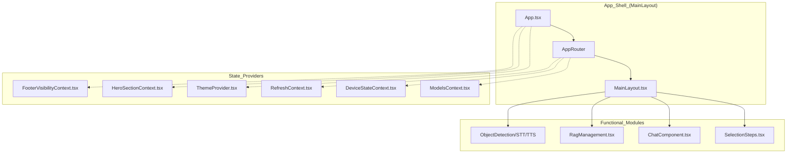
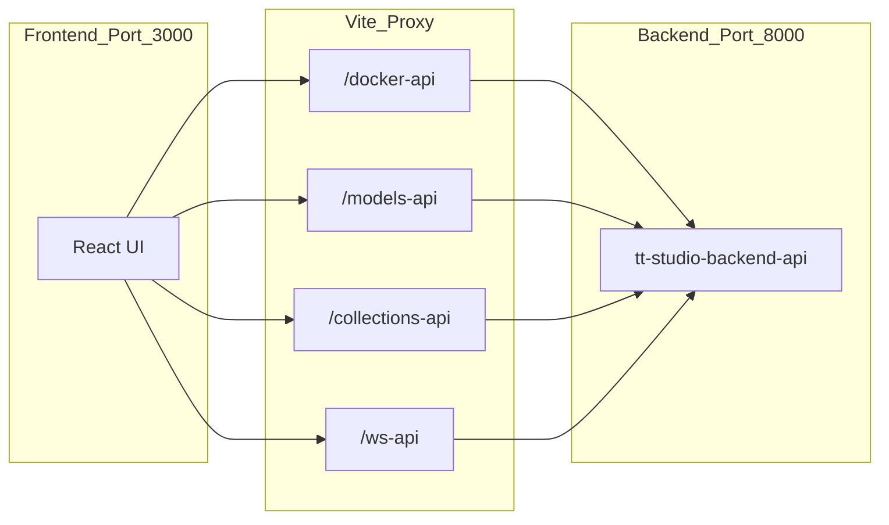

# Frontend Application

The TT-Studio frontend is a modern, responsive single-page application (SPA) built with **React 18**, **TypeScript**, and **Vite**. It provides the primary interface for hardware discovery, model deployment orchestration, and multi-modal AI interaction. The application is designed to handle real-time data streaming via Server-Sent Events (SSE) for both deployment progress and model inference.

## Core Technology Stack
| Category | Technology |
| :--- | :--- |
| **Framework** | React 18 (Functional Components, Hooks) |
| **Build Tool** | Vite 6 + SWC (Fast Refresh, Optimized Bundling) |
| **Styling** | Tailwind CSS 4 + Framer Motion (Animations) |
| **UI Components** | Radix UI Primitives + Lucide Icons |
| **State/Data** | TanStack Query (React Query) + React Context API |
| **Routing** | React Router DOM v6 |

## Application Architecture

The application is structured around a centralized layout shell that manages navigation and global state providers. The frontend communicates with the Django backend through a series of proxied API routes defined in the Vite configuration.

### System Entry and Routing
The application initializes in `App.tsx`, wrapping the component tree in essential providers for theming, data fetching, and layout visibility. Routing is managed by `AppRouter`, which dynamically generates routes based on a configuration file. The application also uses `QueryClient` from `@tanstack/react-query` to manage server state and caching.

### Component Hierarchy Diagram
The following diagram illustrates the relationship between the main application shell and the functional UI modules.

**Frontend Entity Map**


## Key UI Sections

The frontend is divided into several specialized modules, each handling a specific part of the AI lifecycle.

### 1. Application Shell & Navigation
The application uses a persistent layout framework to manage global state. It utilizes `ModelsContext` to track which AI models are currently deployed and `DeviceStateContext` to monitor hardware health and chip status.
*   **Details:** See [Application Shell: Routing, Layout & Providers](app-shell.md).

### 2. Model Deployment
The deployment interface is a multi-step wizard (`SelectionSteps`) that guides users through hardware selection, chip configuration, and container deployment. It uses `useDeploymentProgress` to track real-time logs and status from the backend.
*   **Details:** See [Model Deployment UI](model-deployment-ui.md).

### 3. Chat & Inference
The core interaction hub for LLMs and Vision-Language Models. It supports streaming responses via `StreamingMessage` and handles multi-modal inputs through a unified `InputArea`.
*   **Details:** See [Chat UI](chat-ui.md).

### 4. RAG Management
A dedicated interface for managing vector databases. Users can create collections, upload documents (PDF/Text), and monitor embedding progress using session tracking via `X-Browser-ID`.
*   **Details:** See [RAG Management UI](rag-ui.md).

### 5. Specialized Interfaces
Custom UIs for non-chat models, such as Object Detection, Stable Diffusion, and Speech-to-Text. This also includes the `VoiceAgent` pipeline and `wakeword_control` integration for hands-free interaction.
*   **Details:** See [Specialized Model Interfaces](specialized-models.md).

## Build and Proxy Configuration

The application uses Vite to manage the development server and production build. A critical feature is the proxy mapping that routes frontend requests to the appropriate backend microservices.

**API Proxy Mapping**


### Build Pipeline
* **Development:** `npm run dev` starts the Vite server on port 3000 with Hot Module Replacement (HMR).
* **Production:** `npm run build` executes TypeScript type-checking (`tsc`) followed by `vite build` for optimized assets.
* **Asset Management:** The build process includes copying static assets for specialized features like ONNX Runtime (`onnxruntime-web`) for web-based inference.
* **Tooling:** Includes ESLint for code quality and custom scripts for enforcing SPDX license headers (`header:check`, `header:fix`).
*   **Details:** See [Frontend Build, Tooling & UI Component Library](build-tooling.md).

## Directory Structure
* `src/api/`: Axios instances and API call definitions.
* `src/components/`: Reusable UI components (buttons, cards, chat elements).
*   `src/hooks/`: Custom React hooks for global state and logic.
*   `src/layouts/`: Page structure templates (e.g., `MainLayout`).
* `src/providers/`: React Context providers for global state.
* `src/routes/`: Route definitions and path constants.

---

:::{admonition} Source files this page was written from
:class: dropdown tt-sources

Captured at commit [`c837b829`](https://github.com/tenstorrent/tt-studio/commit/c837b829), so the linked line numbers match that revision.

- [`LICENSE`](https://github.com/tenstorrent/tt-studio/blob/c837b829/LICENSE)
- [`app/frontend/package-lock.json`](https://github.com/tenstorrent/tt-studio/blob/c837b829/app/frontend/package-lock.json)
- [`app/frontend/package.json`](https://github.com/tenstorrent/tt-studio/blob/c837b829/app/frontend/package.json)
- [`app/frontend/src/App.tsx`](https://github.com/tenstorrent/tt-studio/blob/c837b829/app/frontend/src/App.tsx)
:::

```{toctree}
:hidden:
:maxdepth: 2

app-shell
model-deployment-ui
chat-ui
rag-ui
specialized-models
build-tooling
```
