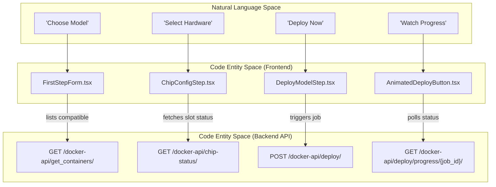
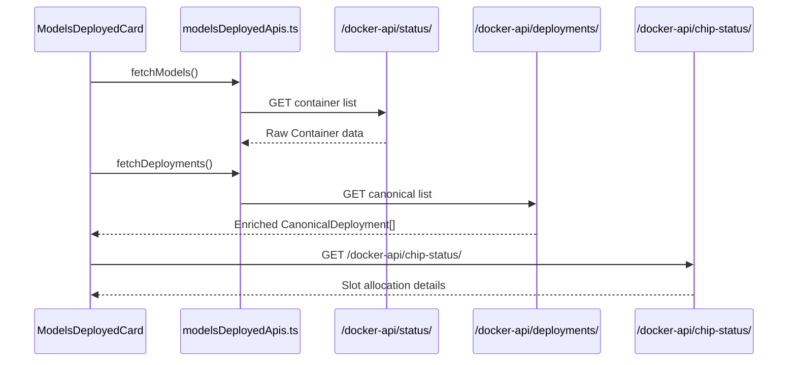

# Model Deployment UI

Relevant source files

<ul>
<li><a href="https://github.com/tenstorrent/tt-studio/blob/c837b829/app/frontend/src/api/modelsDeployedApis.ts">app/frontend/src/api/modelsDeployedApis.ts</a></li>
<li><a href="https://github.com/tenstorrent/tt-studio/blob/c837b829/app/frontend/src/components/ChipConfigStep.tsx">app/frontend/src/components/ChipConfigStep.tsx</a></li>
<li><a href="https://github.com/tenstorrent/tt-studio/blob/c837b829/app/frontend/src/components/DeployModelStep.tsx">app/frontend/src/components/DeployModelStep.tsx</a></li>
<li><a href="https://github.com/tenstorrent/tt-studio/blob/c837b829/app/frontend/src/components/MultiCardResetDialog.tsx">app/frontend/src/components/MultiCardResetDialog.tsx</a></li>
<li><a href="https://github.com/tenstorrent/tt-studio/blob/c837b829/app/frontend/src/components/ResetStepRow.tsx">app/frontend/src/components/ResetStepRow.tsx</a></li>
<li><a href="https://github.com/tenstorrent/tt-studio/blob/c837b829/app/frontend/src/components/SelectionSteps.tsx">app/frontend/src/components/SelectionSteps.tsx</a></li>
<li><a href="https://github.com/tenstorrent/tt-studio/blob/c837b829/app/frontend/src/components/StepperFooter.tsx">app/frontend/src/components/StepperFooter.tsx</a></li>
<li><a href="https://github.com/tenstorrent/tt-studio/blob/c837b829/app/frontend/src/components/StepperFormActions.tsx">app/frontend/src/components/StepperFormActions.tsx</a></li>
<li><a href="https://github.com/tenstorrent/tt-studio/blob/c837b829/app/frontend/src/components/magicui/AnimatedDeployButton.tsx">app/frontend/src/components/magicui/AnimatedDeployButton.tsx</a></li>
<li><a href="https://github.com/tenstorrent/tt-studio/blob/c837b829/app/frontend/src/components/models/DeleteModelDialog.tsx">app/frontend/src/components/models/DeleteModelDialog.tsx</a></li>
<li><a href="https://github.com/tenstorrent/tt-studio/blob/c837b829/app/frontend/src/components/models/ModelPreparingBanner.tsx">app/frontend/src/components/models/ModelPreparingBanner.tsx</a></li>
<li><a href="https://github.com/tenstorrent/tt-studio/blob/c837b829/app/frontend/src/components/models/ModelsDeployedCard.tsx">app/frontend/src/components/models/ModelsDeployedCard.tsx</a></li>
<li><a href="https://github.com/tenstorrent/tt-studio/blob/c837b829/app/frontend/src/components/models/row-cells/ManageCell.tsx">app/frontend/src/components/models/row-cells/ManageCell.tsx</a></li>
<li><a href="https://github.com/tenstorrent/tt-studio/blob/c837b829/app/frontend/src/components/object_detection/ObjectDetectionComponent.tsx">app/frontend/src/components/object_detection/ObjectDetectionComponent.tsx</a></li>
<li><a href="https://github.com/tenstorrent/tt-studio/blob/c837b829/app/frontend/src/components/ui/stepper.tsx">app/frontend/src/components/ui/stepper.tsx</a></li>
<li><a href="https://github.com/tenstorrent/tt-studio/blob/c837b829/app/frontend/src/hooks/useDeploymentProgress.ts">app/frontend/src/hooks/useDeploymentProgress.ts</a></li>
<li><a href="https://github.com/tenstorrent/tt-studio/blob/c837b829/app/frontend/src/hooks/useIsResetting.ts">app/frontend/src/hooks/useIsResetting.ts</a></li>
<li><a href="https://github.com/tenstorrent/tt-studio/blob/c837b829/app/frontend/src/utils/deviceFit.ts">app/frontend/src/utils/deviceFit.ts</a></li>
<li><a href="https://github.com/tenstorrent/tt-studio/blob/c837b829/app/frontend/src/utils/p300x2Placement.ts">app/frontend/src/utils/p300x2Placement.ts</a></li>
</ul>

The Model Deployment UI provides a guided, multi-step workflow for configuring hardware resources and deploying AI models onto Tenstorrent hardware. It transitions from hardware detection and chip selection to model selection, and finally to real-time deployment monitoring and management.

## Deployment Wizard Architecture

The deployment process is encapsulated in the `SelectionSteps` component, which implements a stateful stepper to guide the user through the configuration lifecycle.

### Stepper Workflow Logic
The wizard dynamically adjusts its steps based on the detected hardware (e.g., single-chip N150 vs. multi-chip T3K or P300x2 boards). The `useStepper` hook provides context for navigation and state management.

| Step | Component | Responsibility |
| :--- | :--- | :--- |
| **Step 1 (Selection)** | `FirstStepForm` | Filtering and selecting models compatible with the detected hardware. It handles compatibility warnings and auto-deployment triggers. |
| **Step 2 (Hardware)** | `ChipConfigStep` | Selection between "1 Device" or "All Devices" modes and specific device ID allocation. This step is dynamically shown based on the `advancedActive` flag. |
| **Final Step (Deploy)** | `DeployModelStep` | Final confirmation, slot availability checks, and execution of the deployment job via the `AnimatedDeployButton`. |

### Hardware-Aware Step Injection
For multi-chip boards (like P300x2), the UI conditionally manages `ChipConfigStep`. On P300x2, hardware configuration is often hidden behind a toggle unless existing deployments necessitate manual slot selection. The `deviceFit.ts` utility helps determine preferred device groups and auto-placement logic.

### Natural Language to Code Entity Mapping: Deployment Wizard
This diagram maps the user-facing deployment concepts to the underlying React components and API routes.

## Real-time Deployment Tracking

Deployment is an asynchronous process involving image pulling, weight downloading, and container orchestration.

### 1. `AnimatedDeployButton` & `useDeploymentProgress`
The `AnimatedDeployButton` manages the visual state of the deployment (rocket animation, success/failure icons) and utilizes the `useDeploymentProgress` hook to track the backend job.
* **Job Persistence:** Active job IDs are stored in `localStorage` (`tt_studio_active_deployment_job`) to allow the UI to resume tracking after a page refresh.
* **Polling Logic:** The `useDeploymentProgress` hook polls the backend for status updates. It transitions the UI when the status reaches terminal states like `completed` or `failed`.

### 2. Deployment Logs & `WorkflowLogDialog`
The `DeployModelStep` provides an interface to view detailed logs during the deployment process.
* **Log Fetching:** Logs are retrieved from `/docker-api/deploy/logs/{jobId}/` and formatted with timestamps and severity levels.
* **Workflow Tracking:** The `WorkflowLogDialog` component is used to display these logs in a dedicated modal, often scanning for specific error patterns like `exception:` to surface diagnostic info.

## Models Deployed Management

The `ModelsDeployedCard` serves as the central management hub for all active model containers. It aggregates data from the model catalog and the live Docker state.

### Data Flow and Enrichment
The UI performs "enrichment" by merging raw Docker container data with metadata from the deployment history and model catalog. The `fetchDeployments` function in `modelsDeployedApis.ts` acts as the canonical source of truth, reconciling deployment store data with live Docker status.

### Key Management Features
* **Health Monitoring:** The `HealthCell` and `useHealthRefresh` hook monitor the health status of deployed containers to ensure they are ready for inference.
* **Multi-Chip Visualization:** On multi-chip boards, the UI displays physical chip slot occupancy (e.g., Device 0, Device 1) using the `ChipStatusDisplay` component.
* **Model Type Mapping:** The UI maps backend model types to frontend constants (e.g., `CHAT` to `ChatModel`) to drive conditional navigation to specialized interfaces like Object Detection or Image Generation.
* **Destructive Actions:** The `ManageCell` component provides controls for deleting models and viewing logs, but disables these actions during board resets to prevent system instability.

