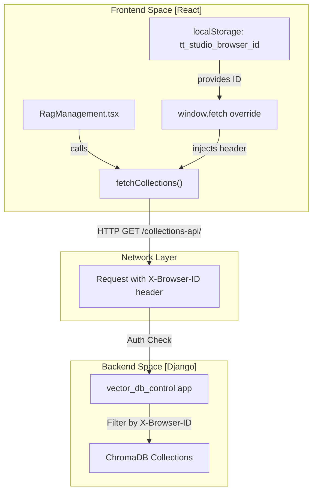
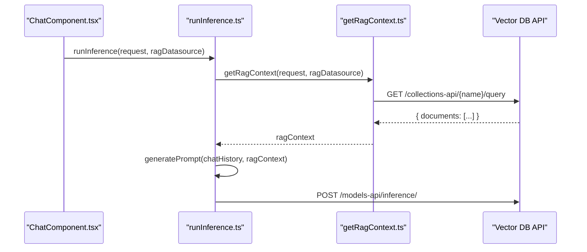

# RAG Management UI

The RAG (Retrieval-Augmented Generation) Management UI provides a comprehensive interface for managing vector database collections, uploading documents, and configuring context injection for chat sessions. It allows users to create isolated knowledge bases, track document chunking, and perform administrative operations on collections.

## Core Components

### RagManagement Component
The primary interface for users to interact with their RAG data sources. It handles the display of existing collections, their associated documents, and the primary actions for data ingestion. It maintains state for `ragDataSources`, `loading` status, and `expandedRows` to show document details.

**Key Features:**
* **Collection Lifecycle:** Users can create new collections via the `RagDataSourceForm` and delete them with a confirmation dialog.
* **Document Management:** Displays document metadata including chunk counts, file extensions, and upload dates.
* **Loading States:** Uses `RagManagementSkeleton` to provide visual feedback during data fetching.
* **Expanded Rows:** Users can toggle collection details to view specific `DocumentInfo` entries.

### RagAdmin Component
A restricted interface requiring authentication to manage all collections across the system, regardless of the browser session.

**Key Features:**
*   **Authentication:** Access is protected by a password-based challenge.
*   **Global Visibility:** Lists all collections in the system, identifying them by user type (e.g., "Anonymous (Browser Session)" or "Authenticated User").
*   **Bulk Management:** Allows administrators to refresh the global collection list or delete any collection in the system.

---

## Session Tracking & Security

TT-Studio utilizes a unique `X-Browser-ID` to track and isolate RAG collections for anonymous users.

### X-Browser-ID Implementation
The system generates a persistent UUID stored in `localStorage` under the key `tt_studio_browser_id` to identify the browser session.

1. **Generation:** If no ID exists, a new UUID is created using `uuidv4()`.
2. **Interception:** The application wraps the native `window.fetch` to automatically inject the `X-Browser-ID` header into every request.

### Data Flow: Session-Aware API Requests
The following diagram illustrates how the `X-Browser-ID` bridges the frontend components to the backend API.

**Session-Aware Request Architecture**

---

## Document Ingestion

The UI supports multi-modal document ingestion, primarily focusing on PDF and text-based documents.

### Upload Workflow
1. **Trigger:** Users utilize the `GentleFileUpload` component or drag-and-drop files onto a collection row.
2. **Validation:** The system detects file types (PDF, text, etc.) defined in `FileData`. The `RagDataSourceForm` validates collection names to ensure they contain no spaces and are at least 2 characters long.
3. **Transmission:** Files are uploaded using the `uploadDocument` function which interfaces with the backend RAG endpoints.

### UI Interaction
The `FileUpload` component uses `react-dropzone` to handle file selection and provides visual feedback via `framer-motion` animations.

---

## Context Injection (getRagContext)

Before an inference request is sent to the LLM, the system retrieves relevant snippets from the selected RAG datasource.

### Retrieval Logic
The `getRagContext` function performs the following:
*   **Single Collection:** Queries a specific collection using the user's prompt.
*   **Special-All:** If the "All Collections" source is selected, it queries across all available collections and prefixes the context with the source collection name.

### Integration with runInference
`runInference.ts` orchestrates the retrieval before calling the model API:
1. It calls `getRagContext` if a `ragDatasource` is provided.
2. The returned documents are passed to `generatePrompt`, which formats them into a system-level context block for the LLM.
3. **File-based Context:** If a user uploads a text file directly in chat, `runInference` processes it as an ad-hoc RAG context via `processUploadedFiles`, merging it with any existing collection context.

**RAG Retrieval to Prompt Flow**

---

## Key Data Structures

### RagDataSource
Defines the metadata and document list for a specific vector collection.

| Field | Type | Description |
| :--- | :--- | :--- |
| `id` | `string` | Unique identifier for the collection. |
| `name` | `string` | User-defined name (validated to have no spaces). |
| `metadata` | `Record<string, string>` | Includes `created_at`, `embedding_func_name`, and `last_uploaded_document`. |
| `documents` | `DocumentInfo[]` | List of files ingested into this collection. |

### DocumentInfo
Details regarding individual files within a collection.

| Field | Type | Description |
| :--- | :--- | :--- |
| `filename` | `string` | Original name of the uploaded file. |
| `chunks_count` | `number` | Number of vector segments created from the file. |
| `upload_date` | `string` | ISO timestamp of ingestion. |
| `file_extension` | `string` | Extension used for icon rendering (e.g., PDF, TXT). |

---

:::{admonition} Source files this page was written from
:class: dropdown tt-sources

Captured at commit [`c837b829`](https://github.com/tenstorrent/tt-studio/commit/c837b829), so the linked line numbers match that revision.

- [`app/frontend/src/components/chatui/MessageActions.tsx`](https://github.com/tenstorrent/tt-studio/blob/c837b829/app/frontend/src/components/chatui/MessageActions.tsx)
- [`app/frontend/src/components/chatui/runInference.ts`](https://github.com/tenstorrent/tt-studio/blob/c837b829/app/frontend/src/components/chatui/runInference.ts)
- [`app/frontend/src/components/chatui/types.ts`](https://github.com/tenstorrent/tt-studio/blob/c837b829/app/frontend/src/components/chatui/types.ts)
- [`app/frontend/src/components/rag/RagDataSourceForm.tsx`](https://github.com/tenstorrent/tt-studio/blob/c837b829/app/frontend/src/components/rag/RagDataSourceForm.tsx)
- [`app/frontend/src/components/rag/RagManagement.tsx`](https://github.com/tenstorrent/tt-studio/blob/c837b829/app/frontend/src/components/rag/RagManagement.tsx)
- [`app/frontend/src/components/ui/file-upload.tsx`](https://github.com/tenstorrent/tt-studio/blob/c837b829/app/frontend/src/components/ui/file-upload.tsx)
:::
