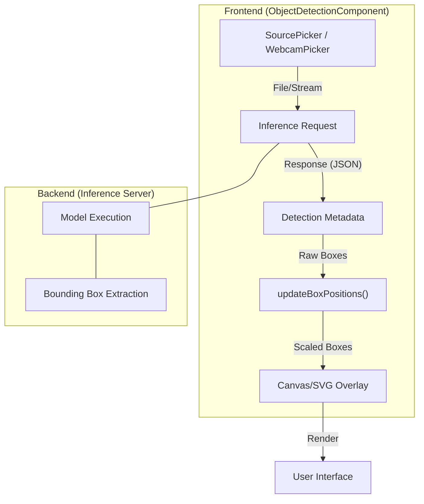
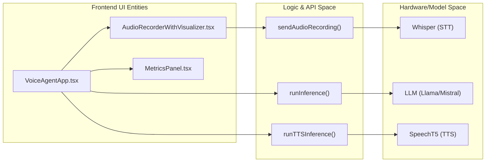

# Specialized Model Interfaces

Relevant source files

<ul>
<li><a href="https://github.com/tenstorrent/tt-studio/blob/c837b829/.gitignore">.gitignore</a></li>
<li><a href="https://github.com/tenstorrent/tt-studio/blob/c837b829/app/frontend/src/api/modelsDeployedApis.ts">app/frontend/src/api/modelsDeployedApis.ts</a></li>
<li><a href="https://github.com/tenstorrent/tt-studio/blob/c837b829/app/frontend/src/components/Footer.tsx">app/frontend/src/components/Footer.tsx</a></li>
<li><a href="https://github.com/tenstorrent/tt-studio/blob/c837b829/app/frontend/src/components/imageGen/Header.tsx">app/frontend/src/components/imageGen/Header.tsx</a></li>
<li><a href="https://github.com/tenstorrent/tt-studio/blob/c837b829/app/frontend/src/components/imageGen/ImageGenParentComponent.tsx">app/frontend/src/components/imageGen/ImageGenParentComponent.tsx</a></li>
<li><a href="https://github.com/tenstorrent/tt-studio/blob/c837b829/app/frontend/src/components/imageGen/ShowcaseGallery.tsx">app/frontend/src/components/imageGen/ShowcaseGallery.tsx</a></li>
<li><a href="https://github.com/tenstorrent/tt-studio/blob/c837b829/app/frontend/src/components/imageGen/StableDiffusionChat.tsx">app/frontend/src/components/imageGen/StableDiffusionChat.tsx</a></li>
<li><a href="https://github.com/tenstorrent/tt-studio/blob/c837b829/app/frontend/src/components/imageGen/types/chat.ts">app/frontend/src/components/imageGen/types/chat.ts</a></li>
<li><a href="https://github.com/tenstorrent/tt-studio/blob/c837b829/app/frontend/src/components/object_detection/ObjectDetectionComponent.tsx">app/frontend/src/components/object_detection/ObjectDetectionComponent.tsx</a></li>
<li><a href="https://github.com/tenstorrent/tt-studio/blob/c837b829/app/frontend/src/components/speechToText/mainContent.tsx">app/frontend/src/components/speechToText/mainContent.tsx</a></li>
<li><a href="https://github.com/tenstorrent/tt-studio/blob/c837b829/app/frontend/src/components/ui/dialog.tsx">app/frontend/src/components/ui/dialog.tsx</a></li>
<li><a href="https://github.com/tenstorrent/tt-studio/blob/c837b829/app/frontend/src/components/ui/focus-cards.tsx">app/frontend/src/components/ui/focus-cards.tsx</a></li>
<li><a href="https://github.com/tenstorrent/tt-studio/blob/c837b829/app/frontend/src/components/videoGen/VideoGenChat.tsx">app/frontend/src/components/videoGen/VideoGenChat.tsx</a></li>
<li><a href="https://github.com/tenstorrent/tt-studio/blob/c837b829/app/frontend/src/components/videoGen/VideoGenParentComponent.tsx">app/frontend/src/components/videoGen/VideoGenParentComponent.tsx</a></li>
<li><a href="https://github.com/tenstorrent/tt-studio/blob/c837b829/app/frontend/src/components/videoGen/VideoInputArea.tsx">app/frontend/src/components/videoGen/VideoInputArea.tsx</a></li>
<li><a href="https://github.com/tenstorrent/tt-studio/blob/c837b829/app/frontend/src/components/videoGen/api/videoGeneration.ts">app/frontend/src/components/videoGen/api/videoGeneration.ts</a></li>
<li><a href="https://github.com/tenstorrent/tt-studio/blob/c837b829/app/frontend/src/components/videoGen/hooks/useVideoChat.ts">app/frontend/src/components/videoGen/hooks/useVideoChat.ts</a></li>
<li><a href="https://github.com/tenstorrent/tt-studio/blob/c837b829/app/frontend/src/components/videoGen/types/chat.ts">app/frontend/src/components/videoGen/types/chat.ts</a></li>
<li><a href="https://github.com/tenstorrent/tt-studio/blob/c837b829/app/frontend/src/pages/CodingAgentsPage.tsx">app/frontend/src/pages/CodingAgentsPage.tsx</a></li>
<li><a href="https://github.com/tenstorrent/tt-studio/blob/c837b829/app/frontend/src/pages/VideoGenPage.tsx">app/frontend/src/pages/VideoGenPage.tsx</a></li>
</ul>

Specialized Model Interfaces provide tailored user experiences for non-chat model types, such as Object Detection, Image Generation, Video Generation, and Speech-to-Text. These components handle specific data modalities (video, audio, images) and visualize model-specific outputs like bounding boxes, generated media, or transcriptions.

## Object Detection Interface

The `ObjectDetectionComponent` is a comprehensive UI for models that identify and locate objects in images or video streams. It supports both static file uploads and live webcam feeds.

### Implementation Details
The component uses a dual-tab system (`webcam` vs `file`) to manage different input sources. It tracks detections and metadata (such as FPS and inference time) separately for each mode.

**Key Features:**
- **Bounding Box Scaling:** Detections are normalized and then scaled to fit the display container using `updateBoxPositions`.
- **Live Mode:** In webcam mode, it supports a "Live Mode" toggle which continuously polls the inference server for new frames.
- **Performance Metrics:** Displays real-time stats including Inference Time (ms), FPS, and total object counts.

### Data Flow: Object Detection
The following diagram illustrates how video frames or files are processed and rendered as bounding boxes.

**Object Detection Data Flow**

## Image Generation Interface

The `ImageGenParentComponent` manages the lifecycle of image generation tasks, primarily using Stable Diffusion models. It transitions between a "Showcase" mode and an "Active Generation" mode.

### Showcase and Generation
- **ShowcaseGallery:** Displays pre-defined prompts and example images to guide users. Clicking an image populates the prompt for the active session.
- **StableDiffusionChat:** A chat-like interface where users send text prompts and receive generated images. It includes a `Download` action for generated artifacts.

### Components
| Component | Role |
| :--- | :--- |
| `StableDiffusionChat` | Main interaction loop using `useChat` hook. |
| `Header` | Provides navigation and history panel toggles. |
| `ImageInputArea` | Text area for prompt entry and generation trigger. |

## Video Generation Interface

The `VideoGenChat` component provides a specialized interface for Text-to-Video (T2V) models like Wan2.2. Due to the high latency of video generation (1–5 minutes), the interface includes comprehensive progress tracking.

### Implementation Details
- **Progress Tracking:** Displays a progress bar with phases like `queued`, `in_progress`, and `finishing up`, along with elapsed vs estimated time.
- **Video Player:** Renders the generated video using a standard `<video>` tag with download capabilities.
- **Parent Wrapper:** `VideoGenParentComponent` handles model ID extraction from navigation state and manages the transition from the landing view to the chat view.

## Speech-to-Text (STT) Interface

The STT interface provides a robust environment for recording audio and viewing transcriptions. It is primarily implemented in `MainContent` and `AudioRecorderWithVisualizer`.

### Audio Pipeline
1.  **Recording:** Uses the `MediaRecorder` API to capture audio chunks.
2.  **Visualization:** An `AnalyserNode` maps frequency data to UI bars to provide visual feedback during recording.
3. **Transcription:** The recorded `Blob` is sent to the inference backend via `sendAudioRecording`.

### Transcription Management
Transcriptions are grouped by date and associated with specific "Conversations". Users can edit transcribed text, copy it to the clipboard, or replay the original audio.

## Voice Agent & Wake Word Pipeline

The Voice Agent is a multi-model pipeline UI that orchestrates three distinct models: **Whisper** (STT), **LLM** (Chat), and **SpeechT5/TTS** (Text-to-Speech).

### Deployment Logic
Model types are normalized from backend strings to frontend constants to ensure correct interface routing. The `ModelType` object defines the supported categories, including `SpeechRecognitionModel`, `FaceRecognitionModel`, and `TTS`.

**Voice Agent Component Entity Mapping**

### Wake Word Control
The application integrates wake-word detection using the `wakeword_control` Django app.
- **Technology:** Utilizes `openWakeWord` ONNX models.
- **Bundled Model:** Includes the `hey_quiet_box` model for local, offline detection.
- **Data Flow:** The frontend establishes a WebSocket connection to the backend; when the wake word is detected, the backend sends a trigger to start the STT recording process.

## Coding Agents Page

The `CodingAgentsPage` provides a specialized interface for LLMs that are eligible for autonomous coding tasks.

- **Eligibility:** The backend identifies `coding_agent_eligible` models in the `CanonicalDeployment` payload.
- **Integration:** These models are exposed via a dedicated gateway that allows the agent to execute code in a sandboxed environment (e.g., E2B) and interact with the local filesystem.

