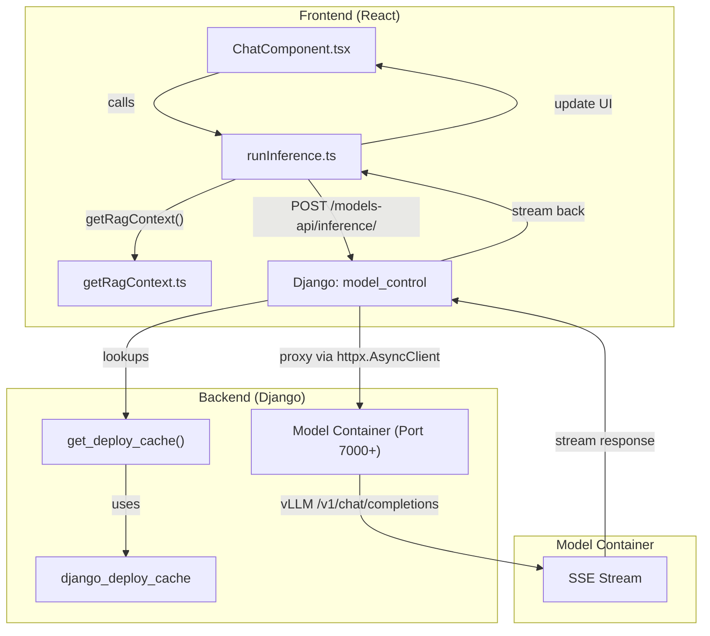
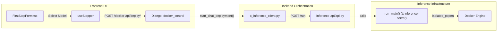

# Glossary

Relevant source files

<ul>
<li><a href="https://github.com/tenstorrent/tt-studio/blob/c837b829/README.md">README.md</a></li>
<li><a href="https://github.com/tenstorrent/tt-studio/blob/c837b829/app/README.md">app/README.md</a></li>
<li><a href="https://github.com/tenstorrent/tt-studio/blob/c837b829/app/backend/docker_control/tt_inference_client.py">app/backend/docker_control/tt_inference_client.py</a></li>
<li><a href="https://github.com/tenstorrent/tt-studio/blob/c837b829/app/backend/model_control/model_utils.py">app/backend/model_control/model_utils.py</a></li>
<li><a href="https://github.com/tenstorrent/tt-studio/blob/c837b829/app/docker-compose.yml">app/docker-compose.yml</a></li>
<li><a href="https://github.com/tenstorrent/tt-studio/blob/c837b829/app/frontend/index.html">app/frontend/index.html</a></li>
<li><a href="https://github.com/tenstorrent/tt-studio/blob/c837b829/app/frontend/src/api/modelsDeployedApis.ts">app/frontend/src/api/modelsDeployedApis.ts</a></li>
<li><a href="https://github.com/tenstorrent/tt-studio/blob/c837b829/app/frontend/src/components/FirstStepForm.tsx">app/frontend/src/components/FirstStepForm.tsx</a></li>
<li><a href="https://github.com/tenstorrent/tt-studio/blob/c837b829/app/frontend/src/components/NavBar.tsx">app/frontend/src/components/NavBar.tsx</a></li>
<li><a href="https://github.com/tenstorrent/tt-studio/blob/c837b829/app/frontend/src/components/chatui/MessageActions.tsx">app/frontend/src/components/chatui/MessageActions.tsx</a></li>
<li><a href="https://github.com/tenstorrent/tt-studio/blob/c837b829/app/frontend/src/components/chatui/runInference.ts">app/frontend/src/components/chatui/runInference.ts</a></li>
<li><a href="https://github.com/tenstorrent/tt-studio/blob/c837b829/app/frontend/src/components/chatui/types.ts">app/frontend/src/components/chatui/types.ts</a></li>
<li><a href="https://github.com/tenstorrent/tt-studio/blob/c837b829/app/frontend/src/components/object_detection/ObjectDetectionComponent.tsx">app/frontend/src/components/object_detection/ObjectDetectionComponent.tsx</a></li>
<li><a href="https://github.com/tenstorrent/tt-studio/blob/c837b829/app/frontend/src/components/rag/RagManagement.tsx">app/frontend/src/components/rag/RagManagement.tsx</a></li>
<li><a href="https://github.com/tenstorrent/tt-studio/blob/c837b829/inference-api/api.py">inference-api/api.py</a></li>
</ul>

This page provides definitions for codebase-specific terms, abbreviations, and domain concepts used throughout the TT-Studio project. It serves as a technical reference for onboarding engineers to understand how high-level concepts map to specific implementation details.

## Core System Concepts

### Tenstorrent Hardware & Drivers
TT-Studio is designed to orchestrate AI models on Tenstorrent AI accelerators.
* **TT-Metal**: The low-level programming model and hardware abstraction layer used to execute kernels on Tenstorrent chips.
*   **Device Configuration**: A specification within a model's metadata defining which hardware (e.g., Grayskull, Wormhole) and how many chips are required.
*   **Chip Slot Allocation**: The logic responsible for tracking which physical Tenstorrent chips are currently occupied by running Docker containers. Implementation is handled in the `ChipSlotAllocator` class within the `docker_control` app. It manages mapping board types like `T3K` or `GALAXY` to available slots.
* **Hardware Context**: Contextual information about the underlying Tenstorrent hardware (e.g., board type) passed during inference to optimize prompt generation.

### Docker Topology
TT-Studio uses a multi-container architecture managed via Docker Compose.
* **Docker Control Service**: A standalone FastAPI service (port 8002) that acts as a secure proxy for Docker socket operations, preventing the need to mount `/var/run/docker.sock` directly into the web backend.
* **tt_studio_network**: A dedicated Docker bridge network that allows the backend to communicate with dynamically deployed model containers,.
* **Compose Overlays**: Modular configuration files (e.g., `docker-compose.tt-hardware.yml`) that add hardware-specific capabilities like mounting `/dev/tenstorrent`.

---

## Technical Glossary

| Term | Definition | Code Pointers |
| :--- | :--- | :--- |
| **ModelImpl** | Specification for an AI model, including its image and hardware requirements. | |
| **Inference API** | A FastAPI bridge (port 8001) that translates TT-Studio requests into `tt-inference-server` commands. | |
| **Deployment Store** | A JSON-backed persistence layer that tracks the lifecycle of deployed model containers. | |
| **TTFT** | Time To First Token. Metric measuring latency from request to first character. | |
| **TPOT** | Time Per Output Token. The average time taken to generate each token after the first. | |
| **RAG** | Retrieval-Augmented Generation. Queries ChromaDB to provide context to the LLM. | |
| **Canonical Deployment** | The single source of truth (SoT) object representing a live or pending container. | |
| **Deploy Cache** | A Django-based cache (using pickle) that stores enriched container metadata, including `max_model_len`. | |
| **Tool Call Parser** | Model-specific parser used by vLLM to enable auto-tool choice for coding agents. | |

---

## Data Flow & System Interactions

### Inference Request Flow
The following diagram illustrates how a user prompt moves from the React frontend through the Django backend to the specific model container, including the optional RAG context path.

**Natural Language to Code Entity Space: Inference Path**

### Model Deployment Lifecycle
When a user selects a model to deploy, the system orchestrates multiple services to prepare the environment and download weights via the `inference-api` bridge.

**Natural Language to Code Entity Space: Deployment Orchestration**

---

## Domain Concepts

### Retrieval-Augmented Generation (RAG)
In TT-Studio, RAG is implemented using **ChromaDB** as the vector store.
*   **Collection**: A logical grouping of documents within ChromaDB.
*   **X-Browser-ID**: A unique identifier used to isolate RAG sessions per browser instance.
* **Context Injection**: The process where relevant snippets from the vector DB or uploaded text files are retrieved and prepended to the LLM's system message.

### Model Types
The system categorizes models into specific types to determine which UI component and API endpoint to use:
* `ChatModel`: Standard LLM interaction.
* `ObjectDetectionModel`: YOLO-based models that return bounding box coordinates and metadata.
* `VLM`: Vision Language Models capable of processing images via `image_url` message structures.
* `ImageGeneration`: Diffusion-based image creation (e.g., FLUX.1).
* `TTS` / `SpeechRecognitionModel`: Audio processing pipelines.

### Hardware Compatibility
The system performs automated checks to ensure models fit on the detected hardware.
* **is_compatible**: A flag returned by the models API indicating if the model supports the current board (e.g., Grayskull vs Wormhole).
* **deviceFit**: Utility logic (e.g., `autoPlacement`, `getModelPlacement`) used to determine if a model's requirements match available chip slots.

### Metrics Tracking
TT-Studio tracks inference performance using the `InferenceMetricsTracker`.
* **InferenceStats**: Data structure containing `ttft`, `tpot`, and `total_tokens` displayed in the Chat UI.

