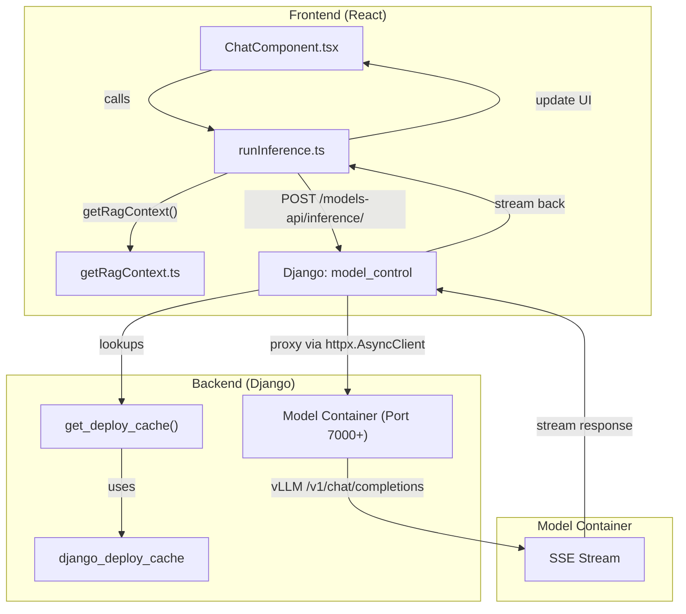
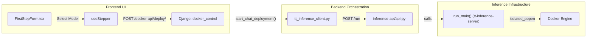

# Glossary

Relevant source files

<ul>
<li><a href="https://github.com/tenstorrent/tt-studio/blob/c837b829/README.md">README.md</a></li>
<li><a href="https://github.com/tenstorrent/tt-studio/blob/c837b829/app/README.md">app/README.md</a></li>
<li><a href="https://github.com/tenstorrent/tt-studio/blob/c837b829/app/backend/docker_control/tt_inference_client.py">app/backend/docker_control/tt_inference_client.py</a></li>
<li><a href="https://github.com/tenstorrent/tt-studio/blob/c837b829/app/backend/model_control/model_utils.py">app/backend/model_control/model_utils.py</a></li>
<li><a href="https://github.com/tenstorrent/tt-studio/blob/c837b829/app/docker-compose.yml">app/docker-compose.yml</a></li>
<li><a href="https://github.com/tenstorrent/tt-studio/blob/c837b829/app/frontend/index.html">app/frontend/index.html</a></li>
<li><a href="https://github.com/tenstorrent/tt-studio/blob/c837b829/app/frontend/src/api/modelsDeployedApis.ts">app/frontend/src/api/modelsDeployedApis.ts</a></li>
<li><a href="https://github.com/tenstorrent/tt-studio/blob/c837b829/app/frontend/src/components/FirstStepForm.tsx">app/frontend/src/components/FirstStepForm.tsx</a></li>
<li><a href="https://github.com/tenstorrent/tt-studio/blob/c837b829/app/frontend/src/components/NavBar.tsx">app/frontend/src/components/NavBar.tsx</a></li>
<li><a href="https://github.com/tenstorrent/tt-studio/blob/c837b829/app/frontend/src/components/chatui/MessageActions.tsx">app/frontend/src/components/chatui/MessageActions.tsx</a></li>
<li><a href="https://github.com/tenstorrent/tt-studio/blob/c837b829/app/frontend/src/components/chatui/runInference.ts">app/frontend/src/components/chatui/runInference.ts</a></li>
<li><a href="https://github.com/tenstorrent/tt-studio/blob/c837b829/app/frontend/src/components/chatui/types.ts">app/frontend/src/components/chatui/types.ts</a></li>
<li><a href="https://github.com/tenstorrent/tt-studio/blob/c837b829/app/frontend/src/components/object_detection/ObjectDetectionComponent.tsx">app/frontend/src/components/object_detection/ObjectDetectionComponent.tsx</a></li>
<li><a href="https://github.com/tenstorrent/tt-studio/blob/c837b829/app/frontend/src/components/rag/RagManagement.tsx">app/frontend/src/components/rag/RagManagement.tsx</a></li>
<li><a href="https://github.com/tenstorrent/tt-studio/blob/c837b829/inference-api/api.py">inference-api/api.py</a></li>
</ul>

This page provides definitions for codebase-specific terms, abbreviations, and domain concepts used throughout the TT-Studio project. It serves as a technical reference for onboarding engineers to understand how high-level concepts map to specific implementation details.

## Core System Concepts

### Tenstorrent Hardware & Drivers
TT-Studio is designed to orchestrate AI models on Tenstorrent AI accelerators.
*   **TT-Metal**: The low-level programming model and hardware abstraction layer used to execute kernels on Tenstorrent chips [README.md:9](https://github.com/tenstorrent/tt-studio/blob/c837b829/README.md?plain=1#L9).
*   **Device Configuration**: A specification within a model's metadata defining which hardware (e.g., Grayskull, Wormhole) and how many chips are required.
*   **Chip Slot Allocation**: The logic responsible for tracking which physical Tenstorrent chips are currently occupied by running Docker containers. Implementation is handled in the `ChipSlotAllocator` class within the `docker_control` app. It manages mapping board types like `T3K` or `GALAXY` to available slots.
*   **Hardware Context**: Contextual information about the underlying Tenstorrent hardware (e.g., board type) passed during inference to optimize prompt generation [app/frontend/src/components/chatui/runInference.ts:28-30](https://github.com/tenstorrent/tt-studio/blob/c837b829/app/frontend/src/components/chatui/runInference.ts#L28-L30).

### Docker Topology
TT-Studio uses a multi-container architecture managed via Docker Compose [app/docker-compose.yml:5-190](https://github.com/tenstorrent/tt-studio/blob/c837b829/app/docker-compose.yml#L5-L190).
*   **Docker Control Service**: A standalone FastAPI service (port 8002) that acts as a secure proxy for Docker socket operations, preventing the need to mount `/var/run/docker.sock` directly into the web backend [app/README.md:18](https://github.com/tenstorrent/tt-studio/blob/c837b829/app/README.md?plain=1#L18).
*   **tt_studio_network**: A dedicated Docker bridge network that allows the backend to communicate with dynamically deployed model containers [app/docker-compose.yml:19-20](https://github.com/tenstorrent/tt-studio/blob/c837b829/app/docker-compose.yml#L19-L20), [app/docker-compose.yml:188-189](https://github.com/tenstorrent/tt-studio/blob/c837b829/app/docker-compose.yml#L188-L189).
*   **Compose Overlays**: Modular configuration files (e.g., `docker-compose.tt-hardware.yml`) that add hardware-specific capabilities like mounting `/dev/tenstorrent` [app/README.md:20-30](https://github.com/tenstorrent/tt-studio/blob/c837b829/app/README.md?plain=1#L20-L30).

---

## Technical Glossary

| Term | Definition | Code Pointers |
| :--- | :--- | :--- |
| **ModelImpl** | Specification for an AI model, including its image and hardware requirements. | [app/backend/docker_control/tt_inference_client.py:45-59](https://github.com/tenstorrent/tt-studio/blob/c837b829/app/backend/docker_control/tt_inference_client.py#L45-L59) |
| **Inference API** | A FastAPI bridge (port 8001) that translates TT-Studio requests into `tt-inference-server` commands. | [inference-api/api.py:4-165](https://github.com/tenstorrent/tt-studio/blob/c837b829/inference-api/api.py#L4-L165) |
| **Deployment Store** | A JSON-backed persistence layer that tracks the lifecycle of deployed model containers. | [app/frontend/src/api/modelsDeployedApis.ts:103-105](https://github.com/tenstorrent/tt-studio/blob/c837b829/app/frontend/src/api/modelsDeployedApis.ts#L103-L105) |
| **TTFT** | Time To First Token. Metric measuring latency from request to first character. | [app/backend/model_control/model_utils.py:21](https://github.com/tenstorrent/tt-studio/blob/c837b829/app/backend/model_control/model_utils.py#L21) |
| **TPOT** | Time Per Output Token. The average time taken to generate each token after the first. | [app/backend/model_control/model_utils.py:21](https://github.com/tenstorrent/tt-studio/blob/c837b829/app/backend/model_control/model_utils.py#L21) |
| **RAG** | Retrieval-Augmented Generation. Queries ChromaDB to provide context to the LLM. | [app/docker-compose.yml:164-187](https://github.com/tenstorrent/tt-studio/blob/c837b829/app/docker-compose.yml#L164-L187) |
| **Canonical Deployment** | The single source of truth (SoT) object representing a live or pending container. | [app/frontend/src/api/modelsDeployedApis.ts:106-134](https://github.com/tenstorrent/tt-studio/blob/c837b829/app/frontend/src/api/modelsDeployedApis.ts#L106-L134) |
| **Deploy Cache** | A Django-based cache (using pickle) that stores enriched container metadata, including `max_model_len`. | [app/backend/model_control/model_utils.py:111-145](https://github.com/tenstorrent/tt-studio/blob/c837b829/app/backend/model_control/model_utils.py#L111-L145) |
| **Tool Call Parser** | Model-specific parser used by vLLM to enable auto-tool choice for coding agents. | [app/backend/docker_control/tt_inference_client.py:24-42](https://github.com/tenstorrent/tt-studio/blob/c837b829/app/backend/docker_control/tt_inference_client.py#L24-L42) |

**Sources:** [app/backend/model_control/model_utils.py:127-145](https://github.com/tenstorrent/tt-studio/blob/c837b829/app/backend/model_control/model_utils.py#L127-L145), [app/frontend/src/api/modelsDeployedApis.ts:106-134](https://github.com/tenstorrent/tt-studio/blob/c837b829/app/frontend/src/api/modelsDeployedApis.ts#L106-L134), [app/backend/docker_control/tt_inference_client.py:24-42](https://github.com/tenstorrent/tt-studio/blob/c837b829/app/backend/docker_control/tt_inference_client.py#L24-L42)

---

## Data Flow & System Interactions

### Inference Request Flow
The following diagram illustrates how a user prompt moves from the React frontend through the Django backend to the specific model container, including the optional RAG context path.

**Natural Language to Code Entity Space: Inference Path**

**Sources:** [app/backend/model_control/model_utils.py:31-38](https://github.com/tenstorrent/tt-studio/blob/c837b829/app/backend/model_control/model_utils.py#L31-L38), [app/backend/model_control/model_utils.py:111-125](https://github.com/tenstorrent/tt-studio/blob/c837b829/app/backend/model_control/model_utils.py#L111-L125), [app/frontend/src/components/chatui/runInference.ts:18-185](https://github.com/tenstorrent/tt-studio/blob/c837b829/app/frontend/src/components/chatui/runInference.ts#L18-L185)

### Model Deployment Lifecycle
When a user selects a model to deploy, the system orchestrates multiple services to prepare the environment and download weights via the `inference-api` bridge.

**Natural Language to Code Entity Space: Deployment Orchestration**

**Sources:** [app/backend/docker_control/tt_inference_client.py:84-166](https://github.com/tenstorrent/tt-studio/blob/c837b829/app/backend/docker_control/tt_inference_client.py#L84-L166), [inference-api/api.py:153-165](https://github.com/tenstorrent/tt-studio/blob/c837b829/inference-api/api.py#L153-L165), [app/frontend/src/components/FirstStepForm.tsx:173-213](https://github.com/tenstorrent/tt-studio/blob/c837b829/app/frontend/src/components/FirstStepForm.tsx#L173-L213)

---

## Domain Concepts

### Retrieval-Augmented Generation (RAG)
In TT-Studio, RAG is implemented using **ChromaDB** as the vector store [app/docker-compose.yml:164-165](https://github.com/tenstorrent/tt-studio/blob/c837b829/app/docker-compose.yml#L164-L165).
*   **Collection**: A logical grouping of documents within ChromaDB.
*   **X-Browser-ID**: A unique identifier used to isolate RAG sessions per browser instance.
*   **Context Injection**: The process where relevant snippets from the vector DB or uploaded text files are retrieved and prepended to the LLM's system message [app/frontend/src/components/chatui/runInference.ts:42-86](https://github.com/tenstorrent/tt-studio/blob/c837b829/app/frontend/src/components/chatui/runInference.ts#L42-L86).

### Model Types
The system categorizes models into specific types to determine which UI component and API endpoint to use [app/frontend/src/api/modelsDeployedApis.ts:55-66](https://github.com/tenstorrent/tt-studio/blob/c837b829/app/frontend/src/api/modelsDeployedApis.ts#L55-L66):
*   `ChatModel`: Standard LLM interaction [app/frontend/src/api/modelsDeployedApis.ts:76-77](https://github.com/tenstorrent/tt-studio/blob/c837b829/app/frontend/src/api/modelsDeployedApis.ts#L76-L77).
*   `ObjectDetectionModel`: YOLO-based models that return bounding box coordinates and metadata [app/frontend/src/components/object_detection/ObjectDetectionComponent.tsx:64-66](https://github.com/tenstorrent/tt-studio/blob/c837b829/app/frontend/src/components/object_detection/ObjectDetectionComponent.tsx#L64-L66).
*   `VLM`: Vision Language Models capable of processing images via `image_url` message structures [app/frontend/src/components/chatui/runInference.ts:87-106](https://github.com/tenstorrent/tt-studio/blob/c837b829/app/frontend/src/components/chatui/runInference.ts#L87-L106).
*   `ImageGeneration`: Diffusion-based image creation (e.g., FLUX.1) [app/frontend/src/components/FirstStepForm.tsx:84-88](https://github.com/tenstorrent/tt-studio/blob/c837b829/app/frontend/src/components/FirstStepForm.tsx#L84-L88).
*   `TTS` / `SpeechRecognitionModel`: Audio processing pipelines [app/frontend/src/api/modelsDeployedApis.ts:86-91](https://github.com/tenstorrent/tt-studio/blob/c837b829/app/frontend/src/api/modelsDeployedApis.ts#L86-L91).

### Hardware Compatibility
The system performs automated checks to ensure models fit on the detected hardware.
*   **is_compatible**: A flag returned by the models API indicating if the model supports the current board (e.g., Grayskull vs Wormhole) [app/frontend/src/components/FirstStepForm.tsx:178-185](https://github.com/tenstorrent/tt-studio/blob/c837b829/app/frontend/src/components/FirstStepForm.tsx#L178-L185).
*   **deviceFit**: Utility logic (e.g., `autoPlacement`, `getModelPlacement`) used to determine if a model's requirements match available chip slots [app/frontend/src/components/FirstStepForm.tsx:41](https://github.com/tenstorrent/tt-studio/blob/c837b829/app/frontend/src/components/FirstStepForm.tsx#L41).

### Metrics Tracking
TT-Studio tracks inference performance using the `InferenceMetricsTracker` [app/backend/model_control/model_utils.py:21](https://github.com/tenstorrent/tt-studio/blob/c837b829/app/backend/model_control/model_utils.py#L21).
*   **InferenceStats**: Data structure containing `ttft`, `tpot`, and `total_tokens` displayed in the Chat UI [app/frontend/src/components/chatui/MessageActions.tsx:9-10](https://github.com/tenstorrent/tt-studio/blob/c837b829/app/frontend/src/components/chatui/MessageActions.tsx#L9-L10).

**Sources:** [app/frontend/src/api/modelsDeployedApis.ts:67-99](https://github.com/tenstorrent/tt-studio/blob/c837b829/app/frontend/src/api/modelsDeployedApis.ts#L67-L99), [app/frontend/src/components/FirstStepForm.tsx:144-160](https://github.com/tenstorrent/tt-studio/blob/c837b829/app/frontend/src/components/FirstStepForm.tsx#L144-L160), [app/frontend/src/components/chatui/runInference.ts:15-16](https://github.com/tenstorrent/tt-studio/blob/c837b829/app/frontend/src/components/chatui/runInference.ts#L15-L16), [app/backend/model_control/model_utils.py:21](https://github.com/tenstorrent/tt-studio/blob/c837b829/app/backend/model_control/model_utils.py#L21)5:["$","$L15",null,{"repoName":"tenstorrent/tt-studio","hasConfig":false,"canSteer":true,"children":["$","$L16",null,{"wiki":{"metadata":{"repo_name":"tenstorrent/tt-studio","commit_hash":"c837b829","generated_at":"2026-07-17T17:59:06.440858","config":null,"config_source":"none"},"pages":[{"page_plan":{"id":"1","title":"TT-Studio Overview"},"content":"$17"},{"page_plan":{"id":"1.1","title":"Getting Started & Setup"},"content":"$18"},{"page_plan":{"id":"1.2","title":"Architecture Overview"},"content":"$19"},{"page_plan":{"id":"1.3","title":"Contributing & Development Workflow"},"content":"$1a"},{"page_plan":{"id":"2","title":"Backend Services"},"content":"$1b"},{"page_plan":{"id":"2.1","title":"Docker Control & Container Lifecycle"},"content":"$1c"},{"page_plan":{"id":"2.2","title":"Model Control & Inference Pipeline"},"content":"$1d"},{"page_plan":{"id":"2.3","title":"Vector DB Control (RAG Backend)"},"content":"$1e"},{"page_plan":{"id":"2.4","title":"Board Control & Hardware Monitoring"},"content":"$1f"},{"page_plan":{"id":"2.5","title":"Logs Control & Bug Reporting"},"content":"$20"},{"page_plan":{"id":"3","title":"Docker Control Service"},"content":"$21"},{"page_plan":{"id":"3.1","title":"Docker Control Service API & Security"},"content":"$22"},{"page_plan":{"id":"3.2","title":"Inference API (FastAPI Bridge)"},"content":"$23"},{"page_plan":{"id":"4","title":"AI Agent Service"},"content":"$24"},{"page_plan":{"id":"4.1","title":"Agent Architecture & LLM Discovery"},"content":"$25"},{"page_plan":{"id":"4.2","title":"Agent API & Tool Integration"},"content":"$26"},{"page_plan":{"id":"5","title":"Frontend Application"},"content":"$27"},{"page_plan":{"id":"5.1","title":"Application Shell: Routing, Layout & Providers"},"content":"$28"},{"page_plan":{"id":"5.2","title":"Model Deployment UI"},"content":"$29"},{"page_plan":{"id":"5.3","title":"Chat UI"},"content":"$2a"},{"page_plan":{"id":"5.4","title":"RAG Management UI"},"content":"$2b"},{"page_plan":{"id":"5.5","title":"Specialized Model Interfaces"},"content":"$2c"},{"page_plan":{"id":"5.6","title":"Frontend Build, Tooling & UI Component Library"},"content":"$2d"},{"page_plan":{"id":"6","title":"Model Integration & Dummy Echo Model"},"content":"$2e"},{"page_plan":{"id":"6.1","title":"Model Configuration & Catalog"},"content":"$2f"},{"page_plan":{"id":"6.2","title":"Dummy Echo Model Reference Implementation"},"content":"$30"},{"page_plan":{"id":"7","title":"Glossary"},"content":"$31"}]},"children":"$L32"}]}]
