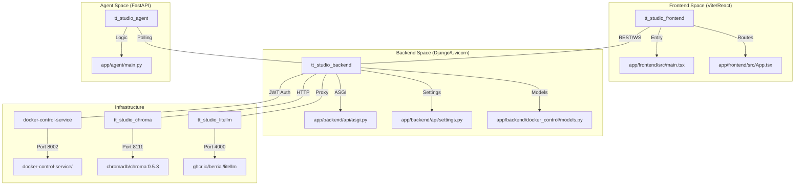
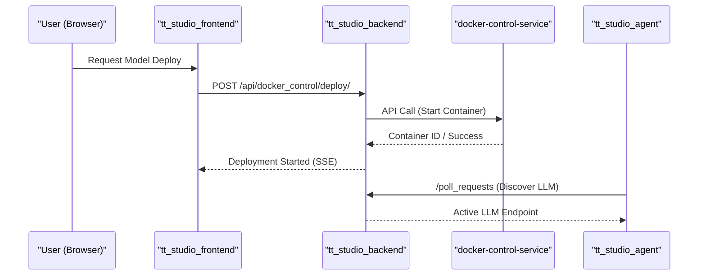

# TT-Studio Overview

TT-Studio is a comprehensive web-based platform designed to simplify the deployment and management of AI models on **Tenstorrent AI accelerators**. It integrates the model execution capabilities of [TT-Metal](https://github.com/tenstorrent-metal/tt-metal) and the orchestration framework of [TT Inference Server](https://github.com/tenstorrent/tt-inference-server) into a unified graphical user interface.

The system automates technical setup, hardware detection, and containerization, allowing users to interact with large language models (LLMs), computer vision, and speech-to-text pipelines through an intuitive React-based frontend. For users without local hardware, the platform supports connecting to remote endpoints via "AI Playground" configurations.

## System Architecture & Code Entities

The following diagram illustrates how the logical services of TT-Studio map to specific code entities and network configurations defined in the orchestration layer.

**Service-to-Code Mapping**


---

## Key Capabilities

TT-Studio provides several high-level features for both end-users and developers:

* **Automated Model Deployment:** Orchestrates the lifecycle of AI models, including weight downloading, container instantiation via the `docker-control-service`, and chip slot allocation.
* **Multi-Modal AI Features:** Built-in support for Chat (LLMs), Image Generation (Stable Diffusion), Speech-to-Text (Whisper), and Object Detection (YOLOv4).
* **Retrieval-Augmented Generation (RAG):** Integrated ChromaDB vector store for document indexing and semantic search, enabling "chat with your data" capabilities.
* **Autonomous AI Agent:** A dedicated `tt_studio_agent` service that can perform complex tasks, discover local LLM containers, and execute code.
* **LiteLLM Gateway:** A LiteLLM instance acting as a gateway for coding-agent tasks and upstream LLM providers.

---

## Logical Subsystems

TT-Studio is composed of several interdependent services networked via the `tt_studio_network` bridge.

**Subsystem Interaction Flow**


### 1.1 Getting Started & Setup
The entry point for the project is the `run.py` script. It handles prerequisite checks, hardware detection, environment configuration via `.env`, and offers different modes such as `--dev` for active development (mounting local source for hot-reload) and `--cleanup-all` for a clean slate.
For details, see [Getting Started & Setup](overview/getting-started.md).

### 1.2 Architecture Overview
The system runs as a multi-container Docker topology. It includes a Django backend (port 8000), a React frontend (port 3000), a FastAPI-based `docker-control-service` (port 8002) to proxy host-level operations (replacing direct socket mounts), and ChromaDB (port 8111) for vector storage.
For details, see [Architecture Overview](overview/architecture.md).

### 1.3 Contributing & Development Workflow
TT-Studio follows a structured contribution process, including branching strategies (branch off `dev`) and mandatory SPDX license headers. The workflow includes tools for checking and adding headers to maintain codebase compliance.
For details, see [Contributing & Development Workflow](overview/contributing.md).

---

## Configuration & Environment
The system relies on an `.env` file (managed via `run.py`) to handle critical paths and secrets. Key variables include:
* **TT_STUDIO_ROOT**: Absolute path to the repository root.
* **HOST_PERSISTENT_STORAGE_VOLUME**: Location for database and model weight persistence on the host machine.
* **DOCKER_CONTROL_SERVICE_URL**: Endpoint for the secure Docker operations proxy, typically `http://host.docker.internal:8002`.
* **JWT_SECRET**: Used for authenticating internal service communication.
* **LITELLM_MASTER_KEY**: Authentication key for the LiteLLM gateway.
* **HF_TOKEN**: Hugging Face token for downloading gated models.

---

:::{admonition} Source files this page was written from
:class: dropdown tt-sources

Captured at commit [`c837b829`](https://github.com/tenstorrent/tt-studio/commit/c837b829), so the linked line numbers match that revision.

- [`.cursor/rules/project-overview.mdc`](https://github.com/tenstorrent/tt-studio/blob/c837b829/.cursor/rules/project-overview.mdc)
- [`CLAUDE.md`](https://github.com/tenstorrent/tt-studio/blob/c837b829/CLAUDE.md)
- [`README.md`](https://github.com/tenstorrent/tt-studio/blob/c837b829/README.md)
- [`app/README.md`](https://github.com/tenstorrent/tt-studio/blob/c837b829/app/README.md)
- [`app/docker-compose.yml`](https://github.com/tenstorrent/tt-studio/blob/c837b829/app/docker-compose.yml)
- [`app/frontend/index.html`](https://github.com/tenstorrent/tt-studio/blob/c837b829/app/frontend/index.html)
:::

```{toctree}
:hidden:
:maxdepth: 2

overview/getting-started
overview/architecture
overview/contributing
backend/index
docker-control-service/index
agent/index
frontend/index
model-integration/index
glossary
```
