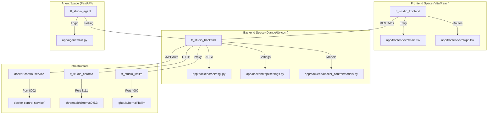
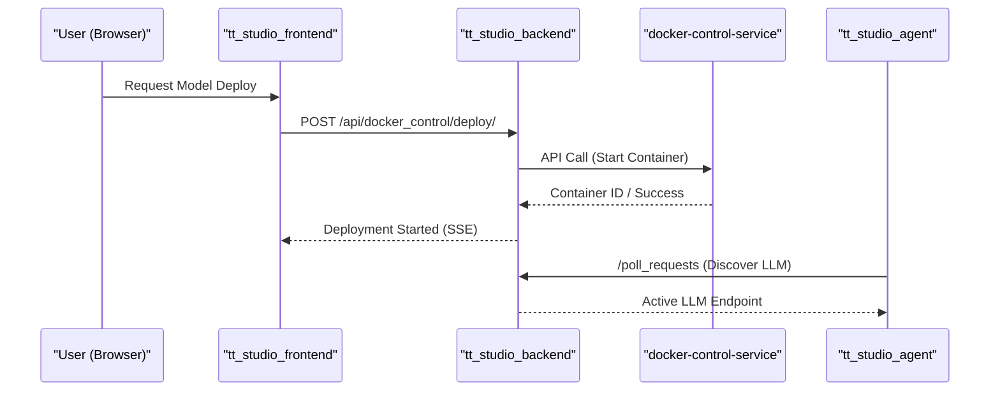

# TT-Studio Overview

<details>
<summary>Relevant source files</summary>
<ul>
<li><a href="https://github.com/tenstorrent/tt-studio/blob/c837b829/.cursor/rules/project-overview.mdc">.cursor/rules/project-overview.mdc</a></li>
<li><a href="https://github.com/tenstorrent/tt-studio/blob/c837b829/CLAUDE.md">CLAUDE.md</a></li>
<li><a href="https://github.com/tenstorrent/tt-studio/blob/c837b829/README.md">README.md</a></li>
<li><a href="https://github.com/tenstorrent/tt-studio/blob/c837b829/app/README.md">app/README.md</a></li>
<li><a href="https://github.com/tenstorrent/tt-studio/blob/c837b829/app/docker-compose.yml">app/docker-compose.yml</a></li>
<li><a href="https://github.com/tenstorrent/tt-studio/blob/c837b829/app/frontend/index.html">app/frontend/index.html</a></li>
</ul>
</details>


TT-Studio is a comprehensive web-based platform designed to simplify the deployment and management of AI models on **Tenstorrent AI accelerators**. It integrates the model execution capabilities of [TT-Metal](https://github.com/tenstorrent-metal/tt-metal) and the orchestration framework of [TT Inference Server](https://github.com/tenstorrent/tt-inference-server) into a unified graphical user interface [README.md:9-12](https://github.com/tenstorrent/tt-studio/blob/c837b829/README.md?plain=1#L9-L12).

The system automates technical setup, hardware detection, and containerization, allowing users to interact with large language models (LLMs), computer vision, and speech-to-text pipelines through an intuitive React-based frontend [app/README.md:1-16](https://github.com/tenstorrent/tt-studio/blob/c837b829/app/README.md?plain=1#L1-L16). For users without local hardware, the platform supports connecting to remote endpoints via "AI Playground" configurations [README.md:11-12](https://github.com/tenstorrent/tt-studio/blob/c837b829/README.md?plain=1#L11-L12) [.cursor/rules/project-overview.mdc:15-17](https://github.com/tenstorrent/tt-studio/blob/c837b829/.cursor/rules/project-overview.mdc?plain=1#L15-L17).

## System Architecture & Code Entities

The following diagram illustrates how the logical services of TT-Studio map to specific code entities and network configurations defined in the orchestration layer.

**Service-to-Code Mapping**

**Sources:** [app/docker-compose.yml:6-160](https://github.com/tenstorrent/tt-studio/blob/c837b829/app/docker-compose.yml#L6-L160), [app/frontend/index.html:17-18](https://github.com/tenstorrent/tt-studio/blob/c837b829/app/frontend/index.html#L17-L18), [app/README.md:18-19](https://github.com/tenstorrent/tt-studio/blob/c837b829/app/README.md?plain=1#L18-L19), [CLAUDE.md:28-43](https://github.com/tenstorrent/tt-studio/blob/c837b829/CLAUDE.md?plain=1#L28-L43)

---

## Key Capabilities

TT-Studio provides several high-level features for both end-users and developers:

*   **Automated Model Deployment:** Orchestrates the lifecycle of AI models, including weight downloading, container instantiation via the `docker-control-service`, and chip slot allocation [app/docker-compose.yml:61-63](https://github.com/tenstorrent/tt-studio/blob/c837b829/app/docker-compose.yml#L61-L63) [CLAUDE.md:29-32](https://github.com/tenstorrent/tt-studio/blob/c837b829/CLAUDE.md?plain=1#L29-L32).
*   **Multi-Modal AI Features:** Built-in support for Chat (LLMs), Image Generation (Stable Diffusion), Speech-to-Text (Whisper), and Object Detection (YOLOv4) [app/docker-compose.yml:42-52](https://github.com/tenstorrent/tt-studio/blob/c837b829/app/docker-compose.yml#L42-L52) [.cursor/rules/project-overview.mdc:46-52](https://github.com/tenstorrent/tt-studio/blob/c837b829/.cursor/rules/project-overview.mdc?plain=1#L46-L52).
*   **Retrieval-Augmented Generation (RAG):** Integrated ChromaDB vector store for document indexing and semantic search, enabling "chat with your data" capabilities [app/docker-compose.yml:164-186](https://github.com/tenstorrent/tt-studio/blob/c837b829/app/docker-compose.yml#L164-L186) [CLAUDE.md:32](https://github.com/tenstorrent/tt-studio/blob/c837b829/CLAUDE.md?plain=1#L32).
*   **Autonomous AI Agent:** A dedicated `tt_studio_agent` service that can perform complex tasks, discover local LLM containers, and execute code [app/docker-compose.yml:106-136](https://github.com/tenstorrent/tt-studio/blob/c837b829/app/docker-compose.yml#L106-L136) [app/README.md:15](https://github.com/tenstorrent/tt-studio/blob/c837b829/app/README.md?plain=1#L15).
*   **LiteLLM Gateway:** A LiteLLM instance acting as a gateway for coding-agent tasks and upstream LLM providers [app/docker-compose.yml:138-162](https://github.com/tenstorrent/tt-studio/blob/c837b829/app/docker-compose.yml#L138-L162).

---

## Logical Subsystems

TT-Studio is composed of several interdependent services networked via the `tt_studio_network` bridge [app/docker-compose.yml:188-190](https://github.com/tenstorrent/tt-studio/blob/c837b829/app/docker-compose.yml#L188-L190) [CLAUDE.md:23-25](https://github.com/tenstorrent/tt-studio/blob/c837b829/CLAUDE.md?plain=1#L23-L25).

**Subsystem Interaction Flow**

**Sources:** [app/docker-compose.yml:6-136](https://github.com/tenstorrent/tt-studio/blob/c837b829/app/docker-compose.yml#L6-L136), [app/README.md:9-18](https://github.com/tenstorrent/tt-studio/blob/c837b829/app/README.md?plain=1#L9-L18), [CLAUDE.md:14-25](https://github.com/tenstorrent/tt-studio/blob/c837b829/CLAUDE.md?plain=1#L14-L25)

### 1.1 Getting Started & Setup
The entry point for the project is the `run.py` script. It handles prerequisite checks, hardware detection, environment configuration via `.env`, and offers different modes such as `--dev` for active development (mounting local source for hot-reload) and `--cleanup-all` for a clean slate [README.md:38-53](https://github.com/tenstorrent/tt-studio/blob/c837b829/README.md?plain=1#L38-L53) [CLAUDE.md:46-52](https://github.com/tenstorrent/tt-studio/blob/c837b829/CLAUDE.md?plain=1#L46-L52).
For details, see [Getting Started & Setup](overview/getting-started.md).

### 1.2 Architecture Overview
The system runs as a multi-container Docker topology. It includes a Django backend (port 8000), a React frontend (port 3000), a FastAPI-based `docker-control-service` (port 8002) to proxy host-level operations (replacing direct socket mounts), and ChromaDB (port 8111) for vector storage [app/docker-compose.yml:5-186](https://github.com/tenstorrent/tt-studio/blob/c837b829/app/docker-compose.yml#L5-L186) [CLAUDE.md:14-25](https://github.com/tenstorrent/tt-studio/blob/c837b829/CLAUDE.md?plain=1#L14-L25).
For details, see [Architecture Overview](overview/architecture.md).

### 1.3 Contributing & Development Workflow
TT-Studio follows a structured contribution process, including branching strategies (branch off `dev`) and mandatory SPDX license headers. The workflow includes tools for checking and adding headers to maintain codebase compliance [README.md:63-64](https://github.com/tenstorrent/tt-studio/blob/c837b829/README.md?plain=1#L63-L64) [CLAUDE.md:59-71](https://github.com/tenstorrent/tt-studio/blob/c837b829/CLAUDE.md?plain=1#L59-L71).
For details, see [Contributing & Development Workflow](overview/contributing.md).

---

## Configuration & Environment
The system relies on an `.env` file (managed via `run.py`) to handle critical paths and secrets. Key variables include:
*   **TT_STUDIO_ROOT**: Absolute path to the repository root [app/docker-compose.yml:37](https://github.com/tenstorrent/tt-studio/blob/c837b829/app/docker-compose.yml#L37).
*   **HOST_PERSISTENT_STORAGE_VOLUME**: Location for database and model weight persistence on the host machine [app/docker-compose.yml:38](https://github.com/tenstorrent/tt-studio/blob/c837b829/app/docker-compose.yml#L38).
*   **DOCKER_CONTROL_SERVICE_URL**: Endpoint for the secure Docker operations proxy, typically `http://host.docker.internal:8002` [app/docker-compose.yml:62](https://github.com/tenstorrent/tt-studio/blob/c837b829/app/docker-compose.yml#L62).
*   **JWT_SECRET**: Used for authenticating internal service communication [app/docker-compose.yml:41](https://github.com/tenstorrent/tt-studio/blob/c837b829/app/docker-compose.yml#L41).
*   **LITELLM_MASTER_KEY**: Authentication key for the LiteLLM gateway [app/docker-compose.yml:65](https://github.com/tenstorrent/tt-studio/blob/c837b829/app/docker-compose.yml#L65).
*   **HF_TOKEN**: Hugging Face token for downloading gated models [CLAUDE.md:75-76](https://github.com/tenstorrent/tt-studio/blob/c837b829/CLAUDE.md?plain=1#L75-L76).

**Sources:** [app/docker-compose.yml:30-67](https://github.com/tenstorrent/tt-studio/blob/c837b829/app/docker-compose.yml#L30-L67), [app/README.md:79-81](https://github.com/tenstorrent/tt-studio/blob/c837b829/app/README.md?plain=1#L79-L81), [CLAUDE.md:73-80](https://github.com/tenstorrent/tt-studio/blob/c837b829/CLAUDE.md?plain=1#L73-L80)18:T1fc3,# Getting Started & Setup


```{toctree}
:hidden:
:maxdepth: 2

overview/getting-started
overview/architecture
overview/contributing
backend/index
docker-control-service/index
agent/index
frontend/index
model-integration/index
glossary
```
