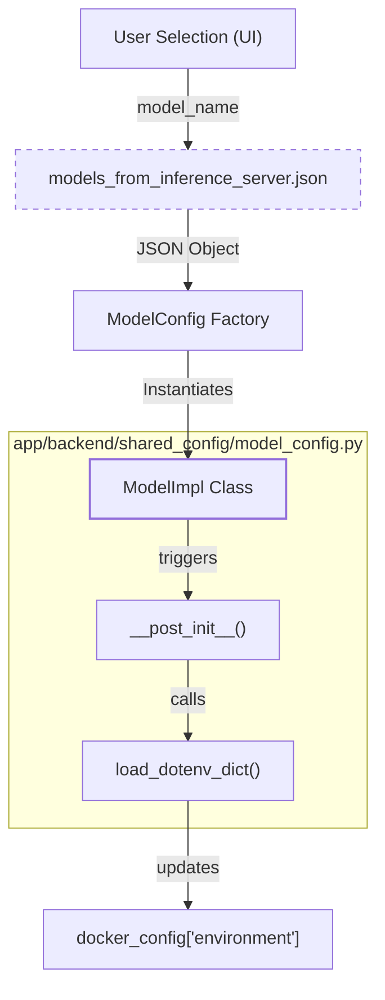
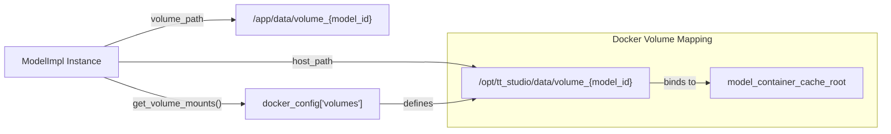

# Model Configuration & Catalog

Relevant source files

<ul>
<li><a href="https://github.com/tenstorrent/tt-studio/blob/c837b829/app/backend/docker_control/deployment_sync.py">app/backend/docker_control/deployment_sync.py</a></li>
<li><a href="https://github.com/tenstorrent/tt-studio/blob/c837b829/app/backend/logs_control/views.py">app/backend/logs_control/views.py</a></li>
<li><a href="https://github.com/tenstorrent/tt-studio/blob/c837b829/app/backend/shared_config/coding_agent_config.py">app/backend/shared_config/coding_agent_config.py</a></li>
<li><a href="https://github.com/tenstorrent/tt-studio/blob/c837b829/app/backend/shared_config/models_from_inference_server.json">app/backend/shared_config/models_from_inference_server.json</a></li>
<li><a href="https://github.com/tenstorrent/tt-studio/blob/c837b829/app/backend/shared_config/sync_models_from_inference_server.py">app/backend/shared_config/sync_models_from_inference_server.py</a></li>
<li><a href="https://github.com/tenstorrent/tt-studio/blob/c837b829/app/backend/shared_config/test_sync_models.py">app/backend/shared_config/test_sync_models.py</a></li>
</ul>

This page details the configuration schema and cataloging system used by TT-Studio to define, discover, and deploy AI models. The system relies on a central dataclass for model metadata and a JSON-based catalog derived from the Tenstorrent inference server artifacts.

## ModelImpl Dataclass

The `ModelImpl` class is the core configuration entity for any model implementation in TT-Studio. It is a frozen dataclass that defines the static properties required to instantiate a model container, including hardware requirements and Docker runtime parameters.

### Key Fields

| Field | Type | Description |
| :--- | :--- | :--- |
| `image_name` | `str` | The Docker image repository (e.g., `ghcr.io/tenstorrent/...`). |
| `image_tag` | `str` | The specific version tag of the Docker image. |
| `device_configurations` | `Set[DeviceConfigurations]` | A set of supported hardware layouts (e.g., `N150`, `T3K`, `GALAXY`). |
| `docker_config` | `Dict[str, Any]` | Runtime parameters passed to the Docker Engine (environment variables, shm_size). |
| `service_route` | `str` | The API endpoint for inference (e.g., `/v1/chat/completions`). |
| `setup_type` | `SetupTypes` | Defines how the model is provisioned (e.g., `TT_INFERENCE_SERVER`). |
| `model_type` | `ModelTypes` | Categorization of the model (e.g., `CHAT`, `IMAGE_GENERATION`). |
| `hf_model_id` | `str` | The HuggingFace repository ID for weight downloading. |
| `shm_size` | `str` | Shared memory allocation, defaults to `32G` for Tenstorrent workloads. |

### Initialization Logic
During `__post_init__`, the class performs several derived configuration steps:
1. **Volume Mapping**: Automatically configures host-to-container volume mounts for model weights and HuggingFace caches.
2. **Hardware Specifics**: If the configuration includes Wormhole-based architectures (`N150_WH_ARCH_YAML`, `N300_WH_ARCH_YAML`, or `N300x4_WH_ARCH_YAML`), it injects the `WH_ARCH_YAML` environment variable set to `wormhole_b0_80_arch_eth_dispatch.yaml`.
3. **Environment Overrides**: Loads model-specific `.env` files from the persistent storage volume via `load_dotenv_dict` to override default Docker environment variables.

## Model Catalog

The system maintains a primary catalog file, `models_from_inference_server.json`, which acts as the source of truth for available models. This file is generated from the `tt-inference-server` project and contains metadata for over 50 models.

### Catalog Synchronization
The catalog is updated via the `sync_models_from_inference_server.py` script. This script performs several normalization tasks:
- **Source Resolution**: Locates `model_specs_output.json` from artifact paths (via `TT_INFERENCE_ARTIFACT_PATH`) or local dev checkouts.
- **Route Derivation**: Uses `map_service_route` to determine if a model should use OpenAI-compatible endpoints like `/v1/chat/completions`, `/v1/audio/speech`, or `/v1/images/generations` based on its engine and type.
- **Environment Filtering**: Strips device-specific environment variables (like `WH_ARCH_YAML`, `MESH_DEVICE`, `ARCH_NAME`) that are handled dynamically by `ModelImpl.__post_init__`.
- **Health Check Mapping**: All models (vLLM, forge, media) are normalized to use `/health` as their health route.

### Natural Language to Code Entity Mapping: Model Discovery
The following diagram illustrates how user-facing model names in the UI are resolved to specific `ModelImpl` instances and Docker configurations.

Title: Model Discovery and Resolution Flow

## Device Configurations & Chip Requirements

TT-Studio infers chip requirements by intersecting the model's `device_configurations` with the system's detected hardware.

### Setup Types and Hardware Layouts
- **SetupTypes**: Defines the deployment backend (e.g., `TT_INFERENCE_SERVER`).
- **DeviceConfigurations**: Maps to specific Tenstorrent board layouts.
 - `N150`: Single Wormhole chip.
 - `N300`: Dual Wormhole chips.
 - `T3K`: Quad-chip configuration.
 - `GALAXY`: High-density cluster.
 - `P300x2`: Dual Blackhole configuration.

### Model ID and Naming
The `ModelImpl` class automatically generates a `model_id` if not provided, using the format `id_{impl_id}-{model_name}-v{version}`. It also defaults the `model_name` to the basename of the `hf_model_id` if the name is missing.

### Natural Language to Code Entity Mapping: Path Resolution
This diagram shows how `ModelImpl` properties resolve host paths to container paths for persistent storage.

Title: Model Storage Path Resolution

## Model Environment Management

Model implementations often require specific environment variables for tuning (e.g., `VLLM_RPC_TIMEOUT`). TT-Studio manages these through a tiered system:

1. **Catalog Defaults**: Defined in the `env_vars` section of `models_from_inference_server.json`. Values are coerced to strings during synchronization to ensure compatibility with Docker environment configuration.
2. **Persistent Overrides**: The `ModelImpl.get_model_env_file()` function searches for a file named `{model_name}.env` in the `model_envs` directory within the persistent storage volume.
3. **JWT Secret Protection**: The system explicitly excludes `JWT_SECRET` from model-specific env files during loading to ensure the global `tt-studio` secret is used for inter-service authentication.
4.  **Coding Agent & Reasoning**: 
 - Models eligible for coding-agent native tool calling (e.g., `Qwen3-32B`, `Llama-3.3-70B-Instruct`) are defined in `CODING_AGENT_ELIGIBLE_MODELS`.
 - Reasoning models like `Qwen3-32B` can be deployed with a specific reasoning parser (e.g., `qwen3`) to split reasoning into `reasoning_content`.
 - The system supports a `-thinking` suffix for requested gateway models to enable reasoning mode.

