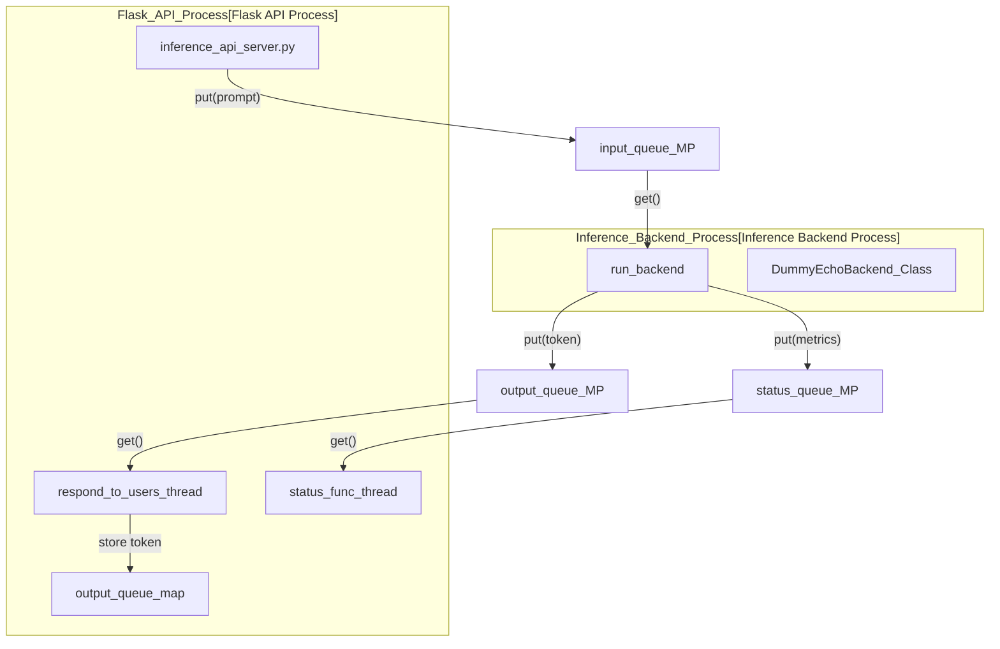
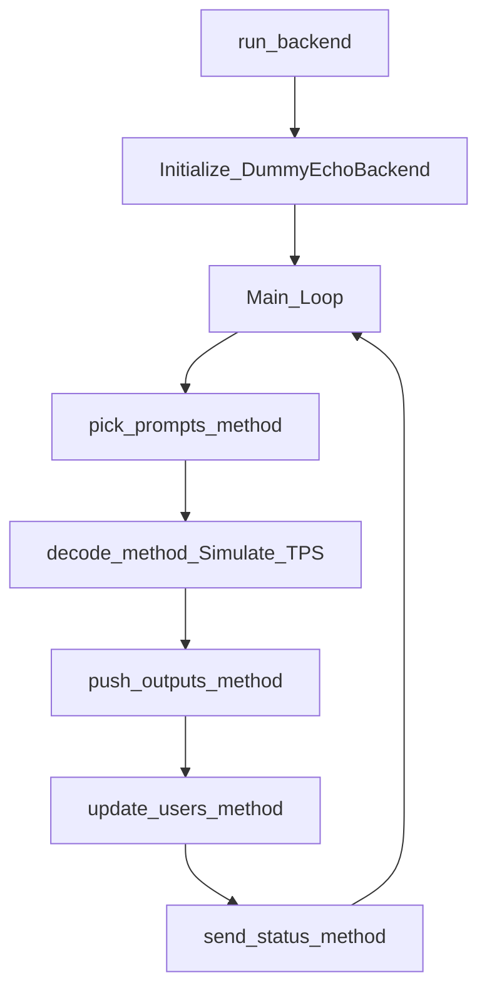

# Dummy Echo Model Reference Implementation

The `dummy_echo_model` serves as the reference implementation and template for integrating new AI models into TT-Studio. It provides a complete, containerized inference environment that simulates the behavior of a Large Language Model (LLM) while running on CPU. This allows developers to test the full deployment pipeline, streaming UI, and backend orchestration without requiring Tenstorrent hardware.

## System Architecture

The reference implementation is split into two primary processes to simulate a real-world inference server: a **Flask-based API Server** and a **Multiprocessing Backend**.

### Process Topology and Data Flow

The `inference_api_server.py` initializes a separate `multiprocessing.Process` to run the `run_backend` function. Communication between these processes occurs via thread-safe `multiprocessing.Queue` objects.

Title: "Dummy Echo Model Process Communication"

## Key Components

### 1. Inference Configuration (`inference_config.py`)
The configuration uses `namedtuple` to define model parameters, hardware requirements, and environment-driven settings. It handles the mapping of environment variables (like `CACHE_ROOT` and `SERVICE_PORT`) to internal configuration objects.

| Parameter | Role |
| :--- | :--- |
| `max_input_qsize` | Limits backpressure on the input queue. |
| `max_inactive_seconds` | Time before a user session is considered stale. |
| `end_of_sequence_str` | The token used to signal completion (`<|endoftext|>`). |
| `ModelConfig` | Defines batch size, sequence length, and sampling defaults. |

### 2. Flask API Server (`inference_api_server.py`)
The server manages the lifecycle of the backend process and provides the REST interface for inference.

* **NUMA Awareness**: To simulate performance optimization, the server parses the system `cpulist` and pins the backend process to NUMA node 0 while keeping the Flask API on other cores.
* **Garbage Collection**: The `_garbage_collection` function periodically reclaims resources for inactive `user_ids` from the `output_queue_map`.
* **Warmup**: Upon initialization, it sends a dummy prompt (`COMPILE-INITIALIZATION`) to the backend to trigger any "just-in-time" compilation or weight loading,.

### 3. Dummy Echo Backend (`dummy_echo_backend.py`)
The `DummyEchoBackend` class simulates a multi-user LLM engine.

* **Simulation Logic**: It mimics a specific Tokens-Per-Second (TPS) rate by using `time.sleep(1.0 / tokens_per_second)`.
* **Token Generation**: It "generates" tokens by slicing the input prompt and returning chunks of characters (simulating 3 chars per token) until the prompt is exhausted.
* **User Management**: It maintains a fixed-size list of `UserInfo` objects (default 32 slots) to track concurrent requests.

Title: "Backend Logic Flow"

### 4. Weights Handler (`model_weights_handler.py`)
Even though this is a dummy model, it implements the `get_model_weights_and_tt_cache_paths` function. This demonstrates how a real model should resolve paths for weights and the `tt_metal` binary cache based on `MODEL_WEIGHTS_ID` and `MODEL_WEIGHTS_PATH` environment variables.

## Containerization

The model is packaged using a multi-stage `Dockerfile`.

* **Base Image**: `ubuntu:20.04`.
* **Execution**: It runs via `gunicorn`.
* **Health Check**: A `curl` based health check monitors the service on the configured `SERVICE_PORT` (default 7000).

## Testing

A standalone test script `test_dummy_backend.py` is provided to verify the backend logic without starting the Flask server. It manually pushes prompts into the `prompt_q` and executes `run_backend` to ensure tokens are generated and the sequence completes.

---

:::{admonition} Source files this page was written from
:class: dropdown tt-sources

Captured at commit [`c837b829`](https://github.com/tenstorrent/tt-studio/commit/c837b829), so the linked line numbers match that revision.

- [`models/dummy_echo_model/Dockerfile`](https://github.com/tenstorrent/tt-studio/blob/c837b829/models/dummy_echo_model/Dockerfile)
- [`models/dummy_echo_model/src/dummy_echo_backend.py`](https://github.com/tenstorrent/tt-studio/blob/c837b829/models/dummy_echo_model/src/dummy_echo_backend.py)
- [`models/dummy_echo_model/src/inference_api_server.py`](https://github.com/tenstorrent/tt-studio/blob/c837b829/models/dummy_echo_model/src/inference_api_server.py)
- [`models/dummy_echo_model/src/inference_config.py`](https://github.com/tenstorrent/tt-studio/blob/c837b829/models/dummy_echo_model/src/inference_config.py)
- [`models/dummy_echo_model/src/model_weights_handler.py`](https://github.com/tenstorrent/tt-studio/blob/c837b829/models/dummy_echo_model/src/model_weights_handler.py)
:::
