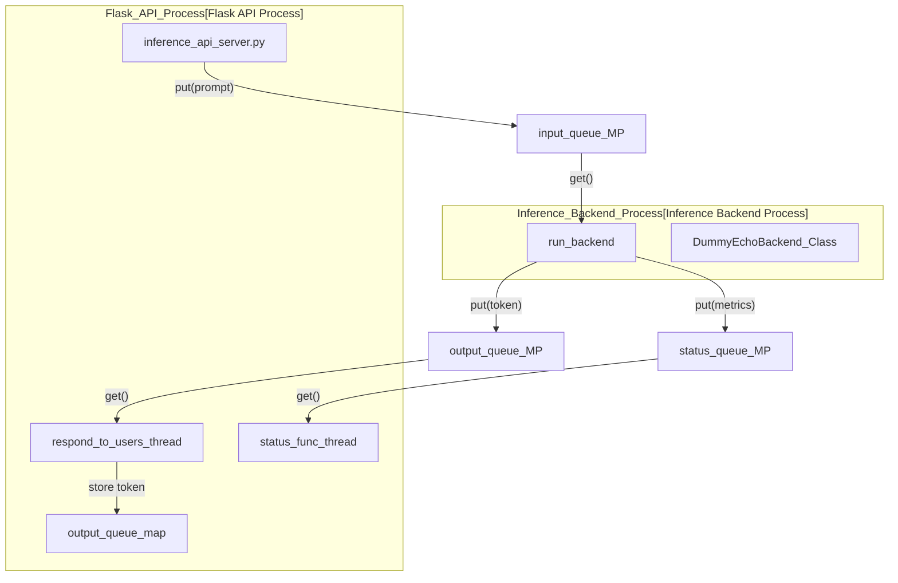
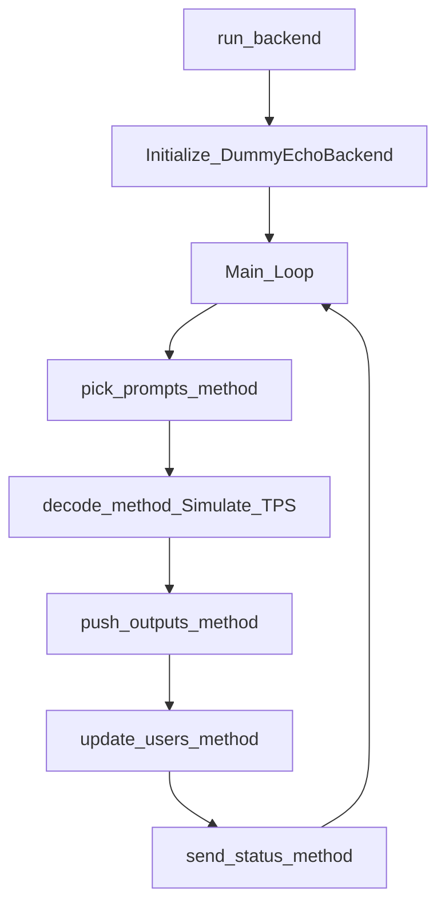

# Dummy Echo Model Reference Implementation

Relevant source files

<ul>
<li><a href="https://github.com/tenstorrent/tt-studio/blob/c837b829/models/dummy_echo_model/Dockerfile">models/dummy_echo_model/Dockerfile</a></li>
<li><a href="https://github.com/tenstorrent/tt-studio/blob/c837b829/models/dummy_echo_model/src/dummy_echo_backend.py">models/dummy_echo_model/src/dummy_echo_backend.py</a></li>
<li><a href="https://github.com/tenstorrent/tt-studio/blob/c837b829/models/dummy_echo_model/src/inference_api_server.py">models/dummy_echo_model/src/inference_api_server.py</a></li>
<li><a href="https://github.com/tenstorrent/tt-studio/blob/c837b829/models/dummy_echo_model/src/inference_config.py">models/dummy_echo_model/src/inference_config.py</a></li>
<li><a href="https://github.com/tenstorrent/tt-studio/blob/c837b829/models/dummy_echo_model/src/model_weights_handler.py">models/dummy_echo_model/src/model_weights_handler.py</a></li>
</ul>

The `dummy_echo_model` serves as the reference implementation and template for integrating new AI models into TT-Studio. It provides a complete, containerized inference environment that simulates the behavior of a Large Language Model (LLM) while running on CPU. This allows developers to test the full deployment pipeline, streaming UI, and backend orchestration without requiring Tenstorrent hardware.

## System Architecture

The reference implementation is split into two primary processes to simulate a real-world inference server: a **Flask-based API Server** and a **Multiprocessing Backend**.

### Process Topology and Data Flow

The `inference_api_server.py` initializes a separate `multiprocessing.Process` to run the `run_backend` function [models/dummy_echo_model/src/inference_api_server.py:115-124](https://github.com/tenstorrent/tt-studio/blob/c837b829/models/dummy_echo_model/src/inference_api_server.py#L115-L124). Communication between these processes occurs via thread-safe `multiprocessing.Queue` objects [models/dummy_echo_model/src/inference_api_server.py:111-113](https://github.com/tenstorrent/tt-studio/blob/c837b829/models/dummy_echo_model/src/inference_api_server.py#L111-L113).

Title: "Dummy Echo Model Process Communication"

Sources: [models/dummy_echo_model/src/inference_api_server.py:111-124](https://github.com/tenstorrent/tt-studio/blob/c837b829/models/dummy_echo_model/src/inference_api_server.py#L111-L124), [models/dummy_echo_model/src/inference_api_server.py:195-205](https://github.com/tenstorrent/tt-studio/blob/c837b829/models/dummy_echo_model/src/inference_api_server.py#L195-L205), [models/dummy_echo_model/src/dummy_echo_backend.py:160-165](https://github.com/tenstorrent/tt-studio/blob/c837b829/models/dummy_echo_model/src/dummy_echo_backend.py#L160-L165)

## Key Components

### 1. Inference Configuration (`inference_config.py`)
The configuration uses `namedtuple` to define model parameters, hardware requirements, and environment-driven settings [models/dummy_echo_model/src/inference_config.py:18-53](https://github.com/tenstorrent/tt-studio/blob/c837b829/models/dummy_echo_model/src/inference_config.py#L18-L53). It handles the mapping of environment variables (like `CACHE_ROOT` and `SERVICE_PORT`) to internal configuration objects [models/dummy_echo_model/src/inference_config.py:58-64](https://github.com/tenstorrent/tt-studio/blob/c837b829/models/dummy_echo_model/src/inference_config.py#L58-L64).

| Parameter | Role |
| :--- | :--- |
| `max_input_qsize` | Limits backpressure on the input queue [models/dummy_echo_model/src/inference_config.py:70](https://github.com/tenstorrent/tt-studio/blob/c837b829/models/dummy_echo_model/src/inference_config.py#L70). |
| `max_inactive_seconds` | Time before a user session is considered stale [models/dummy_echo_model/src/inference_config.py:72](https://github.com/tenstorrent/tt-studio/blob/c837b829/models/dummy_echo_model/src/inference_config.py#L72). |
| `end_of_sequence_str` | The token used to signal completion (`<|endoftext|>`) [models/dummy_echo_model/src/inference_config.py:83](https://github.com/tenstorrent/tt-studio/blob/c837b829/models/dummy_echo_model/src/inference_config.py#L83). |
| `ModelConfig` | Defines batch size, sequence length, and sampling defaults [models/dummy_echo_model/src/inference_config.py:42-53](https://github.com/tenstorrent/tt-studio/blob/c837b829/models/dummy_echo_model/src/inference_config.py#L42-L53). |

Sources: [models/dummy_echo_model/src/inference_config.py:18-40](https://github.com/tenstorrent/tt-studio/blob/c837b829/models/dummy_echo_model/src/inference_config.py#L18-L40), [models/dummy_echo_model/src/inference_config.py:66-93](https://github.com/tenstorrent/tt-studio/blob/c837b829/models/dummy_echo_model/src/inference_config.py#L66-L93)

### 2. Flask API Server (`inference_api_server.py`)
The server manages the lifecycle of the backend process and provides the REST interface for inference.

*   **NUMA Awareness**: To simulate performance optimization, the server parses the system `cpulist` [models/dummy_echo_model/src/inference_api_server.py:70-92](https://github.com/tenstorrent/tt-studio/blob/c837b829/models/dummy_echo_model/src/inference_api_server.py#L70-L92) and pins the backend process to NUMA node 0 while keeping the Flask API on other cores [models/dummy_echo_model/src/inference_api_server.py:125-136](https://github.com/tenstorrent/tt-studio/blob/c837b829/models/dummy_echo_model/src/inference_api_server.py#L125-L136).
*   **Garbage Collection**: The `_garbage_collection` function periodically reclaims resources for inactive `user_ids` from the `output_queue_map` [models/dummy_echo_model/src/inference_api_server.py:153-182](https://github.com/tenstorrent/tt-studio/blob/c837b829/models/dummy_echo_model/src/inference_api_server.py#L153-L182).
*   **Warmup**: Upon initialization, it sends a dummy prompt (`COMPILE-INITIALIZATION`) to the backend to trigger any "just-in-time" compilation or weight loading [models/dummy_echo_model/src/inference_api_server.py:33](https://github.com/tenstorrent/tt-studio/blob/c837b829/models/dummy_echo_model/src/inference_api_server.py#L33), [models/dummy_echo_model/src/inference_api_server.py:141-146](https://github.com/tenstorrent/tt-studio/blob/c837b829/models/dummy_echo_model/src/inference_api_server.py#L141-L146).

Sources: [models/dummy_echo_model/src/inference_api_server.py:102-140](https://github.com/tenstorrent/tt-studio/blob/c837b829/models/dummy_echo_model/src/inference_api_server.py#L102-L140), [models/dummy_echo_model/src/inference_api_server.py:33-38](https://github.com/tenstorrent/tt-studio/blob/c837b829/models/dummy_echo_model/src/inference_api_server.py#L33-L38)

### 3. Dummy Echo Backend (`dummy_echo_backend.py`)
The `DummyEchoBackend` class simulates a multi-user LLM engine.

*   **Simulation Logic**: It mimics a specific Tokens-Per-Second (TPS) rate by using `time.sleep(1.0 / tokens_per_second)` [models/dummy_echo_model/src/dummy_echo_backend.py:147-148](https://github.com/tenstorrent/tt-studio/blob/c837b829/models/dummy_echo_model/src/dummy_echo_backend.py#L147-L148).
*   **Token Generation**: It "generates" tokens by slicing the input prompt and returning chunks of characters (simulating 3 chars per token) until the prompt is exhausted [models/dummy_echo_model/src/dummy_echo_backend.py:146-159](https://github.com/tenstorrent/tt-studio/blob/c837b829/models/dummy_echo_model/src/dummy_echo_backend.py#L146-L159).
*   **User Management**: It maintains a fixed-size list of `UserInfo` objects (default 32 slots) to track concurrent requests [models/dummy_echo_model/src/dummy_echo_backend.py:46-50](https://github.com/tenstorrent/tt-studio/blob/c837b829/models/dummy_echo_model/src/dummy_echo_backend.py#L46-L50).

Title: "Backend Logic Flow"

Sources: [models/dummy_echo_model/src/dummy_echo_backend.py:124-143](https://github.com/tenstorrent/tt-studio/blob/c837b829/models/dummy_echo_model/src/dummy_echo_backend.py#L124-L143), [models/dummy_echo_model/src/dummy_echo_backend.py:144-159](https://github.com/tenstorrent/tt-studio/blob/c837b829/models/dummy_echo_model/src/dummy_echo_backend.py#L144-L159), [models/dummy_echo_model/src/dummy_echo_backend.py:186-196](https://github.com/tenstorrent/tt-studio/blob/c837b829/models/dummy_echo_model/src/dummy_echo_backend.py#L186-L196)

### 4. Weights Handler (`model_weights_handler.py`)
Even though this is a dummy model, it implements the `get_model_weights_and_tt_cache_paths` function [models/dummy_echo_model/src/model_weights_handler.py:22](https://github.com/tenstorrent/tt-studio/blob/c837b829/models/dummy_echo_model/src/model_weights_handler.py#L22). This demonstrates how a real model should resolve paths for weights and the `tt_metal` binary cache based on `MODEL_WEIGHTS_ID` and `MODEL_WEIGHTS_PATH` environment variables [models/dummy_echo_model/src/model_weights_handler.py:32-61](https://github.com/tenstorrent/tt-studio/blob/c837b829/models/dummy_echo_model/src/model_weights_handler.py#L32-L61).

Sources: [models/dummy_echo_model/src/model_weights_handler.py:32-48](https://github.com/tenstorrent/tt-studio/blob/c837b829/models/dummy_echo_model/src/model_weights_handler.py#L32-L48), [models/dummy_echo_model/src/model_weights_handler.py:22-61](https://github.com/tenstorrent/tt-studio/blob/c837b829/models/dummy_echo_model/src/model_weights_handler.py#L22-L61)

## Containerization

The model is packaged using a multi-stage `Dockerfile`.

*   **Base Image**: `ubuntu:20.04` [models/dummy_echo_model/Dockerfile:6](https://github.com/tenstorrent/tt-studio/blob/c837b829/models/dummy_echo_model/Dockerfile#L6).
*   **Execution**: It runs via `gunicorn` [models/dummy_echo_model/Dockerfile:60](https://github.com/tenstorrent/tt-studio/blob/c837b829/models/dummy_echo_model/Dockerfile#L60).
*   **Health Check**: A `curl` based health check monitors the service on the configured `SERVICE_PORT` (default 7000) [models/dummy_echo_model/Dockerfile:63-64](https://github.com/tenstorrent/tt-studio/blob/c837b829/models/dummy_echo_model/Dockerfile#L63-L64).

Sources: [models/dummy_echo_model/Dockerfile:59-60](https://github.com/tenstorrent/tt-studio/blob/c837b829/models/dummy_echo_model/Dockerfile#L59-L60), [models/dummy_echo_model/Dockerfile:63-64](https://github.com/tenstorrent/tt-studio/blob/c837b829/models/dummy_echo_model/Dockerfile#L63-L64)

## Testing

A standalone test script `test_dummy_backend.py` is provided to verify the backend logic without starting the Flask server. It manually pushes prompts into the `prompt_q` and executes `run_backend` to ensure tokens are generated and the sequence completes.

Sources: [models/dummy_echo_model/src/dummy_echo_backend.py:124-143](https://github.com/tenstorrent/tt-studio/blob/c837b829/models/dummy_echo_model/src/dummy_echo_backend.py#L124-L143), [models/dummy_echo_model/src/dummy_echo_backend.py:144-159](https://github.com/tenstorrent/tt-studio/blob/c837b829/models/dummy_echo_model/src/dummy_echo_backend.py#L144-L159)31:T2626,# Glossary
