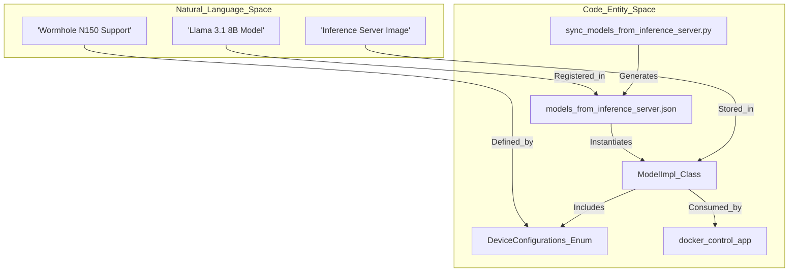
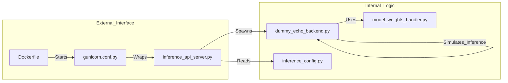

# Model Integration & Dummy Echo Model

<details>
<summary>Relevant source files</summary>
<ul>
<li><a href="https://github.com/tenstorrent/tt-studio/blob/c837b829/app/backend/docker_control/deployment_sync.py">app/backend/docker_control/deployment_sync.py</a></li>
<li><a href="https://github.com/tenstorrent/tt-studio/blob/c837b829/app/backend/logs_control/views.py">app/backend/logs_control/views.py</a></li>
<li><a href="https://github.com/tenstorrent/tt-studio/blob/c837b829/app/backend/shared_config/models_from_inference_server.json">app/backend/shared_config/models_from_inference_server.json</a></li>
<li><a href="https://github.com/tenstorrent/tt-studio/blob/c837b829/models/dummy_echo_model/Dockerfile">models/dummy_echo_model/Dockerfile</a></li>
<li><a href="https://github.com/tenstorrent/tt-studio/blob/c837b829/models/dummy_echo_model/src/inference_api_server.py">models/dummy_echo_model/src/inference_api_server.py</a></li>
</ul>
</details>

This section provides an overview of how AI models are integrated into the TT-Studio ecosystem. Integration is driven by a standardized configuration schema that allows the TT-Studio backend to manage the lifecycle of containerized inference servers, handle hardware requirements for Tenstorrent chips, and provide a unified API for the frontend.

## Model Integration Overview

Models in TT-Studio are treated as independent, containerized services. The integration relies on two primary components:
1. **Model Implementation (`ModelImpl`)**: A Python dataclass that defines the static configuration of a model, including its Docker image, environment variables, and hardware compatibility.
2. **Model Catalog**: A JSON-based registry (`models_from_inference_server.json`) that lists all available models and their specific deployment parameters, such as `device_configurations` and `inference_engine`.

The catalog is maintained via a synchronization script, `sync_models_from_inference_server.py`, which normalizes specs from the `tt-inference-server` artifacts into the Studio's format.

The following diagram illustrates how natural language model definitions are mapped to the codebase entities that manage them.

**Model Integration: From Concept to Code**


---

## Model Configuration & Catalog

The `ModelImpl` class is the central configuration object for any model integrated into TT-Studio. It encapsulates metadata such as `image_name`, `service_route`, and `device_configurations`. This configuration is used to dynamically generate Docker deployment parameters, including volume mounts for HuggingFace caches and Tenstorrent device dispatch headers.

The catalog `models_from_inference_server.json` provides the source of truth for supported models like `distil-large-v3`, `Llama-3.1-8B-Instruct`, or `mochi-1-preview`, specifying their `setup_type`, `model_type`, and `docker_image`. When models are deployed, the `deployment_sync.py` module manages the transition from a `starting` state to `running` by polling the inference API and updating the `ModelDeployment` record.

For details on schema fields, chip requirement inference, and the model catalog, see **[Model Configuration & Catalog](config-and-catalog.md)**.

---

## Dummy Echo Model Reference Implementation

To facilitate the development of new model integrations, TT-Studio provides a reference implementation called the `dummy_echo_model`. This is a fully functional, containerized Flask application that simulates an LLM's behavior by "echoing" input text back to the user at a controlled tokens-per-second (TPS) rate.

The reference implementation demonstrates:
* **Multiprocessing Architecture**: Separating the Flask API server from the "inference" backend using `multiprocessing.Process` to prevent blocking the request handling thread.
* **Resource Management**: Using `psutil` to pin the backend process to specific NUMA nodes for performance isolation and setting process `niceness`.
* **Standardized API**: Implementing `/health` checks and inference routes that match the TT-Studio expectations for container health monitoring.
* **Dockerization**: A complete `Dockerfile` that sets up a Python environment, installs requirements, and runs the service via `gunicorn`.

**Reference Implementation Component Mapping**


For a step-by-step breakdown of the reference implementation and how to use it as a template, see **[Dummy Echo Model Reference Implementation](dummy-echo-model.md)**.

```{toctree}
:hidden:
:maxdepth: 2

config-and-catalog
dummy-echo-model
```
