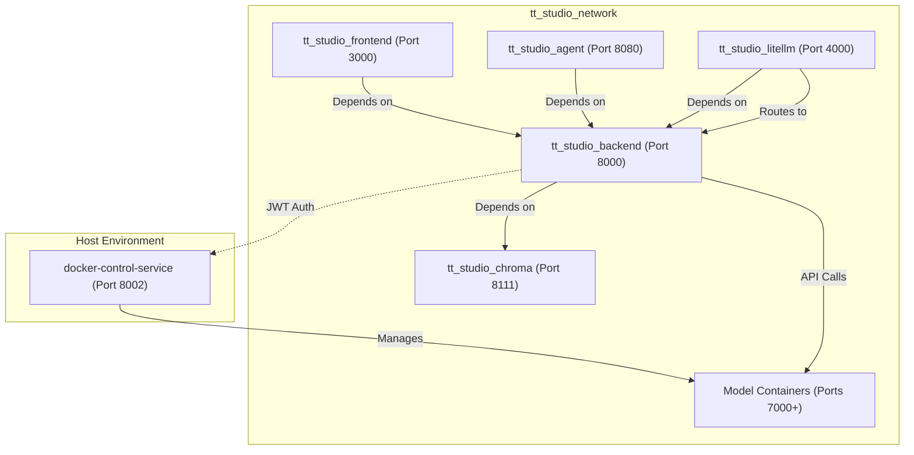
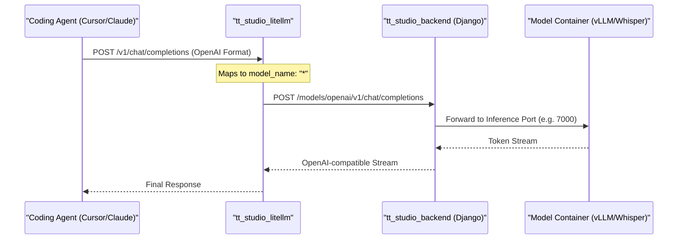

# Architecture Overview

Relevant source files

<ul>
<li><a href="https://github.com/tenstorrent/tt-studio/blob/c837b829/.vscode/extensions.json">.vscode/extensions.json</a></li>
<li><a href="https://github.com/tenstorrent/tt-studio/blob/c837b829/.vscode/settings.json">.vscode/settings.json</a></li>
<li><a href="https://github.com/tenstorrent/tt-studio/blob/c837b829/README.md">README.md</a></li>
<li><a href="https://github.com/tenstorrent/tt-studio/blob/c837b829/app/README.md">app/README.md</a></li>
<li><a href="https://github.com/tenstorrent/tt-studio/blob/c837b829/app/backend/Dockerfile">app/backend/Dockerfile</a></li>
<li><a href="https://github.com/tenstorrent/tt-studio/blob/c837b829/app/docker-compose.yml">app/docker-compose.yml</a></li>
<li><a href="https://github.com/tenstorrent/tt-studio/blob/c837b829/app/frontend/index.html">app/frontend/index.html</a></li>
<li><a href="https://github.com/tenstorrent/tt-studio/blob/c837b829/app/litellm/config.yaml">app/litellm/config.yaml</a></li>
</ul>

TT-Studio is built as a distributed multi-service system orchestrated via Docker. It bridges high-level user interactions (web UI, AI agents) with low-level hardware execution on Tenstorrent AI accelerators. The architecture follows a microservices pattern where specific responsibilities—such as Docker lifecycle management, vector search, and model inference—are isolated into distinct containers.

## Multi-Service Topology

The system is defined by a core `docker-compose.yml` that establishes the networking and dependency graph for the platform [app/docker-compose.yml:5-190](https://github.com/tenstorrent/tt-studio/blob/c837b829/app/docker-compose.yml#L5-L190).

### Core Services
*   **tt_studio_backend**: A Django-based API (running via Uvicorn) that serves as the central orchestrator. It manages the model catalog, tracks deployment states, and interfaces with the vector database [app/docker-compose.yml:6-24](https://github.com/tenstorrent/tt-studio/blob/c837b829/app/docker-compose.yml#L6-L24). It runs with 4 workers and includes a health check at `/up/` [app/docker-compose.yml:24-84](https://github.com/tenstorrent/tt-studio/blob/c837b829/app/docker-compose.yml#L24-L84).
*   **tt_studio_frontend**: A React 18 application built with Vite. It provides the user interface for model deployment, RAG management, and interactive chat [app/docker-compose.yml:95-105](https://github.com/tenstorrent/tt-studio/blob/c837b829/app/docker-compose.yml#L95-L105).
*   **tt_studio_agent**: A FastAPI service hosting a LangChain-based autonomous agent that can discover local LLMs and execute tools like Tavily search [app/docker-compose.yml:106-136](https://github.com/tenstorrent/tt-studio/blob/c837b829/app/docker-compose.yml#L106-L136).
*   **tt_studio_chroma**: A ChromaDB instance (v0.5.3) used for vector storage and semantic retrieval (RAG) [app/docker-compose.yml:164-189](https://github.com/tenstorrent/tt-studio/blob/c837b829/app/docker-compose.yml#L164-L189). It persists data to the host volume at `/chroma/chroma` [app/docker-compose.yml:170](https://github.com/tenstorrent/tt-studio/blob/c837b829/app/docker-compose.yml#L170).
*   **tt_studio_litellm**: A LiteLLM gateway that provides an OpenAI/Anthropic compatible surface for coding agents, routing requests back to the Django backend [app/docker-compose.yml:138-162](https://github.com/tenstorrent/tt-studio/blob/c837b829/app/docker-compose.yml#L138-L162).
*   **docker-control-service**: A security-hardened FastAPI service running on the **host** (port 8002). It acts as a proxy for Docker socket operations, allowing the backend to manage containers without mounting `/var/run/docker.sock` directly into the backend container [app/README.md:18-19](https://github.com/tenstorrent/tt-studio/blob/c837b829/app/README.md?plain=1#L18-L19).

### Networking & Storage
All services communicate over a dedicated bridge network named `tt_studio_network` [app/docker-compose.yml:19-20](https://github.com/tenstorrent/tt-studio/blob/c837b829/app/docker-compose.yml#L19-L20). Persistence is handled via host-mounted volumes defined by `HOST_PERSISTENT_STORAGE_VOLUME`, which stores ChromaDB data and backend application state [app/docker-compose.yml:69-70](https://github.com/tenstorrent/tt-studio/blob/c837b829/app/docker-compose.yml#L69-L70). The backend also mounts `hf_cache` to persist embedding models across restarts [app/docker-compose.yml:76-78](https://github.com/tenstorrent/tt-studio/blob/c837b829/app/docker-compose.yml#L76-L78).

**Service Dependency Graph**
The following diagram illustrates the startup sequence and inter-service dependencies.

**Sources:** [app/docker-compose.yml:5-190](https://github.com/tenstorrent/tt-studio/blob/c837b829/app/docker-compose.yml#L5-L190), [app/litellm/config.yaml:12-17](https://github.com/tenstorrent/tt-studio/blob/c837b829/app/litellm/config.yaml#L12-L17), [app/README.md:9-19](https://github.com/tenstorrent/tt-studio/blob/c837b829/app/README.md?plain=1#L9-L19)

---

## Data Flow & Service Interdependencies

The architecture utilizes a "Control Plane / Data Plane" split. The Backend and Docker Control Service form the control plane, while individual model containers represent the data plane.

### Model Deployment Flow
1.  **Request**: The Frontend sends a deployment request to `tt_studio_backend`.
2.  **Orchestration**: The backend uses its internal logic to communicate with the `docker-control-service` via the `DOCKER_CONTROL_SERVICE_URL` [app/docker-compose.yml:62](https://github.com/tenstorrent/tt-studio/blob/c837b829/app/docker-compose.yml#L62).
3.  **Execution**: `docker-control-service` pulls the image and runs the container. If Tenstorrent hardware is present, the `docker-compose.tt-hardware.yml` overlay mounts `/dev/tenstorrent` into the container [app/README.md:28-29](https://github.com/tenstorrent/tt-studio/blob/c837b829/app/README.md?plain=1#L28-L29).
4.  **Logging**: Deployment logs are stored in `.artifacts/tt-inference-server/workflow_logs`, which the backend mounts as read-only to provide status updates to the UI [app/docker-compose.yml:72-73](https://github.com/tenstorrent/tt-studio/blob/c837b829/app/docker-compose.yml#L72-L73).

### LiteLLM & Coding Agent Flow
LiteLLM acts as a protocol translator for external coding assistants (e.g., Cursor, Claude Code). It maps incoming OpenAI or Anthropic requests to the internal Django backend [app/litellm/config.yaml:7-11](https://github.com/tenstorrent/tt-studio/blob/c837b829/app/litellm/config.yaml#L7-L11).

*   **Upstream Routing**: Requests are routed to `http://tt-studio-backend-api:8000/models/openai/v1` [app/litellm/config.yaml:16](https://github.com/tenstorrent/tt-studio/blob/c837b829/app/litellm/config.yaml#L16).
*   **Key Management**: Uses `LITELLM_MASTER_KEY` for gateway access and `LITELLM_UPSTREAM_KEY` for authenticating with the backend [app/litellm/config.yaml:17-25](https://github.com/tenstorrent/tt-studio/blob/c837b829/app/litellm/config.yaml#L17-L25).

**Entity Mapping: Protocol Translation**

**Sources:** [app/litellm/config.yaml:12-25](https://github.com/tenstorrent/tt-studio/blob/c837b829/app/litellm/config.yaml#L12-L25), [app/docker-compose.yml:138-162](https://github.com/tenstorrent/tt-studio/blob/c837b829/app/docker-compose.yml#L138-L162)

---

## System Configuration & Environment

The architecture is highly configurable via environment variables, typically managed by `run.py` during setup [README.md:43-46](https://github.com/tenstorrent/tt-studio/blob/c837b829/README.md?plain=1#L43-L46).

| Variable | Role | Implementation |
| :--- | :--- | :--- |
| `DOCKER_CONTROL_SERVICE_URL` | Points backend to the host service (usually port 8002) | [app/docker-compose.yml:62](https://github.com/tenstorrent/tt-studio/blob/c837b829/app/docker-compose.yml#L62) |
| `TT_STUDIO_ROOT` | Absolute path for volume mounting and artifact access | [app/docker-compose.yml:37](https://github.com/tenstorrent/tt-studio/blob/c837b829/app/docker-compose.yml#L37) |
| `JWT_SECRET` | Used for backend-to-agent and general service auth | [app/docker-compose.yml:41](https://github.com/tenstorrent/tt-studio/blob/c837b829/app/docker-compose.yml#L41) |
| `DOCKER_CONTROL_JWT_SECRET` | Specifically for authenticating with the host Docker service | [app/docker-compose.yml:63](https://github.com/tenstorrent/tt-studio/blob/c837b829/app/docker-compose.yml#L63) |
| `VITE_ENABLE_DEPLOYED` | Toggles "AI Playground" mode (skips local hardware checks) | [app/backend/Dockerfile:7-9](https://github.com/tenstorrent/tt-studio/blob/c837b829/app/backend/Dockerfile#L7-L9) |

### Security & Deployment Modes
The system supports multiple execution modes through Docker Compose overlays [app/README.md:22-30](https://github.com/tenstorrent/tt-studio/blob/c837b829/app/README.md?plain=1#L22-L30):
1.  **Dev Mode**: Uses `docker-compose.dev-mode.yml` to mount local source code into `tt_studio_backend` and `tt_studio_frontend` for hot-reloading [app/README.md:44-51](https://github.com/tenstorrent/tt-studio/blob/c837b829/app/README.md?plain=1#L44-L51).
2.  **Hardware Mode**: Uses `docker-compose.tt-hardware.yml` to mount `/dev/tenstorrent` devices. The backend container attempts to install `tt-smi` during build if not in Playground mode [app/backend/Dockerfile:28-45](https://github.com/tenstorrent/tt-studio/blob/c837b829/app/backend/Dockerfile#L28-L45).
3.  **Network Security**: Services are isolated within `tt_studio_network`. The backend uses `extra_hosts` to resolve `host.docker.internal` for communicating with the host-side `docker-control-service` [app/docker-compose.yml:91-93](https://github.com/tenstorrent/tt-studio/blob/c837b829/app/docker-compose.yml#L91-L93).

**Sources:** [app/docker-compose.yml:30-68](https://github.com/tenstorrent/tt-studio/blob/c837b829/app/docker-compose.yml#L30-L68), [app/README.md:22-30](https://github.com/tenstorrent/tt-studio/blob/c837b829/app/README.md?plain=1#L22-L30), [app/backend/Dockerfile:7-45](https://github.com/tenstorrent/tt-studio/blob/c837b829/app/backend/Dockerfile#L7-L45)1a:T2871,# Contributing & Development Workflow
