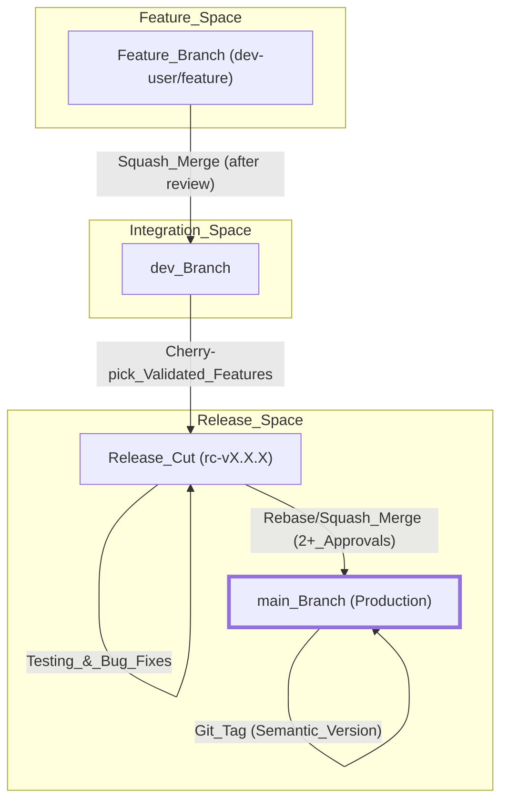
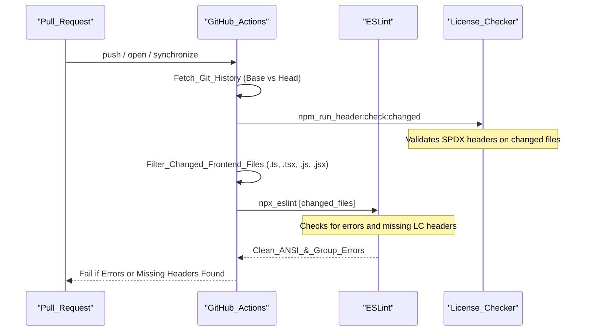
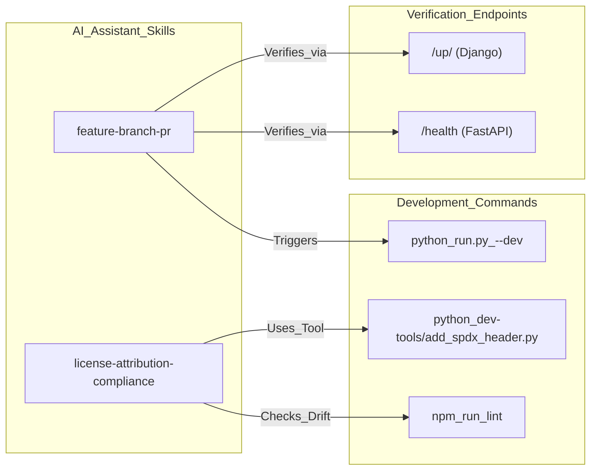

# Contributing & Development Workflow

<details>
<summary>Relevant source files</summary>
<ul>
<li><a href="https://github.com/tenstorrent/tt-studio/blob/c837b829/.claude/skills/feature-branch-pr/SKILL.md">.claude/skills/feature-branch-pr/SKILL.md</a></li>
<li><a href="https://github.com/tenstorrent/tt-studio/blob/c837b829/.claude/skills/license-attribution-compliance/SKILL.md">.claude/skills/license-attribution-compliance/SKILL.md</a></li>
<li><a href="https://github.com/tenstorrent/tt-studio/blob/c837b829/.claude/skills/tt-studio-overview/SKILL.md">.claude/skills/tt-studio-overview/SKILL.md</a></li>
<li><a href="https://github.com/tenstorrent/tt-studio/blob/c837b829/.github/CODEOWNERS">.github/CODEOWNERS</a></li>
<li><a href="https://github.com/tenstorrent/tt-studio/blob/c837b829/.github/workflows/backend-license-checker.yml">.github/workflows/backend-license-checker.yml</a></li>
<li><a href="https://github.com/tenstorrent/tt-studio/blob/c837b829/.github/workflows/frontend-lint-license-checker.yml">.github/workflows/frontend-lint-license-checker.yml</a></li>
<li><a href="https://github.com/tenstorrent/tt-studio/blob/c837b829/CODE_OF_CONDUCT.md">CODE_OF_CONDUCT.md</a></li>
<li><a href="https://github.com/tenstorrent/tt-studio/blob/c837b829/CONTRIBUTING.md">CONTRIBUTING.md</a></li>
<li><a href="https://github.com/tenstorrent/tt-studio/blob/c837b829/app/docker-compose.tt-hardware.yml">app/docker-compose.tt-hardware.yml</a></li>
<li><a href="https://github.com/tenstorrent/tt-studio/blob/c837b829/app/frontend/src/providers/ThemeProvider.tsx">app/frontend/src/providers/ThemeProvider.tsx</a></li>
<li><a href="https://github.com/tenstorrent/tt-studio/blob/c837b829/dev-tools/README.md">dev-tools/README.md</a></li>
</ul>
</details>


This page details the standards, processes, and automated workflows required for contributing to the TT-Studio codebase. It covers branching strategies, versioning, pull request requirements, license compliance tools, and AI assistant configurations.

## Contribution Requirements

All contributions must follow a structured process to ensure stability and traceability.

*   **Issue Tracking**: Before starting work, a feature request or bug report must be filed in the GitHub Issues section [CONTRIBUTING.md:11-13](https://github.com/tenstorrent/tt-studio/blob/c837b829/CONTRIBUTING.md?plain=1#L11-L13).
*   **Pull Requests (PRs)**: All code changes must be submitted via PR and require approval from a maintaining team member and relevant codeowners [CONTRIBUTING.md:16-17, 27-29](https://github.com/tenstorrent/tt-studio/blob/c837b829/CONTRIBUTING.md?plain=1#L16-L17).
*   **Acceptance Criteria**: PRs must pass all criteria mandated in the original issue and satisfy automated GitHub Actions [CONTRIBUTING.md:31-32](https://github.com/tenstorrent/tt-studio/blob/c837b829/CONTRIBUTING.md?plain=1#L31-L32).
*   **Codeowners**: Specific modules have designated owners who must approve changes. For example, `/app/backend/` is owned by `@anirudTT`, `@rnabeelTT`, and `@stisiTT` [.github/CODEOWNERS:29](https://github.com/tenstorrent/tt-studio/blob/c837b829/.github/CODEOWNERS#L29).

### Code of Conduct
Contributors are expected to adhere to the Contributor Covenant, which pledges a harassment-free experience and professional standards of behavior [CODE_OF_CONDUCT.md:1-37](https://github.com/tenstorrent/tt-studio/blob/c837b829/CODE_OF_CONDUCT.md?plain=1#L1-L37).

**Sources:** [CONTRIBUTING.md:11-33](https://github.com/tenstorrent/tt-studio/blob/c837b829/CONTRIBUTING.md?plain=1#L11-L33), [CODE_OF_CONDUCT.md:1-37](https://github.com/tenstorrent/tt-studio/blob/c837b829/CODE_OF_CONDUCT.md?plain=1#L1-L37), [.github/CODEOWNERS:1-78](https://github.com/tenstorrent/tt-studio/blob/c837b829/.github/CODEOWNERS#L1-L78)

---

## Git Branching Strategy

TT-Studio utilizes a multi-tier branching strategy to separate stable production code from active development and feature experimentation.

### Branching Architecture
"Natural Language Space" to "Code Entity Space" mapping for Git workflow:

| Branch Type | Name Pattern | Purpose | Merge Strategy |
| :--- | :--- | :--- | :--- |
| **Main** | `main` | Holds production-ready tagged code [CONTRIBUTING.md:41](https://github.com/tenstorrent/tt-studio/blob/c837b829/CONTRIBUTING.md?plain=1#L41). | Rebase/Squash & Merge [CONTRIBUTING.md:45](https://github.com/tenstorrent/tt-studio/blob/c837b829/CONTRIBUTING.md?plain=1#L45). |
| **Development** | `dev` | Central branch for feature integration and validation [CONTRIBUTING.md:47](https://github.com/tenstorrent/tt-studio/blob/c837b829/CONTRIBUTING.md?plain=1#L47). | Squash Merge [CONTRIBUTING.md:50](https://github.com/tenstorrent/tt-studio/blob/c837b829/CONTRIBUTING.md?plain=1#L50). |
| **Feature** | `dev-name/feature` or `dev/issue-num` | Individual developer work [CONTRIBUTING.md:61](https://github.com/tenstorrent/tt-studio/blob/c837b829/CONTRIBUTING.md?plain=1#L61). | Squash Merge into `dev` [CONTRIBUTING.md:65](https://github.com/tenstorrent/tt-studio/blob/c837b829/CONTRIBUTING.md?plain=1#L65). |
| **Release Cut** | `rc-vx.x.x` | Preparation for production deployment from `main` [CONTRIBUTING.md:75-76](https://github.com/tenstorrent/tt-studio/blob/c837b829/CONTRIBUTING.md?plain=1#L75-L76). | Rebase/Squash into `main` [CONTRIBUTING.md:93](https://github.com/tenstorrent/tt-studio/blob/c837b829/CONTRIBUTING.md?plain=1#L93). |

### Development Workflow Diagram

This diagram illustrates the flow of code from local feature development through validation to production release.



**Sources:** [CONTRIBUTING.md:39-95](https://github.com/tenstorrent/tt-studio/blob/c837b829/CONTRIBUTING.md?plain=1#L39-L95)

---

## Versioning Standards

TT-Studio follows **Semantic Versioning (SemVer)** to track changes and communicate impact to users [CONTRIBUTING.md:105-107](https://github.com/tenstorrent/tt-studio/blob/c837b829/CONTRIBUTING.md?plain=1#L105-L107).

*   **MAJOR**: Incremented for breaking changes, such as altering networking designs or modifying backend API flows [CONTRIBUTING.md:109-114](https://github.com/tenstorrent/tt-studio/blob/c837b829/CONTRIBUTING.md?plain=1#L109-L114).
*   **MINOR**: Incremented for backward-compatible new features, such as adding support for new models [CONTRIBUTING.md:116-118](https://github.com/tenstorrent/tt-studio/blob/c837b829/CONTRIBUTING.md?plain=1#L116-L118).
*   **PATCH**: Incremented for backward-compatible bug fixes and minor improvements [CONTRIBUTING.md:122-123](https://github.com/tenstorrent/tt-studio/blob/c837b829/CONTRIBUTING.md?plain=1#L122-L123).

**Sources:** [CONTRIBUTING.md:105-125](https://github.com/tenstorrent/tt-studio/blob/c837b829/CONTRIBUTING.md?plain=1#L105-L125)

---

## CI/CD & Automated Checks

The repository uses GitHub Actions to enforce code quality, linting, and licensing requirements on every PR.

### SPDX License Headers
Every source file must contain SPDX license identifiers to ensure compliance with Apache-2.0.
*   **Backend Requirement**: Python, Shell, and Dockerfiles must include the header [`.github/workflows/backend-license-checker.yml:52-60`](https://github.com/tenstorrent/tt-studio/blob/c837b829/.github/workflows/backend-license-checker.yml#L52-L60).
*   **Frontend Requirement**: JS/TS files must include the header [`.github/workflows/frontend-lint-license-checker.yml:93-94`](https://github.com/tenstorrent/tt-studio/blob/c837b829/.github/workflows/frontend-lint-license-checker.yml#L93-L94).

**Standard Header Format:**
```python
// SPDX-License-Identifier: Apache-2.0
// SPDX-FileCopyrightText: © 2026 Tenstorrent AI ULC
```
[`app/frontend/src/providers/ThemeProvider.tsx:1-2`](https://github.com/tenstorrent/tt-studio/blob/c837b829/app/frontend/src/providers/ThemeProvider.tsx#L1-L2), [`.github/workflows/backend-license-checker.yml:140-142`](https://github.com/tenstorrent/tt-studio/blob/c837b829/.github/workflows/backend-license-checker.yml#L140-L142)

### Frontend Linting & License Pipeline
The `TT-Studio Frontend Linter SPDX Licenses Checker` workflow performs the following sequence:



**Key Code Entities:**
*   **Workflow**: `.github/workflows/frontend-lint-license-checker.yml` [line 1](https://github.com/tenstorrent/tt-studio/blob/c837b829/line 1)
*   **Header Check Script**: `npm run header:check:changed` [line 59](https://github.com/tenstorrent/tt-studio/blob/c837b829/line 59)
*   **Linter**: `npx eslint` [line 130](https://github.com/tenstorrent/tt-studio/blob/c837b829/line 130)

**Sources:** [`.github/workflows/frontend-lint-license-checker.yml:1-180`](https://github.com/tenstorrent/tt-studio/blob/c837b829/.github/workflows/frontend-lint-license-checker.yml#L1-L180), [`.github/workflows/backend-license-checker.yml:1-162`](https://github.com/tenstorrent/tt-studio/blob/c837b829/.github/workflows/backend-license-checker.yml#L1-L162), [`app/frontend/src/providers/ThemeProvider.tsx:1-2`](https://github.com/tenstorrent/tt-studio/blob/c837b829/app/frontend/src/providers/ThemeProvider.tsx#L1-L2)

---

## Developer Tools

The `dev-tools/` directory contains utilities to automate compliance and maintenance tasks.

### SPDX Header Tool
The `add_spdx_header.py` script automatically adds Apache-2.0 license headers to source files [dev-tools/README.md:17-19](https://github.com/tenstorrent/tt-studio/blob/c837b829/dev-tools/README.md?plain=1#L17-L19).

*   **Functionality**: Scans `app/backend/` and `app/frontend/` recursively, applying the correct comment syntax based on file extension [dev-tools/README.md:27-42](https://github.com/tenstorrent/tt-studio/blob/c837b829/dev-tools/README.md?plain=1#L27-L42).
*   **Safety**: It is safe to run multiple times as it detects existing headers and avoids duplication [dev-tools/README.md:89](https://github.com/tenstorrent/tt-studio/blob/c837b829/dev-tools/README.md?plain=1#L89).
*   **Usage**: `python3 dev-tools/add_spdx_header.py` [dev-tools/README.md:66](https://github.com/tenstorrent/tt-studio/blob/c837b829/dev-tools/README.md?plain=1#L66).

### License Attribution Gate
The `check_license_attribution.py` script serves as a deterministic gate in CI to catch mechanical drift in third-party attributions [.claude/skills/license-attribution-compliance/SKILL.md:22-24](https://github.com/tenstorrent/tt-studio/blob/c837b829/.claude/skills/license-attribution-compliance/SKILL.md?plain=1#L22-L24).

*   **Frontend Freshness**: Checks if `app/frontend/third-party-licenses.txt` is up to date with `package.json` [.claude/skills/license-attribution-compliance/SKILL.md:48](https://github.com/tenstorrent/tt-studio/blob/c837b829/.claude/skills/license-attribution-compliance/SKILL.md?plain=1#L48).
*   **New Dependency Check**: Flags any newly added dependencies in `requirements.txt` or `package.json` that lack an entry in the root `LICENSE` or an allowlist [.claude/skills/license-attribution-compliance/SKILL.md:45, 79-82](https://github.com/tenstorrent/tt-studio/blob/c837b829/.claude/skills/license-attribution-compliance/SKILL.md?plain=1#L45).

**Sources:** [dev-tools/README.md:17-146](https://github.com/tenstorrent/tt-studio/blob/c837b829/dev-tools/README.md?plain=1#L17-L146), [.claude/skills/license-attribution-compliance/SKILL.md:1-135](https://github.com/tenstorrent/tt-studio/blob/c837b829/.claude/skills/license-attribution-compliance/SKILL.md?plain=1#L1-L135)

---

## AI Assistant Skill Configurations

For developers using Claude or Cursor, specific "skills" are defined to enforce the repository's professional standards and technical workflows.

### Feature Branch & PR Skill
Configured in `.claude/skills/feature-branch-pr/SKILL.md`, this skill guides AI assistants through the standard TT-Studio development cycle.

*   **Branching Logic**: Enforces branching off `dev` using the `<username>/<feature>` naming convention [.claude/skills/feature-branch-pr/SKILL.md:21, 59](https://github.com/tenstorrent/tt-studio/blob/c837b829/.claude/skills/feature-branch-pr/SKILL.md?plain=1#L21).
*   **Verification**: Mandates running `python run.py --dev` and checking health endpoints (e.g., `localhost:8000/up/`) before committing [.claude/skills/feature-branch-pr/SKILL.md:94-103](https://github.com/tenstorrent/tt-studio/blob/c837b829/.claude/skills/feature-branch-pr/SKILL.md?plain=1#L94-L103).
*   **Human-Only Attribution**: Strictly forbids AI-tool attribution (e.g., "Co-authored-by: Claude") in commit messages or PR descriptions [.claude/skills/feature-branch-pr/SKILL.md:28-31](https://github.com/tenstorrent/tt-studio/blob/c837b829/.claude/skills/feature-branch-pr/SKILL.md?plain=1#L28-L31).

### License Compliance Skill
Configured in `.claude/skills/license-attribution-compliance/SKILL.md`, this skill provides the judgment layer for third-party assets.

*   **Classification**: Guides the AI to flag NonCommercial (CC BY-NC) or Strong Copyleft (GPL) licenses as blockers [.claude/skills/license-attribution-compliance/SKILL.md:62-70](https://github.com/tenstorrent/tt-studio/blob/c837b829/.claude/skills/license-attribution-compliance/SKILL.md?plain=1#L62-L70).
*   **Bundled Assets**: Requires sidecar `README.md` files for checked-in binaries or weights to document provenance and license inheritance [.claude/skills/license-attribution-compliance/SKILL.md:83-93](https://github.com/tenstorrent/tt-studio/blob/c837b829/.claude/skills/license-attribution-compliance/SKILL.md?plain=1#L83-L93).

### Workflow Integration Diagram
Associating AI skill entities with development commands and checks:



**Sources:** [.claude/skills/feature-branch-pr/SKILL.md:1-181](https://github.com/tenstorrent/tt-studio/blob/c837b829/.claude/skills/feature-branch-pr/SKILL.md?plain=1#L1-L181), [.claude/skills/license-attribution-compliance/SKILL.md:1-135](https://github.com/tenstorrent/tt-studio/blob/c837b829/.claude/skills/license-attribution-compliance/SKILL.md?plain=1#L1-L135), [.claude/skills/tt-studio-overview/SKILL.md:1-56](https://github.com/tenstorrent/tt-studio/blob/c837b829/.claude/skills/tt-studio-overview/SKILL.md?plain=1#L1-L56)1b:T180d,# Backend Services
