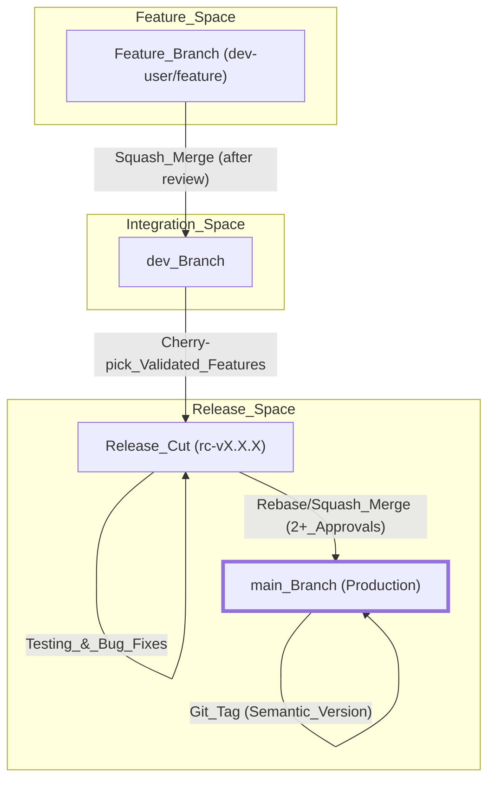
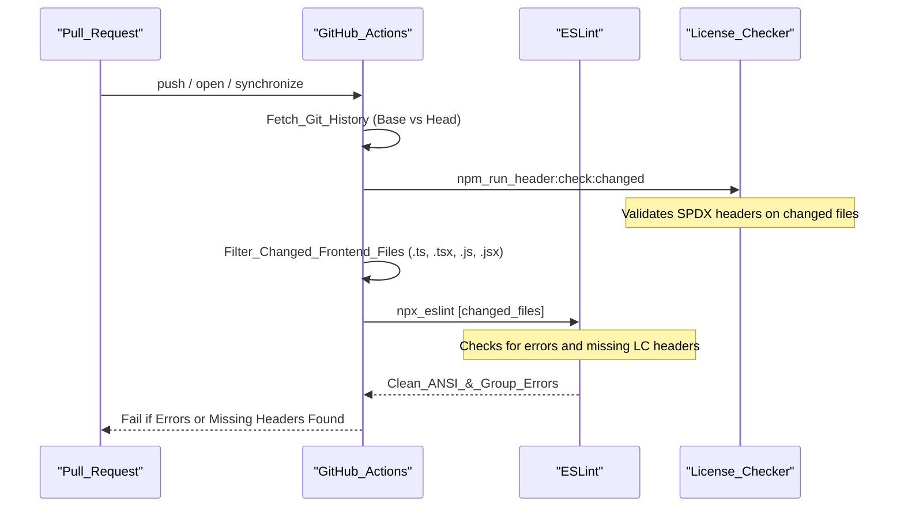
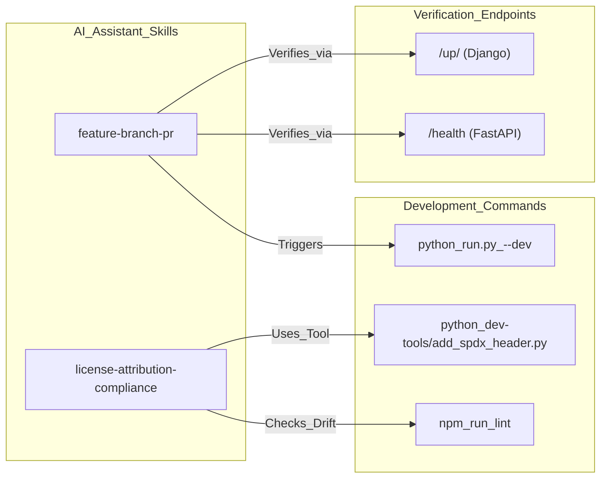

# Contributing & Development Workflow

<details>
<summary>Relevant source files</summary>
<ul>
<li><a href="https://github.com/tenstorrent/tt-studio/blob/c837b829/.claude/skills/feature-branch-pr/SKILL.md">.claude/skills/feature-branch-pr/SKILL.md</a></li>
<li><a href="https://github.com/tenstorrent/tt-studio/blob/c837b829/.claude/skills/license-attribution-compliance/SKILL.md">.claude/skills/license-attribution-compliance/SKILL.md</a></li>
<li><a href="https://github.com/tenstorrent/tt-studio/blob/c837b829/.claude/skills/tt-studio-overview/SKILL.md">.claude/skills/tt-studio-overview/SKILL.md</a></li>
<li><a href="https://github.com/tenstorrent/tt-studio/blob/c837b829/.github/CODEOWNERS">.github/CODEOWNERS</a></li>
<li><a href="https://github.com/tenstorrent/tt-studio/blob/c837b829/.github/workflows/backend-license-checker.yml">.github/workflows/backend-license-checker.yml</a></li>
<li><a href="https://github.com/tenstorrent/tt-studio/blob/c837b829/.github/workflows/frontend-lint-license-checker.yml">.github/workflows/frontend-lint-license-checker.yml</a></li>
<li><a href="https://github.com/tenstorrent/tt-studio/blob/c837b829/CODE_OF_CONDUCT.md">CODE_OF_CONDUCT.md</a></li>
<li><a href="https://github.com/tenstorrent/tt-studio/blob/c837b829/CONTRIBUTING.md">CONTRIBUTING.md</a></li>
<li><a href="https://github.com/tenstorrent/tt-studio/blob/c837b829/app/docker-compose.tt-hardware.yml">app/docker-compose.tt-hardware.yml</a></li>
<li><a href="https://github.com/tenstorrent/tt-studio/blob/c837b829/app/frontend/src/providers/ThemeProvider.tsx">app/frontend/src/providers/ThemeProvider.tsx</a></li>
<li><a href="https://github.com/tenstorrent/tt-studio/blob/c837b829/dev-tools/README.md">dev-tools/README.md</a></li>
</ul>
</details>

This page details the standards, processes, and automated workflows required for contributing to the TT-Studio codebase. It covers branching strategies, versioning, pull request requirements, license compliance tools, and AI assistant configurations.

## Contribution Requirements

All contributions must follow a structured process to ensure stability and traceability.

* **Issue Tracking**: Before starting work, a feature request or bug report must be filed in the GitHub Issues section.
* **Pull Requests (PRs)**: All code changes must be submitted via PR and require approval from a maintaining team member and relevant codeowners.
* **Acceptance Criteria**: PRs must pass all criteria mandated in the original issue and satisfy automated GitHub Actions.
* **Codeowners**: Specific modules have designated owners who must approve changes. For example, `/app/backend/` is owned by `@anirudTT`, `@rnabeelTT`, and `@stisiTT`.

### Code of Conduct
Contributors are expected to adhere to the Contributor Covenant, which pledges a harassment-free experience and professional standards of behavior.

---

## Git Branching Strategy

TT-Studio utilizes a multi-tier branching strategy to separate stable production code from active development and feature experimentation.

### Branching Architecture
"Natural Language Space" to "Code Entity Space" mapping for Git workflow:

| Branch Type | Name Pattern | Purpose | Merge Strategy |
| :--- | :--- | :--- | :--- |
| **Main** | `main` | Holds production-ready tagged code. | Rebase/Squash & Merge. |
| **Development** | `dev` | Central branch for feature integration and validation. | Squash Merge. |
| **Feature** | `dev-name/feature` or `dev/issue-num` | Individual developer work. | Squash Merge into `dev`. |
| **Release Cut** | `rc-vx.x.x` | Preparation for production deployment from `main`. | Rebase/Squash into `main`. |

### Development Workflow Diagram

This diagram illustrates the flow of code from local feature development through validation to production release.



---

## Versioning Standards

TT-Studio follows **Semantic Versioning (SemVer)** to track changes and communicate impact to users.

* **MAJOR**: Incremented for breaking changes, such as altering networking designs or modifying backend API flows.
* **MINOR**: Incremented for backward-compatible new features, such as adding support for new models.
* **PATCH**: Incremented for backward-compatible bug fixes and minor improvements.

---

## CI/CD & Automated Checks

The repository uses GitHub Actions to enforce code quality, linting, and licensing requirements on every PR.

### SPDX License Headers
Every source file must contain SPDX license identifiers to ensure compliance with Apache-2.0.
* **Backend Requirement**: Python, Shell, and Dockerfiles must include the header.
* **Frontend Requirement**: JS/TS files must include the header.

**Standard Header Format:**
```python
// SPDX-License-Identifier: Apache-2.0
// SPDX-FileCopyrightText: © 2026 Tenstorrent AI ULC
```
,

### Frontend Linting & License Pipeline
The `TT-Studio Frontend Linter SPDX Licenses Checker` workflow performs the following sequence:



**Key Code Entities:**
* **Workflow**: `.github/workflows/frontend-lint-license-checker.yml`
* **Header Check Script**: `npm run header:check:changed`
* **Linter**: `npx eslint`

---

## Developer Tools

The `dev-tools/` directory contains utilities to automate compliance and maintenance tasks.

### SPDX Header Tool
The `add_spdx_header.py` script automatically adds Apache-2.0 license headers to source files.

* **Functionality**: Scans `app/backend/` and `app/frontend/` recursively, applying the correct comment syntax based on file extension.
* **Safety**: It is safe to run multiple times as it detects existing headers and avoids duplication.
* **Usage**: `python3 dev-tools/add_spdx_header.py`.

### License Attribution Gate
The `check_license_attribution.py` script serves as a deterministic gate in CI to catch mechanical drift in third-party attributions.

* **Frontend Freshness**: Checks if `app/frontend/third-party-licenses.txt` is up to date with `package.json`.
* **New Dependency Check**: Flags any newly added dependencies in `requirements.txt` or `package.json` that lack an entry in the root `LICENSE` or an allowlist.

---

## AI Assistant Skill Configurations

For developers using Claude or Cursor, specific "skills" are defined to enforce the repository's professional standards and technical workflows.

### Feature Branch & PR Skill
Configured in `.claude/skills/feature-branch-pr/SKILL.md`, this skill guides AI assistants through the standard TT-Studio development cycle.

* **Branching Logic**: Enforces branching off `dev` using the `<username>/<feature>` naming convention.
* **Verification**: Mandates running `python run.py --dev` and checking health endpoints (e.g., `localhost:8000/up/`) before committing.
* **Human-Only Attribution**: Strictly forbids AI-tool attribution (e.g., "Co-authored-by: Claude") in commit messages or PR descriptions.

### License Compliance Skill
Configured in `.claude/skills/license-attribution-compliance/SKILL.md`, this skill provides the judgment layer for third-party assets.

* **Classification**: Guides the AI to flag NonCommercial (CC BY-NC) or Strong Copyleft (GPL) licenses as blockers.
* **Bundled Assets**: Requires sidecar `README.md` files for checked-in binaries or weights to document provenance and license inheritance.

### Workflow Integration Diagram
Associating AI skill entities with development commands and checks:



