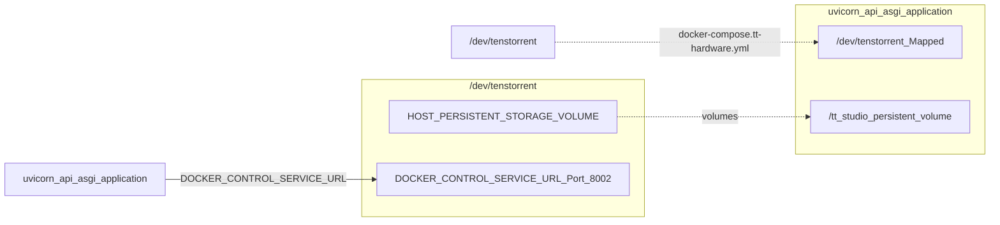

# Getting Started & Setup

<details>
<summary>Relevant source files</summary>
<ul>
<li><a href="https://github.com/tenstorrent/tt-studio/blob/c837b829/.env.default">.env.default</a></li>
<li><a href="https://github.com/tenstorrent/tt-studio/blob/c837b829/README.md">README.md</a></li>
<li><a href="https://github.com/tenstorrent/tt-studio/blob/c837b829/app/README.md">app/README.md</a></li>
<li><a href="https://github.com/tenstorrent/tt-studio/blob/c837b829/app/docker-compose.yml">app/docker-compose.yml</a></li>
<li><a href="https://github.com/tenstorrent/tt-studio/blob/c837b829/app/frontend/index.html">app/frontend/index.html</a></li>
<li><a href="https://github.com/tenstorrent/tt-studio/blob/c837b829/run.py">run.py</a></li>
</ul>
</details>

This page provides a technical guide for setting up and initializing the TT-Studio environment. It covers prerequisites, the execution flow of the primary setup script, environment configuration, and hardware detection mechanisms.

## Prerequisites

Before deploying TT-Studio, the host system must meet specific hardware and software requirements to ensure compatibility with Tenstorrent AI accelerators and Docker-based service orchestration.

* **Tenstorrent Software Stack**: Drivers and system configuration must be completed following the [Tenstorrent Getting Started Guide](https://docs.tenstorrent.com/getting-started/README.html).
* **Python 3.8+**: Required for running the orchestration script `run.py`.
* **Docker & Docker Compose**: Used for containerizing all subsystems. Users must be added to the `docker` group to allow non-sudo execution: `sudo usermod -aG docker $USER`.
* **Hugging Face Token**: Required for downloading gated models such as Llama.
* **Node.js**: The `run.py` script manages frontend dependencies (`node_modules`) during the setup process.

## Setup Orchestration: run.py

The `run.py` script is the unified entry point for TT-Studio. It manages the lifecycle of backend services, environment configuration, and auxiliary services like the `docker-control-service`.

### Execution Modes

| Mode | Command | Description |
| :--- | :--- | :--- |
| **Standard** | `python3 run.py` | Interactive setup that configures `.env`, checks dependencies, and starts containers. |
| **Dev Mode** | `python3 run.py --dev` | Development mode: mounts local source code for the backend and frontend into containers to enable hot-reloading,. |
| **Cleanup** | `python3 run.py --cleanup` | Stops and removes TT-Studio containers and networks while preserving persistent data,. |
| **Cleanup All** | `python3 run.py --cleanup-all` | Full wipe: removes containers, networks, the persistent volume, and the `.env` file,. |

### Startup Data Flow

The following diagram illustrates how `run.py` (Natural Language Space) orchestrates the system components defined in the codebase (Code Entity Space).

**Figure 1: run.py Initialization Logic**
```mermaid
graph TD
    subgraph Host_Space_run_py["run.py"] --> setup_environment["_setup_environment()"]
        setup_environment["_setup_environment()"] --> create_docker_network_tt_studio_network["_create_docker_network('tt_studio_network')"]
        create_docker_network_tt_studio_network["_create_docker_network('tt_studio_network')"] --> start_docker_control_service["start_docker_control_service()"]
        start_docker_control_service["start_docker_control_service()"] --> run_docker_compose["_run_docker_compose()"]
    end

    subgraph Docker_Topology_tt_studio_network["_run_docker_compose()"] --> tt_studio_backend["tt_studio_backend"]
        run_docker_compose["_run_docker_compose()"] --> tt_studio_frontend["tt_studio_frontend"]
        run_docker_compose["_run_docker_compose()"] --> tt_studio_chroma["tt_studio_chroma"]
        run_docker_compose["_run_docker_compose()"] --> tt_studio_agent["tt_studio_agent"]
        run_docker_compose["_run_docker_compose()"] --> tt_studio_litellm["tt_studio_litellm"]
    end

    subgraph Persistence_and_Config["tt_studio_backend"] --- HOST_PERSISTENT_STORAGE_VOLUME["HOST_PERSISTENT_STORAGE_VOLUME"]
        tt_studio_chroma["tt_studio_chroma"] --- HOST_PERSISTENT_STORAGE_VOLUME["HOST_PERSISTENT_STORAGE_VOLUME"]
        setup_environment["_setup_environment()"] --- ROOT_env["ROOT/.env"]
    end
```

## Environment Configuration (.env)

TT-Studio uses a single, canonical `.env` file located at the repository root for the whole project. The `run.py` script generates this from `.env.default` if it does not exist,.

### Key Variables
* **`TT_STUDIO_ROOT`**: Absolute path to the repository root, used for volume mounting.
* **`TT_INFERENCE_ARTIFACT_VERSION`**: Specifies the version of the `tt-inference-server` artifact to deploy (e.g., `v0.17.0`).
* **`JWT_SECRET`**: Secret for signing tokens used in service-to-service communication.
* **`VITE_ENABLE_DEPLOYED`**: Boolean flag that toggles between using local Tenstorrent hardware or remote cloud endpoints for inference,.
* **`DOCKER_CONTROL_SERVICE_URL`**: Points to the host-side proxy for Docker operations, typically `http://host.docker.internal:8002`.
* **`LITELLM_PORT`**: Host port the LiteLLM gateway is published on, defaulting to 4000,.
* **`WAKEWORD_MODEL`**: Defines the model used for wake word detection (default: `hey_quiet_box`).

## Hardware Detection & Container Mounting

TT-Studio detects Tenstorrent hardware by checking for devices in `/dev/tenstorrent`. When hardware is present, `run.py` includes the `docker-compose.tt-hardware.yml` override during the `docker compose up` command,.

**Figure 2: Hardware Access & Resource Mapping**


## AI Playground & Remote Endpoints

For users without local Tenstorrent hardware, TT-Studio supports an "AI Playground" mode by connecting to external model endpoints. This is configured via the `VITE_ENABLE_DEPLOYED` variable and various `CLOUD_*` environment variables in the `.env` file.

* **External Chat**: `CLOUD_CHAT_UI_URL` and `CLOUD_CHAT_UI_AUTH_TOKEN`.
* **Vision/Media**: Supports external URLs for YOLOv4, Speech Recognition, and Stable Diffusion.
* **LiteLLM Gateway**: Acts as a proxy for coding agents, utilizing `LITELLM_MASTER_KEY` and `LITELLM_UPSTREAM_KEY`.

## Cleanup and Reset Commands

To maintain system hygiene or reset the environment, `run.py` provides cleanup options that interface with the Docker daemon and host filesystem.

*   **Standard Cleanup**: `python3 run.py --cleanup`
    *   Stops all containers and removes the `tt_studio_network`.
 * Preserves the `HOST_PERSISTENT_STORAGE_VOLUME` and `.env` file.
*   **Full Reset**: `python3 run.py --cleanup-all`
    *   Removes containers, networks, and images.
 * Wipes the `HOST_PERSISTENT_STORAGE_VOLUME` directory and the `.env` file,.
*   **Manual Cleanup**:
    If using raw docker-compose, you must pass all active overlays to the `down` command to avoid orphaned services:
    ```bash
    docker compose -f app/docker-compose.yml -f app/docker-compose.dev-mode.yml -f app/docker-compose.tt-hardware.yml down
    ```

