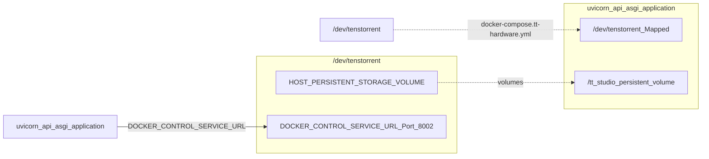

# Setup reference

The full detail behind `run.py`: prerequisites, every command-line flag, environment configuration,
hardware detection, and the Compose overlays.

If you just want it running, the [Quickstart](quickstart.md) is shorter. This page is what you
consult when something isn't behaving.

## Prerequisites

- **Tenstorrent software stack** — drivers and system configuration, following the
  [Tenstorrent Getting Started Guide](https://docs.tenstorrent.com/getting-started/README.html).
  Only needed if you have a card.
- **Python 3.8+** — `run.py` creates and manages its own virtual environment.
- **Docker and Docker Compose** — your user must be in the `docker` group so containers can be
  managed without `sudo`: `sudo usermod -aG docker $USER`, then log out and back in.
- **A Hugging Face token** — for gated weights such as Llama. Entered in the Welcome wizard on
  first run, not in a file.
- **Node.js** — `run.py` installs frontend dependencies during setup.

## Command reference

Flags are grouped the same way `python3 run.py --help` groups them, so the two can be compared
directly.

### Setup and configuration

| Flag | What it does |
| :--- | :--- |
| `--dev` | Development mode: hot reload, local source mounted into the containers |
| `--configure-env` | Interactively configure all environment variables |
| `--reconfigure-inference-server` | Reconfigure the TT Inference Server artifact (alias: `--reconfig-inf`) |
| `--install-shortcut` | Add a `tt-studio` shell shortcut so you can skip typing `python run.py` |
| `--switch REF` | Switch this checkout to a branch or tag, then exit; re-run to start |

### Model deployment

| Flag | What it does |
| :--- | :--- |
| `--auto-deploy MODEL_NAME` | Deploy the named model once startup finishes |
| `--device-id CHIP_ID` | Chip slot (0–7) for `--auto-deploy` |

### Lifecycle

| Flag | What it does |
| :--- | :--- |
| `--stop` | Tear down containers and networks, keeping persistent data |
| `--status` | Open the live monitor for a running stack |
| `--logs` | Stream all container logs |
| `--info` | Re-show the "TT Studio is ready" summary: URLs, mode, hardware |

### Reset

| Flag | What it does |
| :--- | :--- |
| `--purge-all` | Stop and wipe everything, including the persistent volume and `.env` |
| `--uninstall` | The `--purge-all` teardown, plus removal of the `tt-studio` shortcut |
| `--yes`, `-y` | Skip the confirmation prompt |

:::{warning}
`--purge-all` deletes downloaded model weights, RAG collections and deployment history along with
the containers. Use `--stop` for anything routine.
:::

### Advanced

| Flag | What it does |
| :--- | :--- |
| `--reconfigure` | Reset preferences and reconfigure all options |
| `--resync` | Force a resync of the model catalog |
| `--pull-branch` | Re-download the inference artifact from its branch |
| `--skip-fastapi` | Skip TT Inference Server FastAPI setup |
| `--skip-docker-control` | Skip the Docker Control Service |
| `--no-sudo` | Skip sudo usage, which may limit functionality |
| `--no-browser` | Don't open a browser automatically |
| `--wait-for-services` | Block until every service reports healthy |
| `--browser-timeout N` | Seconds to wait for the frontend before opening a browser |

### Developer tools

| Flag | What it does |
| :--- | :--- |
| `--add-headers` | Add missing SPDX license headers, excluding the frontend |
| `--check-headers` | Report files missing SPDX headers |

### Troubleshooting and info

| Flag | What it does |
| :--- | :--- |
| `--help-env` | Detailed help for every environment variable |
| `--report-bug` | Collect a diagnostics bundle and open a pre-filled GitHub issue |
| `--verbose`, `-v` | Full output |

:::{note} Deprecated aliases
`--cleanup` and `--cleanup-all` still work but are hidden. Use `--stop` and `--purge-all`.
:::

## Environment configuration

A single canonical `.env` at the repository root configures the whole project. `run.py` creates it
from `.env.default` if it doesn't exist. Run `python3 run.py --help-env` for the complete list.

:::{important} Secrets live in the UI
`HF_TOKEN`, `TTS_API_KEY`, `TAVILY_API_KEY` and `JWT_SECRET` are set in the first-run Welcome wizard
or later under Settings, and are stored for you. Values in `.env` are a fallback only, and
`JWT_SECRET` is generated automatically on first run.
:::

### Paths and artifact

| Variable | Purpose |
| :--- | :--- |
| `TT_STUDIO_ROOT` | Absolute path to the repository root, used for volume mounts |
| `HOST_PERSISTENT_STORAGE_VOLUME` | Where model weights and application state are kept on the host |
| `TT_INFERENCE_ARTIFACT_VERSION` | Version of the tt-inference-server artifact to use |

### Services

| Variable | Purpose |
| :--- | :--- |
| `DOCKER_CONTROL_SERVICE_URL` | Host-side Docker proxy, usually `http://host.docker.internal:8002` |
| `LITELLM_PORT` | Host port for the LiteLLM gateway, default 4000 |
| `LITELLM_MASTER_KEY` | Client-facing key for the gateway |
| `LITELLM_UPSTREAM_KEY` | Shared secret between the gateway and the backend |
| `CHROMA_DB_EMBED_MODEL` | Embedding model for the vector store. Changing it on an existing volume means recreating collections |
| `RAG_RELEVANCE_THRESHOLD` | Maximum cosine distance for a retrieval result to be used |

### Hardware

| Variable | Purpose |
| :--- | :--- |
| `IS_QB2` | Set `true` on a QuietBox 2 to verify the board via `tt-smi` at startup. Off by default so laptops and cloud runs aren't blocked |

### Voice

| Variable | Purpose |
| :--- | :--- |
| `WAKEWORD_MODEL` | Wake-word model name, default `hey_quiet_box` |
| `WAKEWORD_THRESHOLD` | Detection threshold, default `0.3` |
| `WAKEWORD_DEBUG_SCORES` | Log per-frame scores while tuning the threshold |

### Remote endpoints

Only used when `VITE_ENABLE_DEPLOYED=true`. Each service takes a URL and an auth token:
`CLOUD_CHAT_UI_URL`, `CLOUD_YOLOV4_API_URL`, `CLOUD_SPEECH_RECOGNITION_URL` and
`CLOUD_STABLE_DIFFUSION_URL`, each with a matching `_AUTH_TOKEN`. See
[Run without a Tenstorrent card](../examples/run-without-a-tenstorrent-card.md).

## Hardware detection and container mounting

TT-Studio detects Tenstorrent hardware by looking for `/dev/tenstorrent`. When it's present,
`run.py` adds the `docker-compose.tt-hardware.yml` overlay, which passes the device through to the
containers.

Board identification is separate and runs through `tt-smi`, which reports the board type and card
count; those are mapped onto a device configuration such as `N300`, `T3K` or `P300x2`. Mixed board
types in one machine are not supported. The detected configuration is what filters the model
catalog — see [Will it run on my machine?](will-it-run.md) for the full board list.

**Figure: hardware access and resource mapping**



## Compose overlays

`run.py` composes the right set of overlay files for the situation, so you rarely need to invoke
Docker Compose yourself.

| Overlay | Applied when |
| :--- | :--- |
| `docker-compose.yml` | Always — the base stack |
| `docker-compose.dev-mode.yml` | `--dev` |
| `docker-compose.tt-hardware.yml` | `/dev/tenstorrent` exists |
| `docker-compose.prod.yml` | Production deployment |

If you do drive Compose directly, pass every active overlay to `down` as well, or you'll leave
orphaned services behind:

```bash
docker compose -f app/docker-compose.yml \
  -f app/docker-compose.dev-mode.yml \
  -f app/docker-compose.tt-hardware.yml down
```

## Next steps

- [Quickstart](quickstart.md) — the short version
- [Will it run on my machine?](will-it-run.md) — boards and what each can deploy
- [Deploy a model in one command](../examples/unattended-deploy.md) — using these flags in anger

---

:::{admonition} Source files this page was written from
:class: dropdown tt-sources

- [`.env.default`](https://github.com/tenstorrent/tt-studio/blob/dev/.env.default)
- [`run.py`](https://github.com/tenstorrent/tt-studio/blob/dev/run.py)
- [`tt_setup/cli/_args.py`](https://github.com/tenstorrent/tt-studio/blob/dev/tt_setup/cli/_args.py)
- [`app/docker-compose.yml`](https://github.com/tenstorrent/tt-studio/blob/dev/app/docker-compose.yml)
:::
