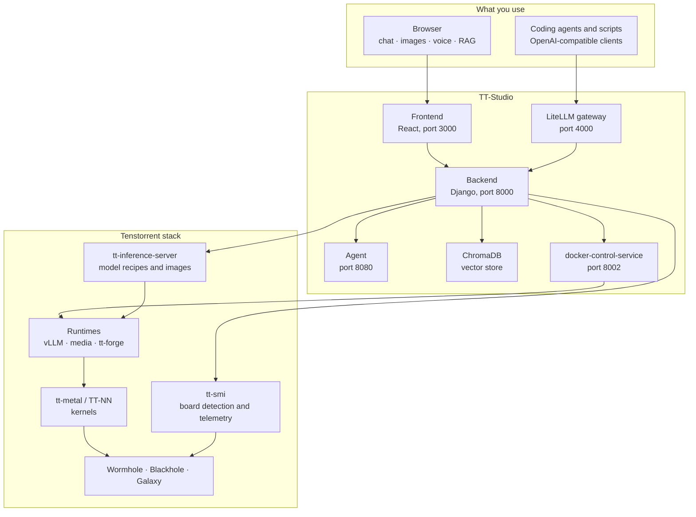

# What is TT-Studio?

TT-Studio is a web application that runs AI models on the Tenstorrent hardware you already own.
You start it with one command, open `http://localhost:3000`, pick a model from a catalog, and click
deploy. A few minutes later you have a chat window, or an image generator, or a voice assistant —
served entirely from your own cards, with nothing leaving the machine.

It is the product layer over the Tenstorrent inference stack. The pieces underneath — the model
recipes, the runtimes, the kernels, the board telemetry — already exist and are well engineered.
What they don't give you is a way to sit down and *use* them without becoming an expert in all of
them first. That gap is what TT-Studio fills.

## Where it sits in the Tenstorrent stack

TT-Studio owns the middle band. Everything below it is the existing Tenstorrent stack, which
TT-Studio consumes rather than replaces.

## Which layer do you actually want?

| Layer | You want this when |
| :--- | :--- |
| **tt-metal / TT-NN** | You are writing custom kernels or ops for Tenstorrent silicon. |
| **tt-forge / tt-mlir / tt-xla** | You are compiling your own model graph down to the hardware. Note this isn't an alternative to TT-Studio — the classification models in its catalog run on the `forge` engine, so tt-forge is one of the runtimes *inside* TT-Studio. |
| **tt-inference-server** | You want one model served from a script, reproducibly, in production. TT-Studio consumes its artifact (pinned by `TT_INFERENCE_ARTIFACT_VERSION`) and its model specs *are* the TT-Studio catalog. |
| **TT-Studio** | You want several models, a UI, retrieval over your own documents, a voice pipeline, and an endpoint your editor can talk to — all on one box. |
| **tt-smi / tt-toplike** | You are inspecting, resetting, or monitoring the cards directly. TT-Studio shells out to `tt-smi` for board detection and telemetry, so it's a dependency rather than a competitor. |
| **The hardware** | The cards themselves: Wormhole, Blackhole, Galaxy. |

## "Couldn't I just run vLLM myself?"

You could, and for some jobs you should. Here is the honest comparison.

| | By hand | With TT-Studio |
| :--- | :--- | :--- |
| Getting a model onto the card | Find the right tt-inference-server recipe, pull or build the image, work out which device configuration your board matches, download the weights, wire up your Hugging Face token | Pick it from a list and click deploy |
| Running a second model | Track ports and chip assignments yourself | Chip slots are allocated for you, and capacity is checked before the deploy starts |
| A user interface | Build one | Chat, image, video, speech, text-to-speech, object detection and voice pages ship with it |
| Retrieval over your documents | Stand up a vector database and write the ingestion | ChromaDB is already in the stack, with upload and collection management in the UI |
| Using it from your editor | Write an adapter | A LiteLLM gateway with generated setup for Claude Code, OpenCode, OpenClaw and any OpenAI-compatible client |
| Board health | `watch tt-smi` | Telemetry, alerts, snapshots and device reset in the app |

**When not to use it.** If you want exactly one model, headless, driven from a script, in
production — use tt-inference-server directly. TT-Studio is aimed at the machine you sit in front
of, not the one in the rack.

## What makes it unusual

**Breadth on one box.** Chat, vision-language, image generation, video generation,
speech-to-text, text-to-speech, embeddings, classification and object detection all deploy through
the same flow. The voice agent chains three of them into a single request — speech in, an LLM in
the middle, speech out — and reports the latency of each stage separately so you can see where the
time goes.

**Private by construction.** Every service is a container on your own host. Model weights are
downloaded once; after that the only outbound traffic is whatever you deliberately turn on, such as
the agent's web search. Your documents, prompts, and generated media stay on the machine.

**Your box becomes an endpoint.** The LiteLLM gateway exposes deployed models over an
OpenAI-compatible API, so Claude Code or any compatible client can point at your hardware instead
of a paid API.

**It degrades gracefully.** No Tenstorrent card is a limitation, not a blocker: point TT-Studio at
remote endpoints running on cards elsewhere, or deploy the CPU-only echo model to exercise the
whole pipeline with no accelerator at all.

## Next steps

- [What you can build](use-cases.md) — the jobs people actually use it for
- [Will it run on my machine?](will-it-run.md) — boards, prerequisites, and the no-hardware paths
- [Quickstart](quickstart.md) — from clone to a model answering questions
